```
Author: Antony_Weng <weng851107@gmail.com>

This file is only used for the record of the learning process, only used by myself and the file has never been leaked out.
If there is related infringement or violation of related regulations, please contact me and the related files will be deleted immediately. Thank you!
```

# 深入浅出ssd-固态存储核心技术原理与实战

- [深入浅出ssd-固态存储核心技术原理与实战.pdf](./深入浅出ssd-固态存储核心技术原理与实战.pdf)

    

- [Pre-Knowledge](#0)
  - [Diode 二極體(管)](#0.1)
  - [Transistor 三極體（電晶體）](#0.2)
    - [功能](#0.2.1)
    - [原理](#0.2.2)
    - [特性](#0.3.3)
  - [MOSFET](#0.3)
    - [功能](#0.3.1)
    - [原理](#0.3.2)
    - [特性](#0.3.3)
- [重點概述](#00)
  - [SSD 控制器](#00.1)
  - [FTL，Flash Translation Layer](#00.2)
  - [PICe, SATA 與 NVMe,AHCI 與 ONFI,Toggle 關係](#00.3)
  - [EEPROM 和 Flash 閃存的最小讀取單元](#00.4)
  - [eMMC](#00.5)
  - [UFS](#00.6)
  - [DRAM 和 SRAM 差別](#00.7)
- [一、SSD總述](#1)
  - [1.1 引言](#1.1)
  - [1.2 SSD vs. HDD](#1.2)
  - [1.4 SSD 基本工作原理](#1.4)
  - [1.5.1 基本信息剖析](#1.5.1)
  - [1.5.2 性能剖析](#1.5.2)
  - [1.5.3 壽命（Endurance）剖析](#1.5.3)
  - [1.5.4 數據可靠性剖析](#1.5.4)
  - [1.5.5 功耗剖析](#1.5.5)
  - [1.6 接口型態](#1.6)
  - [1.7.2 SSD、HDD應用場合](#1.7.2)
- [二、SSD主控和全閃存陣列](#2)
  - [2.1 SSD系統架構](#2.1)
- [三、SSD儲存介質：閃存](#3)
  - [3.1 閃存物理結構](#3.1)
  - [3.1.2 SLC、MLC和TLC](#3.1.2)
  - [3.1.3 閃存晶片架構](#3.1.3)
  - [3.1.4 讀、寫、擦原理](#3.1.4)
  - [3.1.5 三維閃存](#3.1.5)
  - [3.1.6 Charge Trap閃存 & 3.1.7 3D XPoint](#3.1.6)
  - [3.2.1 異步時序](#3.2.1)
  - [3.2.2 同步時序](#3.2.2)
  - [3.2.3 閃存命令集](#3.2.3)
  - [3.2.4 閃存尋址](#3.2.4)
  - [3.2.5 讀、寫、擦時序](#3.2.5)
  - [3.2.6 ONFI與Toggle協議之爭](#3.2.6)
  - [3.1 閃存存在的問題](#3.1)
    - [3.3.1.1 閃存壞塊](#3.3.1.1)
    - [3.3.1.2 讀干擾](#3.3.1.2)
    - [3.3.1.3 寫干擾](#3.3.1.3)
    - [3.3.1.4 存儲單元間的耦合](#3.3.1.4)
    - [3.3.1.5 電荷洩漏](#3.3.1.5)
  - [3.3.2 壽命](#3.3.2)
  - [3.3.3 閃存測試](#3.3.3)
  - [3.3.4 MLC使用特性](#3.3.4)
  - [3.3.5 讀干擾](#3.3.5)
  - [3.3.6 閃存數據保存期](#3.3.6)
  - [3.4 閃存數據完整性](#3.4)
    - [3.4.2 重讀](#3.4.2)
    - [3.4.3 ECC糾錯碼](#3.4.3)
    - [3.4.4 RAID](#3.4.4)
    - [3.4.5 數據隨機化](#3.4.5)
- [四、SSD核心技術：FTL(Flash Translation Layer，閃存轉換層)](#4)
  - [4.2 映射管理](#4.2)
  - [4.3 垃圾回收](#4.3)
  - [4.4 Trim](#4.4)
  - [4.5 磨損平衡](#4.5)
  - [4.6 掉電恢復](#4.6)
  - [4.7 壞塊管理](#4.7)
  - [4.8 SLC cache](#4.8)
  - [4.9 Read Disturb(RD) & Data Retention(DR)](#4.9)
  - [4.10 Host Based FTL & Device Based FTL](#4.10)
- [五、PCIe介紹](#5)
  - [5.1 PCIe的速度](#5.1)
  - [5.2 PCIe拓撲結構](#5.2)
  - [5.3 PCIe分層結構](#5.3)
  - [5.4 PCIe TLP類型](#5.4)
  - [5.5 PCIe TLP結構](#5.5)
  - [5.6 PCIe配置和地址空間](#5.6)
  - [5.7 TLP的路由](#5.7)
  - [5.8 數據鏈路層](#5.8)
  - [5.9 物理層](#5.9)
  - [5.10 PCIe Reset](#5.10)
  - [5.11 PCIe Max Payload Size和Max Read Request Size](#5.11)
  - [5.12 PCIe SSD熱插拔](#5.12)
  - [5.13 SSD PCIe链路性能损耗分析](#5.13)
- [六、NVMe介紹](#6)
  - [6.1 AHCI到NVMe](#6.1)
  - [6.2 NVMe總述](#6.2)
  - [6.3 SQ、CQ和DB](#6.3)
  - [6.4 尋址雙雄：PRP和SGL](#6.4)
  - [6.5 Trace分析](#6.5)
  - [6.6 NVMe中端到端的數據保護功能](#6.6)
  - [6.7 Namespace](#6.7)
  - [6.8 NVMe over Fabrics](#6.8)
- [七、SSD測試](#7)
  - [7.1 主流SSD測試軟件介紹](#7.1)
    - [7.1.0 名詞介紹](#7.1.0)
    - [7.1.1 FIO](#7.1.1)
    - [7.1.2 AS SSD Benchmark](#7.1.2)
    - [7.1.3 ATTO Disk Benchmark](#7.1.3)
    - [7.1.4 CrystalDiskMark](#7.1.4)
    - [7.1.5 PCMark Vantage](#7.1.5)
    - [7.1.6 PCMark Vantage](#7.1.6)
  - [7.2 驗證與確認](#7.2)
  - [7.3 測試儀器](#7.3)
    - [7.3.1 Emulator](#7.3.1)
    - [7.3.2 協議分析儀](#7.3.2)
    - [7.3.3 Jammer](#7.3.3)
  - [7.4 回歸測試](#7.4)
  - [7.5 DevSlp測試](#7.5)
  - [7.6 PCIe InterOP](#7.6)
  - [7.7 WA(Write Amplification)測試](#7.7)
  - [7.8 耐久度測試](#7.8)
  - [7.9 認證Certification](#7.9)
  - [7.10 SSD Performance測試](#7.10)
- [八、SSD電源管理](#8)
  - [8.1 SATA省電模式Partial和Slumber](#8.1)
  - [8.2 SATA超級省電模式DevSlp](#8.2)
  - [8.3 SATA終極省電模式RTD3](#8.3)
  - [8.4 PCIe省電模式ASPM](#8.4)
  - [8.6 NVMe動態電源管理](#8.6)
  - [8.7 Power Domain](#8.7)
- [九、ECC原理](#9)
  - [9.1 信號和噪音](#9.1)
  - [9.2 通信系統模型](#9.2)
  - [9.3 糾錯編碼的基本思想](#9.3)
    - [9.3.1 編碼距離](#9.3.1)
    - [9.3.2 線性糾錯碼的基石 -- 奇偶校驗](#9.3.2)
    - [9.3.3 校驗矩陣H和生成矩陣G](#9.3.3)
  - [9.4 LDPC碼原理簡介](#9.4)
    - [9.4.1 LDPC是什麼](#9.4.1)
    - [9.4.2 Tanner圖](#9.4.2)
  - [9.5 LDPC解碼](#9.5)
    - [9.5.1 Bit-flipping算法](#9.5.1)
    - [9.5.2 和積信息傳播算法](#9.5.2)
  - [9.6 LDPC編碼](#9.6)
  - [9.7 LDPC在SSD中的應用](#9.7)
    - [9.7.1 NAND會出錯](#9.7.1)
    - [9.7.2 NAND糾錯模型](#9.7.2)


<h1 id="0">Pre-Knowledge</h1>

<h2 id="0.1">Diode 二極體(管)</h2>

- P型半導體 + N型半導體 = 二極體

    

- 將其通電，即會產生電場，電場方向與受力方向相反

    

    

  - 當P端接正極：自由電子能向左移動與電洞結合，在電源的作用下可以形成電流

    

  - 當N端接正極：自由電子因為電場，而受力向右無法和電洞結合，無法形成電流，而造成截止

    

- 二極體的單向導電性

    

<h2 id="0.2">Transistor 三極體(管)（電晶體(管)）</h2>

<h3 id="0.2.1">功能：</h3>

- 當基極(B)沒有電流時，三極管會是截止非導通的狀態

    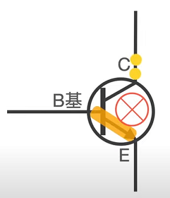

- 當基區(B)有電流時，三極管會是導通的狀態

    

<h3 id="0.2.2">原理：</h3>

**N型半導體**

- 將磷原子摻進硅原子中，此時多出來的那顆電子，只要些許的能量就可以成為自由電子

    

- 因為自由電子帶負電，故取名為N型半導體

    

**P型半導體**

- 將硼原子摻進硅原子中，此時會缺少一個電子，即多一個電洞，帶正電，會吸引電子，故取名為P型半導體

    

**電晶體**

- 三極體可以理解為兩個二極體以P作為重疊進行相接

    

- 三個部分分別為**發射區(E)**、**基區(B)**、**收集區(C)**，且與二極體相接不相同的地方為它各區的濃度不相同，已發射區(E)最高，且基區(B)最薄

    

    

- 當三極體與電源，不論正接或反接，就是截止非導通的狀態

    

    

- 為了使三極體能夠導通，故需要在BE極也加上一個電源

    

    

- 接上電源的BE二極體會使電子由E極流向B極，但由於B區的電洞密度不大，故址會有些許的電流由B極流向E極，形成**基極電流**，而大部分的電子會吸引到了集電區(C)，形成**集電極電流**，也就是**輸出電流**

    

    

    

<h3 id="0.3.3">特性：</h3>

- 當基極電流越大，流入基區的電子越多，進而流入集電區的電子更多，因此會有更大的集電極電流，這就是三極體利用**小電流控制大電流**的原理

    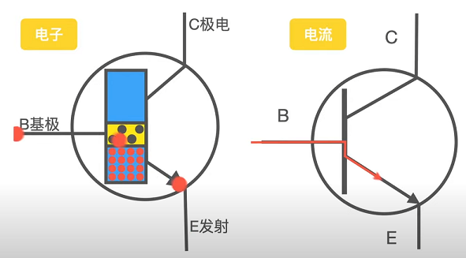

    

- 基區(B)作的很薄，是因為讓發射區(E)的電子更容易地進入集電區(C)

    

- 基區(B)的電動濃度很低，是為了使基極電流越小，也使電子更容易地進入集電區(C)

    

<h2 id="0.3">MOSFET</h2>

<h3 id="0.3.1">功能：</h3>


- 當柵極(G)沒有施加電壓時，漏極(D)至源極(S)會被截斷

    

- 當柵極(G)施加電壓時，電流由漏極(D)至源極(S)會導通

    

<h3 id="0.3.2">原理：</h3>

**二極體：**

- P型半導體 + N型半導體 = 二極體

    

- 將其通電，即會產生電場，電場方向與受力方向相反

    

    

  - 當P端接正極：自由電子能向左移動與電洞結合，在電源的作用下可以形成電流

    

  - 當N端接正極：自由電子因為電場，而受力向右無法和電洞結合，無法形成電流，而造成截止

    

**電晶體：**

- 金屬氧化物半導體場效電晶體(Metal-Oxide-Semiconductor Field-Effect Transistor，縮寫：MOSFET)：

  - 以NPN相接，形成兩個二極體，且方向相反，在兩個N型半導體引出兩個電極，分別作為漏極(D)與源極(S)

    

  - 將其接上電後，MOSFET會是截止的(NP會是截止，PN會是導通)

    

  - 為了能使其導通，加上一層絕緣層以及金屬層，作為柵極(G)

    

    

    

  - 將柵極(G)與正極相連形成一個開關，當close的時候，柵極(G)會對內產生一個電場，隨著電場大小吸引電子與排斥電洞，

    

    

  - 當電子數量到達一定程度時，可將兩個N型半導體之間視為一個N溝道(一個N型半導體)，此時因為外在電壓可以造成電子移動，形成電流導通

    

    

    

  - 當柵極(G)與正極為open的時候，是截止不導通的

    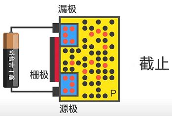

<h3 id="0.3.3">特性：</h3>

1. 柵極(G)與源極(S)之間的阻抗非常大且流入柵極(G)的電流極小，因為絕緣層的原因

    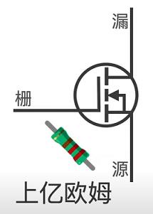

2. 由於柵極(G)與源極(S)之間的阻抗非常大且流入柵極(G)的電流極小，使得柵極會有高壓的狀態，容易會有靜電擊穿的發生，造成絕緣層的效果失效，進一步使的N型半導體之間的電子會通過柵極(G)往正極跑至源級(S)形成電流由柵極(G)往源極(S)的導通

    

    

    

**Note：靜電擊穿**

- 靜電(static electricity)，是一種處於靜止狀態的電荷

- 由於電子行業的迅速發展，體積小、集成度高的器件得到大規模生產，從而導致導線間距越來越小，絕緣膜越來越薄，致使耐擊穿電壓也愈來愈低。

- 電子行業中靜電障害可分為兩類：
  - 由靜電引力引起的浮游塵埃的吸附
  - 由靜電放電引起的介質擊穿

- 介質擊穿分熱擊穿、化學擊穿和電擊穿三種形式：
  - 熱擊穿
    - 介質工作時，當損耗產生的熱量大於介質向周圍散發的熱量時，介質的溫度迅速升高，導電隨之增加，直至介質的熱損壞。
    - 可見熱擊穿的核心問題是散熱問題。
  - 化學擊穿
    - 在高壓下，強電場會在介質表面或內部的缺陷小孔附近產生局部空氣碰撞電離，引起介質電輝，生成化學物質--臭氧和二氧化碳，使絕緣性能降低，致使介質損壞。
  - 電擊穿
    - 在強電場中，隨著電場強的增強，電荷不斷積累，當達到一定程度時，電介質會失去極化特徵而成為導體，最後產生介質的熱損壞現象，這種現象稱為電介質的擊穿。
    - 可見電擊穿的本質是電荷積聚所致，因而防止電荷積聚就可防止電擊穿。
    - 一般把擊穿的臨界電壓稱為擊穿電壓, 臨界場強稱為擊穿場強。

**Note：靜電**

- 無論是什麼物體，都會帶有正、負兩種電。

- 正電與負電數量相同，可說是已取得平衡的良好狀態。專業術語稱此為「電中性的狀態」。

    

- 取得平衡的良好狀態並無法永遠維持，一旦發生某個現象，平衡就會輕易被破壞。而這個現象就是當不同的兩個物體相互「碰撞」，其中一方的負電將會轉移到另一方。

- 因「物體」不同，其吸引負電的力道不同所產生的相對關係。當兩個物體相互碰撞時，負電將會移動到吸引負電力道較強的一方。

    

- 此失去平衡的狀態就稱作「靜電」。帶有靜電的狀態，以專業的說法就是「有帶電」。靜電有帶正電的「正靜電」與帶負電的「負靜電」。

- 負電返回正電端的現象稱為「放電」。換句話說，放電就是「釋放負電」，這時候在「物體」與「物體」之間會有電流流動。

    

<h1 id="00">重點概述</h1>

<h2 id="00.1">SSD 控制器</h2>

SSD 控制器（Solid State Drive Controller）是固態硬盤（SSD）中的一個關鍵組件，負責協調和管理 SSD 的內部操作。它是一個專用的微處理器，通常嵌入在 SSD 的硬體中，用於處理與 NAND 閃存和主機系統之間的數據傳輸、錯誤檢測和修復、磨損均衡等各種功能。

SSD 控制器的主要職責如下：

1. 數據傳輸：控制器負責將來自主機系統（如計算機）的讀取和寫入請求轉換為對 NAND 閃存的實際操作。同時，它還需要將 NAND 閃存中的數據返回給主機系統。
2. 閃存翻譯層（FTL）管理：FTL 是 SSD 控制器的核心部分，用於實現邏輯塊地址（LBA）到物理頁面地址（PPA）的映射。此外，FTL 還負責磨損均衡、垃圾收集等操作，以提高 SSD 的性能和壽命。
3. 錯誤檢測和修復：控制器包含錯誤檢測和修復（Error Detection and Correction, EDC）算法，例如 LDPC（低密度奇偶校驗）編碼，以檢測並修復 NAND 閃存中的錯誤。
4. 緩存管理：為了提高 SSD 的性能，控制器通常會利用一部分 DRAM 或 SLC 快閃記憶體作為緩存，對讀取和寫入的數據進行緩存和合並。
5. 接口協議：SSD 控制器需要支持與主機系統通信的接口協議，例如 SATA、NVMe、AHCI 等。這些協議確保 SSD 能夠與不同類型的計算機和操作系統兼容。
6. 電源管理：控制器還負責 SSD 的電源管理，包括在需要時將 SSD 進入低功耗模式，以節省能源並延長設備的使用壽命。

總之，SSD 控制器是 SSD 的核心組件，負責協調和管理 SSD 中的各種操作，以實現高性能

<h2 id="00.2">FTL，Flash Translation Layer</h2>

Flash Translation Layer（FTL）是固態硬盤（SSD）中的一個重要組件，它的主要功能是在 NAND 閃存（非易失性存儲介質）和主機系統之間建立一個抽象層。

FTL 的主要功能包括：

1. 地址映射：NAND 閃存的寫入特性與傳統硬盤驅動器（HDD）不同。NAND 閃存需要在寫入數據之前擦除整個塊，而 HDD 可以直接覆寫數據。FTL 將主機系統中的 LBA 映射到 NAND 閃存中的 PPA，從而讓 NAND 閃存在主機系統看起來像一個常規的磁盤驅動器。
2. 磨損均衡（Wear Leveling）：NAND 閃存有有限的寫入/擦除周期，對單個塊的重複擦除會降低其壽命。磨損均衡策略確保 NAND 閃存中的塊均勻地分配擦除次數，從而延長 SSD 的使用壽命。
3. 垃圾收集（Garbage Collection）：NAND 閃存需要在寫入新數據之前擦除塊。當塊中的部分頁面無效時，FTL 會將有效頁面遷移到其他塊，並擦除包含無效頁面的塊以釋放空間。這個過程稱為垃圾收集。
4. 錯誤檢測和修復（Error Detection and Correction）：FTL 還包含用於檢測和修復 NAND 閃存中的錯誤的算法，例如 LDPC（低密度奇偶校驗）編碼。
5. 緩存和合併：FTL 可以使用緩存技術，例如 DRAM 或 SLC 快閃記憶體，來暫存即將寫入 NAND 閃存的數據。這允許 FTL 在實際寫入 NAND 閃存之前進行合併操作，從而提高 SSD 的性能。

總之，Flash Translation Layer（FTL）是 SSD 中的核心技術，它允許 SSD 在主機系統中表現得像一個傳統的磁盤驅動器，同時解決 NAND 閃存的寫入操作限制和磨損均衡問題。FTL 還提供了一些高級功能，如垃圾收集、錯誤檢測和修復，以及緩存和合併操作，進一步提高 SSD 的性能和可靠性。

FTL 的實現方式可能因 SSD 控制器和 NAND 閃存類型而異。不同的 SSD 製造商可能選擇不同的 FTL 算法和策略，以便根據其產品的特性和目標市場來優化性能和可靠性。儘管 FTL 的具體實現可能有所不同，但其基本概念和功能在所有 SSD 中都是相似的。

<h2 id="00.3">PICe, SATA 與 NVMe,AHCI 與 ONFI,Toggle 關係</h2>

關係：

- PCIe 和 SATA 是用於連接存儲設備（如 SSD）的物理接口。
- NVMe 和 AHCI 是基於 PCIe 和 SATA 接口的協議，它們負責協調存儲設備與主機系統之間的通信。主要區別在於它們支持的底層接口和性能。NVMe 通常比 AHCI 更快，因為它可以更好地利用 NAND 閃存的並行性，並且它支持更多的佇列和命令。
  - NVMe 是基於 PCIe 的高性能存儲協議 -> 專為固態硬盤（SSD）
  - AHCI 是針對 SATA 接口的傳統存儲協議 -> 用於硬盤驅動器（HDD）和 SSD 設計
- ONFi 和 Toggle 是 NAND 閃存設備之間的通信接口標準。由不同的組織制定，但都旨在確保 NAND 閃存設備的兼容性。ONFi 和 Toggle 標準通常不直接影響最終用戶，但它們對 SSD 控制器和 NAND 閃存供應商的設計和開發具有重要意義。

<h2 id="00.4">EEPROM 和 Flash 閃存的最小讀取單元</h2>

1. EEPROM（Electrically Erasable Programmable Read-Only Memory）：EEPROM 是一種非易失性記憶體，可以在單個字節級別進行擦除和寫入。因此，EEPROM 的最小讀取單元是一個字節（8 位元）。
2. Flash 閃存：Flash 閃存是另一種非易失性存儲技術，與 EEPROM 類似，但具有更高的密度和更快的擦除速度。Flash 閃存可以分為兩類：NAND 閃存和 NOR 閃存。

   - NAND 閃存：NAND 閃存的最小讀取單元是一個頁面。頁面的大小因 NAND 閃存類型和製造商而異，典型的大小範圍在 2KB 至 16KB 之間。
   - NOR 閃存：NOR 閃存具有較低的存儲密度，但允許單個字節的隨機讀取。因此，NOR 閃存的最小讀取單元與 EEPROM 相同，即一個字節（8 位元）。

總之，對於 EEPROM 和 NOR 閃存，最小讀取單元是一個字節（8 位元）。對於 NAND 閃存，最小讀取單元是一個頁面，其大小取決於閃存類型和製造商。

<h2 id="00.5">eMMC</h2>

eMMC（嵌入式多媒體卡，Embedded MultiMediaCard）是一種非揮發性記憶體存儲技術，廣泛應用於智能手機、平板電腦、數位相機等消費性電子產品。eMMC將NAND閃存和記憶體控制器整合到一個封裝中，以實現高度集成化和易於使用的解決方案。

eMMC的主要特點有：

1. 高度集成：eMMC將NAND閃存、控制器和介面統一封裝，簡化了設計，減少了印刷電路板（PCB）上的佔用空間，降低了電子產品的成本和體積。
2. 簡單的接口：eMMC採用標準MMC接口，易於集成到不同硬體平台中，並可與不同類型的NAND閃存兼容。
3. 可擴展性：eMMC容量從數百MB到數百GB不等，可根據實際需求靈活選擇。
4. 性能：eMMC的讀寫速度通常在數十MB/s到數百MB/s之間，性能較傳統SD卡快。但與當前較為先進的存儲技術，如UFS（Universal Flash Storage）和NVMe SSD（非揮發性記憶體快閃存儲器）相比，性能較低。
5. 功耗：eMMC在空閒和低功耗模式下具有較低的功耗，適合電池供電的便攜式電子設備。

然而，eMMC也有一定的局限性：

1. 速度限制：eMMC的讀寫速度相對較慢，對於需要高速存儲的應用場景（如高端智能手機、筆記本電腦等），eMMC可能無法滿足需求。
2. 同時讀寫性能：eMMC的同時讀寫性能相對較差，可能在高負荷工作時出現性能瓶頸。

儘管如此，eMMC仍在許多低功耗和成本敏感的產品中被廣泛使用。不過，隨著技術的發展，越來越多的裝置開始採用更先進的存儲技術，如UFS和NVMe SSD，這些技術在速度、性能和可靠性方面具有明顯優勢。

1. UFS（Universal Flash Storage）：UFS是一種先進的存儲技術，專為移動設備和消費電子產品設計。相比eMMC，UFS具有更高的讀寫速度和更好的多任務性能。此外，UFS支持全雙工操作，可以同時讀取和寫入數據，而eMMC僅支持半雙工操作。高端智能手機和平板電腦等設備已經開始採用UFS作為主要存儲技術。
2. NVMe SSD（非揮發性記憶體快閃存儲器）：NVMe是一種專為固態硬盤（SSD）設計的高性能存儲接口。與eMMC相比，NVMe SSD具有更高的讀寫速度、更低的延遲和更高的IOPS（輸入/輸出操作每秒）。NVMe SSD主要應用於筆記本電腦、高性能工作站和數據中心等場景，提供卓越的存儲性能。

隨著市場對存儲性能需求的不斷提高，UFS和NVMe SSD等更先進的技術將逐步取代eMMC。然而，在低端市場和成本敏感的產品中，eMMC依然具有一定的市場地位，並將繼續為這些產品提供可靠的存儲解決方案。

MMC（多媒體卡，MultiMediaCard）接口是一種用於連接和存儲數字多媒體數據的通信協議。它最早於1997年由三星和西門子共同開發。MMC接口最初是為了在攝像機、MP3播放器、智能手機等便攜式電子設備中提供可移除存儲解決方案。隨著技術的發展，這種接口已經演變為多種應用和設備所使用的存儲接口，如嵌入式系統、導航設備和物聯網設備等。

MMC接口的特點：

1. 尺寸和形狀：MMC卡通常具有極小的尺寸，方便集成到各種電子設備中。最初的標準MMC卡尺寸為32毫米×24毫米×1.4毫米。隨後，推出了更小尺寸的RS-MMC（Reduced-Size MultiMediaCard）和microMMC。
2. 通用性：MMC接口允許不同類型和容量的存儲卡在多個設備之間通用，簡化了消費者的選擇和使用過程。
3. 記憶體容量：隨著NAND閃存技術的發展，MMC卡的存儲容量從最初的數MB增加到數GB，能夠滿足不同應用的需求。
4. 簡單的接口：MMC卡使用SPI（Serial Peripheral Interface）和SD bus兩種主要接口。SPI接口簡單且容易實現，適用於低速和低功耗應用。SD bus接口則提供更高的數據傳輸速度，適用於高速存儲應用。

然而，隨著市場對更高性能和更大容量存儲的需求，SD卡（Secure Digital）逐漸取代了MMC卡。SD卡在讀寫速度、容量和安全性方面提供了更好的性能。此外，許多SD卡槽同時兼容MMC卡，使得過渡過程更加順利。

現在，MMC接口已經從可移除存儲領域轉向嵌入式存儲領域，例如eMMC（嵌入式多媒體卡）。

<h2 id="00.6">UFS</h2>

UFS（Universal Flash Storage，通用快閃存儲）是一種高性能的非揮發性存儲技術，旨在提供更快的數據傳輸速度和更高的性能。它是JEDEC（國際電子技術標準組織）發布的一個標準，專為智能手機、平板電腦和其他消費性電子產品設計，用以取代過去的eMMC和其他嵌入式存儲解決方案。

UFS的主要特點包括：

1. 高性能：UFS提供了比eMMC更高的讀寫速度，可大大提升應用程式啟動速度、數據傳輸速度和多任務處理性能。UFS 3.0版本的峰值速度可達到每秒2.9GB的數據傳輸速率。
2. 全雙工操作：UFS支持全雙工操作，意味著它可以同時讀取和寫入數據。相比之下，eMMC僅支持半雙工操作，無法在同一時間進行讀寫操作。
3. 可擴展性：UFS支持多種容量選擇，從數GB到1TB甚至更高，可根據不同設備的需求靈活選擇。
4. 命令隊列：UFS支持SCSI（Small Computer System Interface）標準的命令隊列技術，可以同時處理多個讀寫請求，提高了存儲設備的性能。
5. 低功耗：UFS具有低功耗特性，適用於依賴電池供電的便攜式電子設備。

UFS在高端智能手機和其他消費性電子產品中已經取得了廣泛應用，並逐漸取代eMMC成為主流存儲解決方案。隨著UFS技術的不斷發展，其在存儲性能和可靠性方面的優勢將進一步擴大。

<h2 id="00.7">DRAM 和 SRAM 差別</h2>

DRAM（Dynamic Random Access Memory，動態隨機存取記憶體）和 SRAM（Static Random Access Memory，靜態隨機存取記憶體）都是計算機系統中使用的兩種主要類型的 RAM。它們之間的主要區別在於內部結構、性能、功耗和成本。

內部結構：

1. DRAM：DRAM 由一個電容和一個晶體管組成，用於存儲一個位（0 或 1）。電容充電表示一個數字位，而放電表示另一個。然而，電容會自然放電，因此需要定期刷新（充電和放電）以保持數據。
2. SRAM：SRAM 使用六個晶體管構成一個存儲單元，用於存儲一個位。SRAM 不需要刷新，因為數據在通電時保持穩定。

性能：

1. DRAM：由於需要定期刷新，DRAM 的存取速度相對較慢。
2. SRAM：SRAM 不需要刷新，因此存取速度更快，通常用作高速緩存（如 CPU 的 L1、L2 或 L3 緩存）。

功耗：

1. DRAM：DRAM 需要定期刷新，這會導致較高的功耗。
2. SRAM：SRAM 不需要刷新，因此功耗較低。

成本和容量：

1. DRAM：由於每個存儲單元只需要一個電容和一個晶體管，DRAM 的製造成本相對較低。因此，DRAM 通常具有較大的容量，用作主記憶體。
2. SRAM：SRAM 的製造成本較高，因為每個存儲單元需要六個晶體管。這使得 SRAM 的容量相對較小。


總之，DRAM 和 SRAM 的主要區別在於內部結構、性能、功耗和成本。DRAM 由於成本較低且容量較大，通常用作主記憶體。而 SRAM 由於存取速度快和低功耗的特性，通常用作高速緩存。


<h1 id="1">一、SSD總述</h1>

SSD（Solid State Drive），即固態硬盤，是一種以半導體閃存（NAND Flash）作為介質的存儲設備

<h2 id="1.1">1.1 引言</h2>

SATA2.5吋與3.5吋，以及M.2接口的尺寸
Note: 傳統HDD2.5吋


SSD是用固態電子存儲芯片陣列製成的硬盤，主要部件為控制器和存儲芯片

SSD硬件包括幾大組成部分：主控、閃存、緩存芯片DRAM（可選，有些SSD上可能只有SRAM，並沒有配置DRAM）、PCB（電源芯片、電阻、電容等）、接口（SATA、SAS、PCIe等），其主體就是一塊PCB


SSD內部運行固件（Firmware，FW）負責調度數據從接
口端到介質端的讀寫，還包括嵌入核心的閃存介質壽命和可靠性管理調度算法，以及其他一些SSD內部算法

SSD的三大技術核心 = SSD控制器 + 閃存 + 固件

### 儲存介質

存儲介質按物理材料的不同可分為三大類：光學存儲介質、半導體存儲介質和磁性存儲介質

- 光學存儲介質，就是大家之前都使用過的DVD、CD等光盤介質，靠光驅等主機讀取或寫入
- HDD是以磁性存儲介質來存儲數據
- SSD採取半導體芯片作為存儲介質


閃存

- 浮柵晶體管（Floating Gate Transistor）
- 相比MOSFET就多了個Floating Gate，懸浮在中間，所以叫浮柵
- 它被高阻抗的材料包裹，和上下絕緣，能夠保存電荷，而電荷通過量子隧道效應進入浮柵

    

<h2 id="1.2">1.2 SSD vs. HDD</h2>

HDD = 馬達 + 磁頭 + 磁盤, 機械結構
SSD = 閃存介質 + 主控, 半導體存儲芯片結構


1. 性能好

- 性能測試工具包括 連續讀寫吞吐量（Throughput）工具 和 隨機讀寫IOPS工具 兩種

    

2. 功耗低

- 工作功耗HDD為6～8W，SATA SSD為5W，待機功耗SSD可降低到毫瓦（mW）級別

    

- 科學地比較功耗的方法應該是Power/IOPS，也就是比較單位IOPS性能上的功耗輸出，該值越低越好

3. 抗震防摔

- SSD內部不存在任何機械部件，相比HDD更加抗震

4. 無噪聲

- 客觀上，由於結構上沒有馬達的高速運轉，SSD是靜音的

5. 尺寸小巧多樣

- HDD一般只有3.5寸和2.5寸兩種形式

- SSD除了3.5寸和2.5寸，還有更小的可以貼放在主板上的M.2形式，甚至可以小到芯片級，例如BGASSD的大小只有16mm×30mm

<h2 id="1.4">1.4 SSD 基本工作原理</h2>

從主機PC端開始，用戶從操作系統應用層面對SSD發出請求，文件系統將讀寫請求經驅動轉化為相應的符合協議的讀寫和其他命令，SSD收到命令執行相應操作，然後輸出結果

SSD的輸入是 命令（Command），輸出是 數據（Data） 和 命令狀態（Command Status）


SSD主要有三大功能模塊組成：

- 前端接口和相關的協議模塊
- 中間的FTL層（Flash Translation Layer）模塊
- 後端和閃存通信模塊

SSD通過諸如SATA、SAS和PCIe等接口與主機相連，實現對應的ATA、SCSI和NVMe等協議


SSD是怎麼進行讀寫的，以寫為例

- 主機通過接口發送寫命令給SSD，SSD接收到該命令後執行，並接收主機要寫入的數據
- 數據一般會先緩存在SSD內部的RAM中，FTL會為每個邏輯數據塊分配一個閃存地址，當數據湊到一定數量後，FTL便會發送寫閃存請求給後端，然後後端根據寫請求，把緩存中的數據寫到對應的閃存空間。
- SSD內部維護了一張邏輯地址到物理地址轉換的映射表

由於閃存不能覆蓋寫，閃存塊需擦除才能寫入

主機發來的某個數據塊，它不是寫在閃存固定位置，SSD可以為其分配任何可能的閃存空間寫入。透過 FTL 完成邏輯數據塊到閃存物理空間的轉換或者映射。

- 假設SSD容量為128GB，邏輯數據塊大小為4KB，所
以該SSD一共有128GB/4KB=32M個邏輯數據塊
- 每個邏輯塊都有一個映射，即每個邏輯塊在閃存空間都有一個存儲位置
- 閃存地址大小如果用4字節表示，那麼存儲32M個邏輯數據塊在閃存中的地址則需要32M×4B=128MB大小的映射表。

一個SSD在前端協議及閃存確定下來後，差異化就體現在FTL算法上了。 FTL算法決定了性能、可靠性、功耗等SSD的核心參數。

<h2 id="1.5.1">1.5.1 基本信息剖析</h2>

### SSD容量

以字節（Byte）為單位

同樣一組數據，二進制比十進制會多出7%的容量，例如：

- 十進制128GB：128×1000×1000×1000=128000000000字節
- 二進制128GB：128×1024×1024×1024=137438953472字節

裸容量：以二進制為單位的容量
用戶容量：以十進制為單位的容量

SSD可以利用這多出來的7%空間管理和存儲內部數據，比如把這部分額外的空間用作FTL映射表存儲空間、垃圾回收所需的預留交換空間、閃存壞塊的替代空間等。

7%多餘空間也可以轉換為OP概念（Over Provisioning）

$$
OP=\frac{(SSD裸容量-用戶容量)}{用戶容量}
$$

### 介質信息

閃存分SLC、MLC、TLC（甚至QLC），它指的是一個存儲單元存儲的比特數
- SLC（Single-Level Cell）即單個存儲單元存儲1bit的數據。 SLC速度快，壽命長（5萬～10萬次擦寫壽命），但價格超貴（約是
MLC 3倍以上的價格）。
- MLC（Multi-Level Cell）即單個存儲單元存儲2bit的數據。 MLC速度一般，壽命一般（約為3k～10k次擦寫壽命），價格一般。
- TLC（Trinary-Level Cell）即單個存儲單元存儲3bit的數據，也
有閃存廠家叫8LC，速度慢，壽命短（約500～1500次擦寫壽命），
價格便宜。

    

### 外觀尺寸


<h2 id="1.5.2">1.5.2 性能剖析</h2>

### 性能指標

IOPS（Input Output Operations Per Second，反映的是隨機讀寫性能）
- 設備每秒完成IO請求數，一般是小塊數據讀寫命令的響應次數，比如4KB數據塊尺寸。 IOPS數字越大越好。

吞吐量（Throughput，單位 MB/s，反映的是順序讀寫性能）：
- 每秒讀寫命令完成的數據傳輸量，也叫帶寬（Bandwidth），一般是大塊數據讀寫命令，比如512KB數據塊尺寸。吞吐量越大越好。

Response Time/Latency（響應時間/時延，單位ms或μs）：

- 每個命令從發出到收到狀態回复所需要的響應時間，時延指標有平均時延（Average Latency）和最大時延兩項（Max Latency）。響應時間越小越好。

### 訪問模式

Random/Sequential：隨機（Random）和連續（Sequential）數據命令請求。
- 何為隨機和連續？指的是前後兩條命令LBA地址是不是連續的

Block Size：塊大小，即單條命令傳輸的數據大小，性能測試從4KB～512KB不等。
- 隨機測試一般用小數據塊，比如4KB；
- 順序測試一般用大塊數據，比如512KB。

Read/Write Ratio：讀寫命令數混合的比例

<h2 id="1.5.3">1.5.3 壽命（Endurance）剖析</h2>

衡量SSD壽命主要有兩個指標，

- DWPD（Drive Writes Per Day）：即在SSD保質期內，用戶每天可以把盤寫滿多少次；
- TBW（Terabytes Written）：在SSD的生命週期內可以寫入的總的字節數。

200GB SSD五年使用期限內對應的壽命是3600TB，平均到每天可以寫入3600TB/（5×365）=1972GB，這塊盤本身200GB，1972GB相當於每天寫入10次，也就是規范書說的10Drive Writes Per Day，簡稱10DWPD。 DWPD為5年的壽命期內每天可以滿盤寫入的次數。

TBW就是在SSD的生命週期內可以寫入的總的字節數

$$
總寫入量TBW=Capacity(單盤容量)\frac{NAND PE Cycles(NAND寫擦除壽命)}{WA(寫放大)}
$$

- NAND PE Cycles：SSD使用的閃存標稱寫擦除次數，如3K、5K。
- Capacity：SSD單盤用戶可使用容量。
- WA：寫入放大係數，這跟SSD FW的設計和用戶的寫入的數據類型（順序寫還是隨機寫）強相關。

TBW和DWPD的計算公式：

$$
DWPD=\frac{TBW}{Years(SSD盤標示使用年限)*365*Capacity(單盤容量)}
$$

<h2 id="1.5.4">1.5.4 數據可靠性剖析</h2>

衡量SSD可靠性的關鍵指標

- UBER：Uncorrectable Bit Error Rate，不可修復的錯誤比特率
  - UBER是一種數據損壞率衡量標準，等於在應用了任意特定的錯誤糾正機制後依然產生的每比特讀取的數據錯誤數量佔總讀取數量的比例（概率）
- RBER：Raw Bit Error Rate，原始錯誤比特率
  - RBER反映的是閃存的質量。所有閃存出廠時都有一個RBER指標。 RBER指標也不是固定不變的，閃存的數據錯誤率會隨著使用壽命（PE Cycle）的增加而增加

    

  - RBER還跟閃存內部結構也有關係，Upper Page的RBER比Lower Page的RBER要高兩個數量級。

    

- MTBF：Mean Time Between Failure，平均故障間隔時間
  - MTBF指標反映的是產品的無故障連續運行時間


閃存有天然的數據比特翻轉率

- 擦寫磨損（P/E Cycle）
- 讀取乾擾（Read Disturb）
- 編程干擾（Program Disturb）
- 數據保持（Data Retention）發生錯誤

<h2 id="1.5.5">1.5.5 功耗剖析</h2>

SSD的功耗類型：

- 空閒（Idle）功耗：
  - 當主機無任何命令發給SSD，SSD處於空閒狀態但也沒有進入省電模式時，設備所消耗的功耗。
- Max active功耗：
  - 最大功耗是SSD處於最大工作負載下所消耗的功耗，SSD的最大工作負載條件一般是連續寫
- Standby/Sleep功耗：
  - 在Standby和Sleep狀態下，設備應盡可能把不工作的硬件模塊關閉，降低功耗。一般消費級SSD Standby和Sleep功耗為100～500mW。
- DevSleep功耗：
  - SATA和PCIe新定義的一種功耗標準，目的是在Standby和Sleep基礎上再降一級功耗
  - 配合主機和操作系統完成系統在休眠狀態下（如Hibernate），SSD關掉一切自身模塊，處於極致低功耗模式，甚至是零功耗。一般是10mW以下。

對於主機而言，它的功耗狀態和SSD作為設備端是一一對應的，而功耗模式發起端是主機，SSD被動執行和切換對應功耗狀態。

系統Power State（SATA SSD作為OS盤）：

- S0：工作模式
- S1：是低喚醒延遲的狀態, 硬件負責維持所有的系統上下文。
- S2：與S1相似，從處理器的reset vector開始執行。
- S3：睡眠模式（Sleep），CPU不運行指令，SATA SSD關閉，
除了內存之外的所有上下文都會丟失。
- S4：休眠模式（Hibernation），CPU不運行指令，SATA SSD
關閉，DDR內容寫入SSD中，所有的系統上下文都會丟失，OS負責上
下文的保存與恢復。
- S5：Soft off state，與S4相似，但OS不會保存和恢復系統上下
文。消耗很少的電能，可通過鼠標鍵盤等設備喚醒。

SSD功耗最大的是ASIC主控和閃存模塊

- 特定應用積體電路（英語：Application Specific Integrated Circuit，縮寫：ASIC）
- 控制SSD溫度是固件設計要考慮的，就是設計降溫處理算法

    

<h2 id="1.5.6">1.5.6 SSD系統兼容性</h2>

BIOS和操作系統的兼容性

- SSD上電加載後，主機中的BIOS作為第一層軟件和SSD進行交互。第一步，和SSD發生鏈接，SATA和PCIe走不同的底層鏈路鏈接

- 主機端和SSD連接成功後發出識別盤的命令（如SATA Identify）來讀取盤的基本信息，基本信息包括產品part number、FW版本號、產品版本號等，BIOS會驗證信息的格式和數據的正確性，

- 接著BIOS會讀取盤其他信息，如SMART，直到BIOS找到硬盤上的主引導記錄MBR，加載MBR
  - S.M.A.R.T指的是自我監控分析與報告技術，也是一種內建於硬碟和 SSD 中的監控功能
  - 主開機紀錄（Master Boot Record，縮寫：MBR），又叫做主引導磁區，是電腦開機後存取硬碟時所必須要讀取的首個磁區

- MBR開始讀取硬盤分區表DPT，找到活動分區中的分區引導記錄PBR(Partition Boot Record)，並且把控制權交給PBR……最後，SSD通過數據讀寫功能來完成最後的OS加載

啟動順序： BIOS -> MBR -> DPT -> PBR

從測試角度來看，系統兼容性認證包括以下各個方面：

- OS種類（Windows、Linux）和各種版本的OS；
- 主板上CPU南北橋芯片組型號（Intel、AMD）和各個版本；
- BIOS的各個版本；
- 特殊應用程序類型和各個版本（性能BenchMark工具、Oracle數據庫……）

電信號兼容性和硬件兼容性

- SSD工作時，主機提供的電信號處於非穩定狀態，比如存在抖動、信號完整性差等情況，但依然在規範誤差範圍內，此時SSD通過自身的硬件設計（比如power regulator）和接口信號完整性設計依然能正常工作，數據也依然能正確收發

容錯處理

- SSD盤若能容錯並返回錯誤狀態給主機，提供足夠的日誌來幫助主機軟硬件開發人員調試就更好了。這裡的錯誤包括接口總線上的數據CRC錯誤、丟包、數據命令格式錯誤、命令參數錯誤等。

<h2 id="1.6">1.6 接口型態</h2>

SSD接口形態和尺寸的英文是SSD Form Factor


mSATA是前些年出現的，與標準SATA相比體積大為縮小，主要應用於消費級筆記本領域。但待M.2出現後，基本上替代了mSATA，革了它的命。

M.2原名是NGFF（Next Generation Form Factor），它是為超極本（Ultrabook）量身定做的新一代接口標準，主要用來取代mSATA接口，具備體積小巧、性能主流等特點。


U.2Form Factor（SFF-8639）起步於PCIe SSD 2.5寸盤形態制定的接口，到後來統一了SATA、SAS和PCIe三種物理接口，從而減小了下游SSD應用場合的接口復雜度，是一種新型連接器FormFactor，目前標準還在更新中。

BGA SSD

- 隨著製程和封裝技術的成熟，當今一個PCB 2.5寸大小的存儲器可以放到一個16mm×20mm BGA封裝中，這就是BGA uSSD

    

- 目前（2017年）世界上最小尺寸的SSD，其與手機中的eMMC及UFS的尺寸一樣大小，但是容量要大得多

    


SDP(SATA Disk in Package)

- 指將SSD主控芯片、閃存芯片在封裝廠封裝成一體化模塊，經過開卡量產、測試後出廠。這種產品形態相當於SSD的半成品，只需要加上外殼就能成為完整的SSD產品

    

與傳統$PCBA$模式相比，$SDP^{TM}$具備哪些優勢？


U.2

- U.2俗稱SFF-8639，這是新生產物，採用非AIC(Add-In Card)形式，以盤的形態存在。開發U.2的目的是統一SAS、SATA、PCIe三種接口，方便用戶部署。

<h2 id="1.7.2">1.7.2 SSD、HDD應用場合</h2>

數據按照熱度的不同會採取不同的存儲方式，這樣可以平衡性能和成本的問題，俗稱性價比。在HDD和SSD二分天下的今天，SSD主要用於存放和用戶貼近的熱數據，其對總容量需求較小，性能優先；HDD主要用於存放和用戶較遠的溫（warm）數據或冷（cold）數據，其對總容量需求較大，價格優先

- 數據加速層：採用PCIe接口的高性能的SSD。
- 熱數據（頻繁訪問）層：採用普通SATA、SAS SSD。
- 溫數據層：採用高性能HDD。
- 冷數據層：採用HDD。
- 歸檔層：採用大容量價格低廉的HDD，甚至磁帶

SSD的研發模式，三方配合：主控廠商 + 閃存廠商 + 生產製造

<h1 id="2">二、SSD主控和全閃存陣列</h1>

SSD主要由兩大模塊構成——主控和閃存介質。
除了上述兩大模塊外，可選的還有緩存單元

主控是SSD的大腦，承擔著指揮、運算和協調的作用

- 實現標準主機接口與主機通信；
- 實現與閃存的通信；
- 運行SSD內部FTL算法。

<h2 id="2.1">2.1 SSD系統架構</h2>

SSD作為數據存儲設備，其實是一種典型的（System on Chip）單機系統，有主控CPU、RAM、操作加速器、總線、數據編碼譯碼等模塊，操作對象為協議、數據命令、介質，操作目的是寫入和讀取用戶數據。


前端（Host Interface Controller，主機接口控制器）跟主機打交道，接口可以是SATA、PCIe、SAS等


- SATA的全稱是Serial Advanced Technology Attachment（串行高級技術附件），是一種基於行業標準的串行硬件驅動器接口，是由Intel、IBM、Dell、APT、Maxtor和Seagate公司共同提出的硬盤接口規

    

- SAS（Serial Attached SCSI）即串行連接SCSI，是新一代的SCSI技術，和現在流行的Serial ATA（SATA）硬盤相同，都是採用串行技術以獲得更高的傳輸速度，並通過縮短連接線改善內部空間等

- SAS是並行SCSI接口之後開發出的全新接口，此接口的設計是為了改善存儲系統的效能、可用性和擴充性，並且提供與SATA硬盤的兼容性。SAS的接口技術可以向下兼容SATA

    

- PCIe（Peripheral Component Interconnect Express）是一種高速串行計算機擴展總線標準，旨在替代舊的PCI、PCI-X和AGP總線標準。

- PCIe屬於高速串行點對點多通道高帶寬傳輸，所連接的設備分配獨享通道帶寬，不共享總線帶寬，主要支持主動電源管理、錯誤報告、端對端的可靠性傳輸、熱插拔以及服務質量（QoS，Quality of Service）等功能。

- 數據傳輸速率高，目前最高的4.0版本可達到2GB/s（單向單通道速率）

- PCI Express也有多種規格，從PCI Express 1X到PCI Express 32X，意思就是1個通道到32個通道

    

    

主控CPU

- SSD控制器SoC模塊和其他嵌入式系統SoC模塊並沒有什麼本質的不同，一般由一顆或多顆CPU核組成，同時片上有I-RAM、DRAM、PLL、IO、UART、高低速總線等外圍電路模塊
- CPU負責運算、系統調度，IO完成必要的輸入輸出，總線連接前後端模塊。
- 的固件就運行在CPU核上，分別有代碼存儲區I-RAM和數據存儲區D-RAM
- 對稱多處理（SMP）多核共享OS和同一份執行代碼，共享一份I-RAM和D-RAM; 非對稱多處理（AMP)是多核分別執行不同代碼每核對應一份IRAM和D-RAM，每核獨立運行，沒有內存搶占導致代碼速度執行變慢的問題。
- SSD的CPU外圍模塊包括UART、GPIO、JTAG，這些都是程序必不可少的調試端口，另外還有定時器模塊Timer及其他內部模塊，比如DMA、溫度傳感器、Power regulator模塊等。

> Note: 
> JTAG是聯合測試工作群組（Joint Test Action Group）的簡稱，是在名為標準測試存取埠和邊界掃描結構的IEEE的標準1149.1的常用名稱。此標準用於驗證設計與測試生產出的印刷電路板功能。
> 在設計印刷電路板時，目前最主要用在測試積體電路的副區塊，而且也提供一個在嵌入式系統很有用的偵錯機制，提供一個在系統中方便的"後門"。當使用一些偵錯工具像電路內模擬器用JTAG當做訊號傳輸的機制，使得程式設計師可以經由JTAG去讀取整合在CPU上的偵錯模組。偵錯模組可以讓程式設計師偵錯嵌入式系統中的軟體。

後端（Flash Controller，閃存控制器）跟閃存打交道並完成數據編解碼和ECC

- ECC模塊是數據編解碼單元，由於閃存存儲天生存在誤碼率，為了數據的正確性，在數據寫入操作時應給原數據加入ECC校驗保護，這是一個編碼過程。
- 讀取數據時，同樣需要通過解碼來檢錯和糾錯，如果錯誤的比特數超過ECC糾錯能力，數據會以“不可糾錯”的形式上傳給主機
- 閃存控制器使用符合閃存ONFI(Open NAND Flash Interface)、Toggle標準的閃存命令，負責管理數據從緩存到閃存的讀取和寫入。
- 一個Die/LUN是一個閃存命令執行的基本單元
- Die/LUN是閃存通信的最小基本管理單元，配有下述的一套總線
- 從閃存控制器角度看，為了性能需求需要並發多個閃存Die/LUN，通常配置有多個通道（channel）。一個通道掛多少個閃存Die/LUN，取決於SSD容量和性能需求，Die/LUN個數越多，並發的個數越多，性能越好。
- 果一個通道上掛了多個閃存Die/LUN，每個Die共用每個通道上的一套總線，那閃存控制器通過選通信號CE#識別和哪個Die通信

閃存控制器和閃存連接引腳按照如下操作


- 外部接口：8個IO接口，5個使能信號（ALE、CLE、WE#、RE#、CE#），1個狀態引腳（R/B#），1個寫保護引腳（WP#）；
- 命令、地址、數據都通過8個IO接口輸入輸出；
- 寫入命令、地址、數據時，都需要將WE#、CE#信號同時拉低，數據在WE#上升沿被鎖存；
- CLE、ALE用來區分IO引腳上傳輸的是數據還是地址。


- 緩衝（Buffer）、DRAM
- 模塊之間通過AXI高速和APB低速總線互聯互通，完成信息和數據的通信
- 固件（Firmware）統一完成SSD產品所需要的功能，調度各個硬件模塊，完成數據從主機端到閃存端的寫入和讀取

<h1 id="3">三、SSD儲存介質：閃存</h1>

幾種存儲器特性對比


<h2 id="3.1">3.1 閃存物理結構</h2>

現在的固態硬盤一般都是使用閃存作為存儲介質，並且是NAND閃存

固態硬盤的工作原理很多也都是基於閃存特性的，比如：
- 閃存在寫之前必須先擦除，不能覆蓋寫，於是固態硬盤才需要垃圾回收（Garbage Collection，或者叫Recycle）
- 閃存每個塊（Block）擦寫次數達到一定值後，這個塊要么變成壞塊，要么存儲在上面的數據不可靠，所以固態硬盤固件必須做磨損平衡，讓數據平均寫在所有塊上，而不是盯著幾個塊拼命寫（不然很快固態硬盤就報廢了）。

閃存是一種非易失性存儲器，掉電了數據也不會丟失

閃存基本存儲單元（Cell）是一種類NMOS的雙層浮柵（Floating Gate）MOS管


- 在源極（Source）和漏極（Drain）之間電流單向傳導的半導體上形成存儲電子的浮柵，浮柵上下被絕緣層包圍，存儲在裡面的電子不會因為掉電而消失，所以閃存是非易失性存儲器。
- 寫操作是在控制極CG（Control Gate）加正電壓，使電子通過絕緣層進入浮柵極（Floating Gate，FG）。
- 擦除操作正好相反，是在襯底（Substrate）加正電壓，把電子從浮柵極（Floating Gate，FG）中吸出來


NAND 一個 plane 內部 MOS陣列，MOS管的 

- 漏極 BL = bit line，
- 柵極 WL = word line，
- 源極都連在一起，
- WL連接了若干個page，通過WL加不同電壓和不同時間長度進行各種操作，在BL端進行讀的操作。 
- Bit Line對應的一串MOS叫做string，Block的高度一般是一個string，但是很寬，很多個WL。


<h2 id="3.1.2">3.1.2 SLC、MLC和TLC</h2>

SLC(SingleLevel Cell)：一個存儲單元存儲1bit數據的閃存
MLC(Multiple Level Cell)：存儲2bit數據的閃存
TLC(Triple Level Cell)：存儲3bit數據的閃存


閃存芯片裡面存儲單元的閾值電壓分佈函數，橫軸是閾值電壓，縱軸是存儲單元數量

擦除之後，閃存讀出來的值為1，充過電之後，就是0。所以，如果需要寫1，就什麼都不用作；寫0，就需要充電到0。


一個存儲單元電子劃分得越多，那麼在寫入的時候，控制進入浮柵極的電子個數就要越精細，所以寫耗費的時間就越長；同樣的，讀的時候，需要嘗試用不同的參考電壓去讀取，一定程度上加長了讀取時間


<h2 id="3.1.3">3.1.3 閃存晶片架構</h2>

閃存芯片就是由成千上萬這樣的存儲單元按照一定的組織結構組成的。


一個Wordline對應著一個或若干個Page，具體是多少取決於是SLC、MLC或者TLC。

- SLC：一個Wordline對應1個Page
- MLC：一個Wordline對應2個Page，這兩個Page是一對（Lower Page和Upper Page）
- TLC：一個Wordline對應3個Page（Lower Page、Upper Page和Extra Page

一個Page有多大，那麼Wordline上面就有多少個存儲單元，就有多少個Bitline

一個Block當中的所有這些存儲單元都是共用一個襯底

一個閃存芯片有若干個DIE（或者叫LUN）
每個DIE有若干個Plane
每個Plane有若干個Block
每個Block有若干個Page
每個Page對應著一個或若干個Wordline
Wordline由成千上萬個存儲單元構成。


DIE/LUN是接收和執行閃存命令的基本單元。 
- LUN0和LUN1可以同時接收和執行不同的命令
- 但在一個LUN當中，一次只能獨立執行一個命令，你不能對其中某個Page寫的同時，又對其他Page進行讀訪問

一個LUN又分為若干個Plane，市面上常見的是1個或者2個Plane，現在也有4個Plane的閃存了。
- 每個Plane都有自己獨立的Cache Register和Page Register，其大小等於一個Page的大小。
- 主控在寫某個Page的時候，先把數據從主控傳輸到該Page所對應Plane的Cache Register當中，然後再把整個Cache Register當中的數據寫到閃存陣列
- 讀的時候則相反，先把這個Page的數據從閃存介質讀取到Cache Register，然後再按需傳給主控。
- Cache讀支持在傳輸前一個Page數據給主控的時候（Cache Register→主控），可以從閃存介質讀取下一個主控需要讀的Page的數據到Page Register（閃存介質→Page Register），這樣數據在閃存總線傳輸的時間就可以隱藏在讀閃存介質的時間裡
- Cache寫支持閃存寫前一個Page數據的同時（Page Register→閃存介質），傳輸下一個要寫的數據到Cache Register（主控→Cache Register），這樣數據在閃存總線傳輸可以隱藏在前一個Page的寫時間裡。

閃存寫入時間是指一個Page的數據從Page Register當中寫入閃存介質的時間，閃存讀取時間是指一個Page的數據從閃存介質讀取到Page Register的時間。

閃存一般都支持Multi-Plane（或者Dual-Plane）操作。
- 使用Dual-Plane操作，兩個不同Plane上的Page數據會在一個閃存讀取(寫入)時間加載到各自的Cache Register當中，這樣用一個讀取(寫入)時間讀取(寫入)到兩個Page的數據，讀取速度加快

一個Block當中的所有存儲單元是共用一個襯底（Substrate），當你對某襯底施加強電壓，那麼上面所有浮柵極的電子都會被吸出來。 ，所以閃存的擦除是以Block為單位的

<h2 id="3.1.4">3.1.4 讀、寫、擦原理</h2>

### 擦除

如下圖，擦除前，浮柵上有可能有電子，P well加20V電壓，經過足夠時間後，由於量子隧道效應，電子從浮柵到溝道裡面，完成一個block的擦除，閾值電壓都變成了-V T，狀態為“1” 。一個die上的MOS管都是用一個Pwell ，但是其它不用擦除的block ，柵極電壓是float ，不會有隧道效應。


### 寫入

如下圖，Erase後所有的Cell閾值電壓為-VT ，Program時電壓如下，要Program的Cell WL為高電壓，BL=0V ，由於量子隧道效應，電子從溝道到浮柵，成為“0” 。不program的cell BL為2V ，在溝道裡的效應阻礙了量子隧道效應發生。

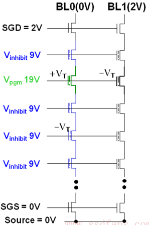

### 讀取

要讀的cell WL = 0V ，-Vt的管子導通，BL端的傳感運放（Sense Amp ）能夠檢測到，所以讀到“1” ，而經過program的+Vt的管子不導通，Sense Amp讀為“0” 。


<h2 id="3.1.5">3.1.5 三維閃存</h2>

二維平面單元尺寸逐漸減小，單元間的相互干擾卻在逐漸增加。基於二二維平面單元尺寸逐漸減小，單元間的相互干擾卻在逐漸增加。基於二維平面單元結構的尺寸縮小已經無法進一步降低比特成本了，即達到了技術上的瓶頸。維平面單元結構的尺寸縮小已經無法進一步降低比特成本了，即達到了技術上的瓶頸。


- 2007年，BiCS（Bit Cost Scalable）技術（包含多堆疊柵極層結構）被提出
- 2009年，金屬柵極三維閃存技術（Terabit Cell Array Transistor，TCAT）被提出來

1）堆疊柵極層數目增加帶來的問題。正如前面所說，三維閃存通過增加堆疊柵極層的數目來提高比特密度，而且每一代堆疊柵極層數目都會增加30%～50%，這會帶來許多困難，比如串電流的減小，高層與低層單元特徵的差異性增大。


- 隨著堆疊柵極層數目的增加，每個Block的Page數目不斷增加。
- 在讀的過程中，對一個Block來說，累積的讀取數目增加，導致讀干擾會變嚴重。
- 為了降低讀干擾，需要降低讀參考電壓Vread，這樣就會導致串電流減小，使得提供給傳感運放的信號更微弱。
- 底層單元的通道孔小，所以耦合率更高，擦寫速度更快。但是，底層單元的柵極更薄，所以數據保存期更短。

    

2）單元模具厚度減小帶來的問題。跟二維閃存類似，隨著工藝一代一代迭代，最小尺寸也在不斷減小，所以單元模具厚度不斷減小，單元間的干擾也得到了增強。

<h2 id="3.1.6">3.1.6 Charge Trap閃存 & 3.1.7 3D XPoint</h2>

CT(Charge Trap)是閃存的一種技術

閃存不只有Floating Gate，還有Charge Trap。中文可以翻譯成電阱，CT像個陷阱一樣，把電荷困在裡面存起來。

Charge Trap(CT)與Floating Gate(FG)最大的不同是存儲電荷的元素不同

- FG是用導體存儲電荷
- CT是用高電荷捕捉（Trap）密度的絕緣材料（一般為氮化矽，SI3N4）來存儲電荷
- FG就像水，電子可在裡面自由移動；而CT就像是奶酪，電子在裡面移動是非常困難的


浮柵晶體管對浮柵極下面的絕緣層很敏感，該氧化物厚度變薄（製程不斷減小導致的）或者老化（Degradation，擦寫次數多了），浮柵極裡面存儲的電子進出變得容易

CT對隧道氧化層不敏感，當厚度變薄或者擦除導致老化時，對於CT中的電子影響不大

浮柵晶體管的浮柵極材料是導體，任何兩個彼此絕緣且相隔很近的導體間都會構成一個電容器(耦合電容)。因此，任何兩個存儲單元的浮柵極都構成一個電容器，一個浮柵極裡面電荷的變化都會引起別的存儲單元浮柵極電荷的變化


CT相比浮柵晶體管有很多優勢，如上面提到的，對隧道氧化層要求不是那麼苛刻；更小的存儲單元間距；隧道氧化層磨損更慢；更節能；工藝實現容易；可以在更小的尺寸上實現。但是，CT也不能完胜。在Read Disturb和Data Retention方面，CT閃存就不如浮柵極閃存。

CT技術現在主要是應用在3D閃存上


<h2 id="3.2.1">3.2.1 異步時序</h2>

閃存接口有同步異步之分，一般來說，

- 異步傳輸速率慢
- 同步傳輸速率快。

異步(Async)接口

- 沒有時鐘
- 每個數據讀由一次RE_n信號觸發
- 每個數據寫由一次WE_n信號觸發

同步(Sync)接口

- 有一個時鐘信號
- 數據讀寫和時鐘同步


- CLE：Command Latch Enable，CLE有效時IOx發送命令
- CE_n：Chip Enable
- WE_n：Write Enable，寫使能
- ALE：Address Latch Enable，ALE有效時IOx發送地址
- IOx：數據總線


- RE_n：讀使能
- R/B_n：Ready/Busy。閃存正在進行內部讀的時候，Busy_n有效，當操作完成且數據準備好之後，Ready有效，用戶可以來讀了

<h2 id="3.2.2">3.2.2 同步時序</h2>

同步時序最重要的兩個信號是 時鐘CLK 和 DQS(Data Strobe)

現在的閃存基本都採用了DDR（Double Data Rate）技術，就是說每個時鐘週期傳輸兩次數據


- CLK：時鐘。時鐘信號由用戶產生，在時鐘信號的上升沿和下降沿都有數據被觸發，實現DDR，意味著100MHz的時鐘頻率數據傳輸速率是200MT/s。
- W/R_n：Write/Read_n。寫的時候高電平，讀的時候低電平。
- DQS：Data Strobe。 DQS用來區分出每個數據傳輸週期，便於接收方准確接收數據。
  - 讀數據時，DQS由閃存產生，DQS上下沿和數據對齊。
  - 寫數據時，DQS由用戶產生，DQS中間對應數據的中間穩定區域。
  - DQS可以看成數據的同步信號。
- DQ[7：0]：數據總線

<h2 id="3.2.3">3.2.3 閃存命令集</h2>

每款閃存芯片都定義了其支持的命令，以ONFI 2.3協議為例，它定義的命令如下表所示


<h2 id="3.2.4">3.2.4 閃存尋址</h2>

圖3-36所示是一個Target，就是我之前說的一個可以獨立工作的邏輯芯片。它包含2個LUN，每個LUN有2個Plane，每個Plane有很多Block，每個Block又有很多Page。


為了訪問這些資源，閃存裡面使用了列地址（Row Address）和行地址（Column Address）

- Column Address：Page內部的偏移地址
- Row Address：如圖3-37所示，從高位到低位依次為LUN、Block和Page地址，至於具體位寬，則和每個芯片的容量有關。


Plane是在Block地址的最低位


<h2 id="3.2.5">3.2.5 讀、寫、擦時序</h2>

讀時序如圖3-39所示：

- 在用戶發送命令00～30h之間傳輸了所讀的地址，包括2個列地址和3個行地址
- 發完命令後，SR[6]（Status Register，狀態寄存器，bit 6）狀態轉為Busy
- 經過一段時間之後 SR[6]狀態轉為Ready，數據就可以讀了。


寫時序如圖3-40所示：

- 用戶發了80h命令之後，發送寫地址，一般列地址是0，因為要把一個Page寫滿，如果不從頭開始寫滿一個Page，往往會導致數據出錯。
- 發完地址tADL時間之後，開始傳輸數據到閃存的緩存。
- 數據傳完，發送命令10h，閃存芯片開始向介質寫入數據，SR[6]狀態為Busy，在寫操作完成後狀態轉為Ready。


擦除如圖3-41所示：

- 在命令60h和D0h之間發送LUN和Block行地址即可（因為擦除是以Block為單位）


<h2 id="3.2.6">3.2.6 ONFI與Toggle協議之爭</h2>

閃存不只涉及ONFI協議，還有Toggle協議

ONFI（Open NAND Flash Interface）聯盟


三星和東芝計劃一起研發新一代閃存產品，也就是後來的Toggle NAND


- Toggle同步模式下不用時鐘，寫數據用DQS差分信號跳變沿觸發，讀數據根據主控發的REN差分信號跳變沿發送讀請求，DQS跳變沿輸出數據。
- ONFI同步模式下有時鐘，數據、命令、地址都要與時鐘同步。但是DQS、Clock都不是差分信號，所以邊沿容易受干擾。
- ONFI 3.0裡面有NV DDR2模式，這就和Toggle一樣了，不再用Clock，用DQS和REN差分信號。

<h2 id="3.1">3.1 閃存存在的問題</h2>

<h3 id="3.3.1.1">3.3.1.1 閃存壞塊</h3>

當一個閃存塊接近或者超出其最大擦寫次數時，可能導致存儲單元永久性損傷，不能再使用。

隨著閃存工藝不斷向前發展，晶體管的尺寸越來越小，擦寫次數也變得越來越少。

閃存中的存儲單元先天就有一些是壞的，或者說是不穩定的。並且隨著閃存的不斷使用，壞的存儲單元越來越多。

用戶寫入閃存的數據，必須要有ECC糾錯碼保護，這樣即使其中的一些比特發生反轉，讀取的時候也能通過ECC糾正過來。但若出錯的比特數超過糾錯能力範圍，數據就會丟失，對這樣的閃存塊，我們應該棄之不再使用。

因此需要有壞塊管理機制

<h3 id="3.3.1.2">3.3.1.2 讀干擾</h3>

當你讀取一個閃存頁（Page）的時候，閃存塊當中未被選取的閃存頁的控制極都會加一個正電壓，以保證未被選中的MOS管是導通的

頻繁地在一個MOS管控制極加正電壓，就可能導致電子被吸進浮柵極，形成輕微寫，從而最終導致比特翻轉

不是永久性損傷，重新擦除閃存塊還能正常使用

讀干擾影響的是同一個閃存塊中的其他閃存頁，而非讀取的閃存頁本身


<h3 id="3.3.1.3">3.3.1.3 寫干擾</h3>

寫干擾（Program Disturb）也會導致比特翻轉

寫一個閃存頁的時候，數據是0和1混合的。

由於擦除過的閃存塊所有的存儲單元初始值是1，只有寫0的時候才真正需要操作。

如圖3-45所示，方框裡的單元是寫0，即需要寫的，圓圈裡的單元的代表寫1，並不需要寫操作。我們這裡把方框裡的單元稱為Programmed Cells，圓圈裡的單元稱為Stressed Cells。

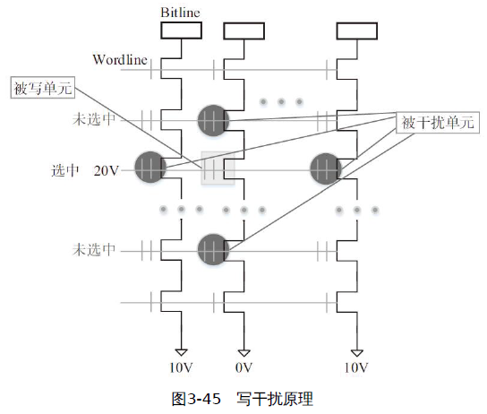

寫某個閃存頁的時候，我們是在其Wordline控制極加一個正電壓（圖3-45中是20V）。 Programmed Cells所在的String是接地的；不需要寫的單元所在的String接一個正電壓（圖3-45中為10V）

Stressed Cell也會被輕微寫，產生非永久性損傷，經擦除後，閃存塊還能再次使用。

與讀干擾不同的是，寫干擾影響的不僅是同一個閃存塊當中的其他閃存頁，自身閃存頁也會受到影響。

<h3 id="3.3.1.4">3.3.1.4 存儲單元間的耦合</h3>

存儲單元之間的耦合影響（Cell-to-Cell interference）

浮柵極閃存存儲電荷的是導體，因此存儲單元之間存在耦合電容，這會使存儲單元內的電荷發生意外變化，最終導致數據讀取錯誤。

<h3 id="3.3.1.5">3.3.1.5 電荷洩漏</h3>

存儲在閃存存儲單元的電荷，如果長期不使用，會發生電荷洩漏。

同樣會導致非永久性損傷，擦除後閃存塊還能使用。

<h2 id="3.3.2">3.3.2 壽命</h2>

0 的區域表示被寫過的那些單元電壓分佈區間
1 的區域表示被擦過的那些單元電壓分佈區間

回憶一下讀數據的原理

- 要讀的單元柵極加0V電壓

- 這時擦過的晶體管閾值電壓是-Vt，導通，溝道有電流，Bitline端的傳感器能夠檢測到，讀到“1”。

- 而經過寫的晶體管閾值電壓是+Vt，不導通，溝道電流很小，讀為“0”。

隨著擦寫次數的增加，會發生3種故障：

- 擦過的晶體管(1的區域)閾值電壓變大，從-Vt向0V靠近，這樣讀的時候溝道電流變小，傳感器檢測不到，讀出錯。
- 寫過的晶體管(0的區域)閾值電壓變小，從+Vt向0V靠近，有可能會被誤檢測為擦過的狀態(1的區域)。
- 寫過的晶體管(0的區域)閾值電壓變大（如圖3-47所示，>5V，即使控制極加5V電壓，它也是截止的），有可能在其他的單元讀的時候，把整個Bitline都給關了。

浮柵晶體管對浮柵極下面的絕緣層（Tunnel氧化物）很敏感，該氧化物厚度變薄（製程不斷減小導致的）或者老化（Degradation，擦寫次數多了）對浮柵極裡面的電荷影響很大，會產生不少Charge Trap，這些陷阱會吃掉電子，導致寫之後，進入浮柵的電子數量會減少，最終的結局就是0和1兩個區間不斷靠近。


如圖3-48所示，上面是寫後的閾值電壓，下面是擦除後的閾值電壓

擦除後的閾值電壓在擦很多次之後顯著變高。所以，一般擦除之後會做校驗，方法是把所有的Wordline設為0V，再去檢測每個Bitline的電流。如果某個Bitline電流是0，就意味著有個單元的擦除閾值電壓接近0V，導致晶體管關斷。所以這個閃存塊應該標為壞塊。

<h2 id="3.3.3">3.3.3 閃存測試</h2>

固態硬盤出廠前要對每一塊閃存進行測試，測試方法如下：

- 測試每個CE是否可以正常操作，比如Reset、Read ID等；
- 對每個LUN、Plane進行讀寫測試，要考慮到一定的比特翻轉率，看看寫入的數據和讀出差距有多大。

<h2 id="3.3.4">3.3.4 MLC使用特性</h2>

擦除一個閃存塊的時間大概是幾毫秒

閃存的讀寫則是以閃存頁為基本單元的，一個閃存頁大小主要有4KB、8KB、16KB幾種

對MLC或者TLC來說，寫一個閃存塊當中的閃存頁，應該順序寫Page0、Page1、Page2、Page3……禁止隨機寫入。但對讀來說，沒有這個限制。 SLC也沒有這個限制。

對MLC來說，一個存儲單元存儲了2bit的數據，對應著兩個Page：Lower Page和Upper Page。因此寫一個閃存頁失敗，可能會導致另外一個閃存頁的數據損壞。

寫Lower Page時間短，寫Upper Page時間長，所以會看到有些閃存頁寫入速度快，有些閃存頁寫入速度慢。

兩條存儲行業的規矩：

- 一般在沒有盤內緩存的情況下，我們認為寫到硬盤的數據如果已經返回寫成功，那麼這個數據就是安全的。數據寫到物理介質上就可以放心了。
- 如果數據在寫的過程中發生了異常掉電，那麼該數據即使丟了也可以接受，畢竟用戶認為數據還沒寫完。

Lower Page數據損壞打破了這個常識，假如數據位於Lower Page上，後面有數據寫對應的Upper Page時發生了異常掉電，會導致Lower Page上已經寫好的數據也被破壞

應對的方法：

- 只寫Lower Page：成本比較高，只適合關鍵數據
- Lower Page和Upper Page一起寫：每次數據量多湊點，爭取Lower Page和Upper Page都寫（需要閃存支持One Pass Programming）。
- 定期填充Upper Page：消費級固態硬盤要求省電，所以會頻繁進入省電模式，可能安靜個幾百毫秒就自動休眠了。休眠之前檢查是不是有Lower Page寫過了，有Upper Page還沒寫的情況，就把Upper Page也寫一下。
- 寫Lower Page數據時，備份該數據到別的閃存塊上，直到它對應的Upper Page數據寫完

降低Lower Page數據損壞的危害？

- 一般是在固態硬盤內配備大電容，發生異常掉電後，大電容儲存的電量可以支撐幾十毫秒，保證正在進行寫操作的閃存把數據寫完。
- 現在主流的企業級固態硬盤控制器不僅能在大電容供電的時間內把閃存正在寫的數據寫完，還能把緩存裡的數據寫完，最後寫一些固態硬盤內部的關鍵管理數據，比如映射表等。

<h2 id="3.3.5">3.3.5 讀干擾</h2>

讀干擾為什麼會導致性能下降？

讀干擾會導致浮柵極進入電子。由於有額外的電子進入，會導致晶體管閾值電壓右移（Data Retention問題導致閾值電壓左移），如圖3-50所示。會導致讀到錯誤的數據

閾值電壓右移的速度，也就是讀干擾影響數據的程度

- 與讀該閃存塊上數據的次數有關，讀得越多，右移越多，影響越大
- 與閃存塊的擦除次數有關，擦寫次數越多，絕緣效果越差，電子進入浮柵極就越容易，讀干擾的影響也就越大。


減小Vpass（加在沒有被讀的那個Wordline上的電壓）可以緩解讀干擾

- 因為Vpass變小，電場減弱，吸入電子的能力減弱，自然能緩解讀干擾的影響。
- 但是現在閃存廠商都沒有開放調Vpass電壓的接口給用戶；
- 另外過低的Vpass可能導致讀失敗

<h2 id="3.3.6">3.3.6 閃存數據保存期</h2>

從寫入操作到電子慢慢洩漏，直到數據出錯，這個期限叫作數據保存期，數據保存時間叫作Data Retention。到了期限，數據就會出錯，無法用ECC糾錯成功

閃存一般有以下錯誤：

- 電氣問題：比如虛焊或者芯片故障，導致正常命令無法執行或者數據錯誤率異常高。這種問題在閃存或固態硬盤出廠測試時就會被發現。
- 讀、寫、擦失敗：基本命令執行失敗，通過狀態位可以讀到結果。這些問題在芯片使用過程中也有可能發生，但是概率非常小。
- ECC糾錯失敗：其實就是數據錯誤率太高，超過了糾錯算法的糾錯能力。 Data Retention是其中一個元兇。

閃存存儲的機理是通過量子隧道效應，電子躍遷到浮柵層並停留在那裡。隨著時間的流逝，電子還是有一定概率離開浮柵層，回到溝道裡面，導致數據出錯

Data Retention和浮柵層下面的氧化層厚度有關，畢竟氧化層越厚，電子離開的概率越小。有研究表明，氧化層厚度如果是4.5nm，那麼理論上數據可以保存10年。


- 控制電壓很高的時候，會產生量子隧穿效應，電子從襯底Substrate出發，穿過隧道氧化層，進入浮柵保存起來，就完成了寫操作。
- 在控制層加很強的負電壓，電子就從浮柵量子隧穿，回到襯底，這個操作叫作擦除
- 控制層不加電壓的時候，氧化層依然會產生一個電場，叫作特徵電場，它是由浮柵裡面的電子產生的。在這個電場的作用下，電子會從浮柵慢慢洩露

Trap-assisted tunneling（TAT）效應會導致數據保存時間越短

- 隨著氧化層老化，有不少通過它的電荷被滯留下來，絕緣體有了導電性。電荷從浮柵跑得就更快了。所以，閃存擦寫次數越多，數據保存時間就越短。

氧化層並不總是在截留電荷，有時候它攔截的電荷也會離開，叫作Charge de-trapping。只不過離開的既有正電荷，也有負電荷，所以對閾值電壓的影響是雙向的。

一般固態硬盤會採用Read Scrub技術，或者叫數據巡檢、掃描重寫技術等來處理Data Retention的問題

- 在固態硬盤不忙的時候，按照一定的算法，掃描全盤，如果發現某個閃存頁翻轉比特數量超過一定閾值，就重寫數據到新的地方

<h2 id="3.4">3.4 閃存數據完整性</h2>

### 讀錯誤來源

擦寫次數增多

- 氧化層逐漸老化，電子進出存儲單元越來越容易

Data Retention

- 存儲在存儲單元的電子會流失，整個閾值電壓分佈向左移動，導致讀數據的時候發生誤判

讀干擾

- 讀一個Wordline數據時，需要施加Vpass電壓在其他Wordline上，導致其他閃存頁發生輕微寫，使閾值電壓分佈發生右移

存儲單元之間干擾

- 由於存儲電子的浮柵極是導體，兩個導體之間構成電容，一個存儲單元電荷的變化會導致其他存儲單元電荷變化


寫錯誤

- 寫錯誤一般發生在MLC或者TLC 2-pass（先寫Lower Page，然後再寫Upper Page）寫過程中

---

使用閃存作為存儲介質的固態硬盤，需要採用一些數據完整性的技術來確保用戶數據可靠不丟失。常見的技術有：

- ECC糾錯。
- RAID數據恢復。
- 重讀（Read Retry）。
- 掃描重寫技術（Read Scrub）。
- 數據隨機化

<h3 id="3.4.2">3.4.2 重讀</h3>

對於電壓分佈平移的問題，因為數據之間還是清楚隔離的。因此可以不斷改變參考電壓來重讀，直到正確讀出數據

理論上，只要這四種狀態的電壓分佈沒有發生重疊，就可以通過重讀恢復數據。


<h3 id="3.4.3">3.4.3 ECC糾錯碼</h3>

目前市面上很多固態硬盤控制器上採用的是BCH，但採用LDPC正成為一種趨勢。

- BCH（Bose、Ray-Chaudhuri與Hocquenghem三位大神名字的首字母）
- LDPC（Low Density Parity Check Code），低密度奇偶檢查碼

閃存頁空間除了用戶空間，還有額外的預留空間，這部分空間可以用來寫ECC校驗數據。糾錯強度受限於閃存頁的預留空間。越多的預留空間就能提供越強的ECC糾錯能力。

目前絕大多數固態硬盤都採用靜態ECC糾錯方案，ECC糾錯單元（用戶數據）和ECC校驗數據大小在整個固態硬盤生命週期都是固定的，也就是說糾錯能力始終保持不變。

動態ECC糾錯方案就是隨著固態硬盤的使用，動態調整其ECC糾錯能力。如果開始使用更少的ECC校驗數據，那麼每個頁能寫入的用戶數據就更多，相當於固態硬盤擁有更多的OP（Over Provisioning，預留空間），減小了寫放大；同時，在數據從控制器寫入或者讀取閃存的通道上，用戶數據越多，ECC校驗數據越小，帶寬利用率高。

<h3 id="3.4.4">3.4.4 RAID</h3>

RAID（Redundant Arrays of Independent Disks）糾錯技術

固態硬盤的RAID一般採用RAID 5

Die P則存儲校驗數據，為Die 0、Die1、Die 2和Die 3數據之“異或”。假設Die 1上出現ECC不可糾的錯誤，那麼可以通過讀取Die 0、Die 2、Die 3和Die P對應位置上的數據，然後做“異或”，就能恢復出Die 1上的數據。


採用RAID 5的固態硬盤只能恢復單個ECC不可糾的數據，如果出現多個ECC不可糾的錯誤，它也無能為力。

由於採用了冗餘糾錯技術，它需要額外的空間來存儲冗餘數據（校驗數據），需要固態硬盤架構的巨大改變

<h3 id="3.4.5">3.4.5 數據隨機化</h3>

不斷地輸入全0或者全1，很容易導致閃存內部電量不均衡，從而造成信號抗干擾性下降，導致這些數據在閃存中可靠性變差。

閃存寫入數據需要做隨機化有兩個原因：

- 讓0和1的分佈充分隔離。
- 降低相鄰單元之間的耦合電壓產生的影響。

在圖3-62中，數據隨機化也可以在ECC校驗之前做，兩者順序可交換。


<h1 id="4">四、SSD核心技術：FTL(Flash Translation Layer，閃存轉換層)</h1>

FTL算法的優劣與否，直接決定了SSD在性能（Performance）、可靠性（Reliability）、耐用性（Endurance）等方面的好壞，FTL可以說是SSD固件的核心組成。

FTL是Flash Translation Layer（閃存轉換層）的縮寫，完成主機（或者用戶，Host）邏輯地址空間到閃存（Flash）物理地址空間的轉換（Translation），或者說映射（Mapping）。

閃存有一些重要的特性，比如：

- 閃存塊（Block）需先擦除才能寫入，不能覆蓋寫（Update in Place）。`GC（Garbage Collection，垃圾回收）`
- 閃存塊都是有一定壽命的，可以用PE（Program/EraseCount）數衡量。`Wear Leveling（耗損平均技術）`
- 每個閃存塊讀的次數是有限的。`Read Disturb（讀干擾）`
- `閃存的數據保持（Data Retention）`
- 閃存天生就有壞塊。`壞塊管理`
- 對MLC或TLC來說，存在`Lower Page corruption`

FTL分為Host Based（基於主機）和Device Based（基於設備）：目前主流SSD都是Device Based FTL

- Host Based表示的是，FTL是在Host（主機）端實現的，用的是你自己計算機的CPU和內存資源

    

- Device Based表示的是，FTL是在Device（設備）端實
現的，用的是SSD上的控制器和RAM資源

    

<h2 id="4.2">4.2 映射管理</h2>

FTL映射


- 有基於塊的映射
  - 每個頁在塊中的偏移保持不變
  - 存儲映射表所需空間小
  - 有好的連續大尺寸的讀寫性能，但小尺寸數據的寫性能是非常糟糕的

    

- 有基於頁的映射
  - 需要較多的空間來存儲映射表。
  - 性能較好，尤其體現在隨機寫上面
  - SSD一般都採用頁映射

    

- 有混合映射（Hybrid Mapping）
  - 每個頁的偏移並不是固定不動的，塊內採用頁映射的方式

    

映射基本原理

- 用戶通過LBA（Logical Block Address，邏輯塊地址）訪問SSD
- 每個LBA代表著一個邏輯塊（大小一般為512B/4KB/8KB……）
- 用戶訪問SSD的基本單元稱為邏輯頁（Logical Page）
- SSD主控是以閃存頁為基本單元讀寫閃存的，我們稱閃存頁為物理頁（Physical Page）
- SSD內部維護了一張邏輯頁到物理頁地址轉換的映射表（Map Table）

    

用戶每寫入一個邏輯頁，就會產生一個新的映射關係，這個映射關係會加入（第一次寫）或者更改（覆蓋寫）映射表。
當讀取某個邏輯頁時，SSD首先查找映射表中該邏輯頁對應的物理頁，然後再訪問閃存讀取相應的用戶數據。

由於閃存頁和邏輯頁大小不同，一般前者大於後者，所以實際上不會是一個邏輯頁對應一個物理頁，而是若干個物理頁寫在一個邏輯頁

>假設我們有一個256GB的SSD，以4KB大小的邏輯頁為例，那麼用戶空間一共有64M（256GB/4KB）個邏輯頁，也就意味著SSD需要有能容納64M條映射關係的映射表。映射表中的每個單元（entry）存儲的就是物理地址（Physical Page Address），假設其為4字節（32bits），那麼整個映射表的大小為64M×4B=256MB。

一般來說，映射表大小為SSD容量大小的千分之一，準確來說，映射表大小是SSD容量大小的1/1024

絕大多數SSD，我們可以看到上面都有板載DRAM，其主要作用就是存儲這張映射表


入門級SSD或者移動存儲設備（比如eMMC、UFS），出於成本和功耗考慮，它們採用DRAM-Less設計，即不帶DRAM。它採用二級映射（見圖4-8）。一級映射表常駐SRAM，二級映射表小部分緩存在SRAM，大部分都存放在閃存上。


Host Memory Buffer (HMB, 主機高速緩衝存儲器)

- 映射表除了可以放在板載DRAM、SRAM和閃存中，它還可以放到主機的內存中
- SSD訪問主機端DRAM的速度肯定比訪問SSD端DRAM的速度要慢，但還是比訪問閃存的速度（約40μs）要快


映射表刷新

- 映射表在SSD掉電前，是需要把它寫入到閃存中去的
- 下次上電初始化時，需要把它從閃存中部分或全部加載到SSD的緩存（DRAM或者SRAM）中
- SSD運行過程中，按照一定策略把映射表寫進閃存。這樣，即使發生異常掉電，丟失的也只是一小部分映射關係，上電時可以較快地重建這些映射關係。

觸發映射表的寫入：

- 新產生的映射關係累積到一定的閾值
- 用戶寫入的數據量達到一定的閾值
- 閃存寫完閃存塊的數量達到一定的閾值
- Others

寫入策略：

- 全部更新
  - 緩存中映射表（乾淨的和不干淨的）全部寫入到閃存

- 增量更新
  - 把新產生的（不干淨的）映射關係刷入到閃存中去

<h2 id="4.3">4.3 垃圾回收</h2>

GC（Garbage Collection, 垃圾回收）
WA（Write Amplification, 寫放大）
OP（Over Provisioning, 預留空間）

垃圾回收原理

- 垃圾回收，就是把某個閃存塊上的有效數據（圖4-19中淺色方塊）讀出來，重寫，然後把該閃存塊擦除，就得到新的可用閃存塊了。

    

    

- SSD越寫越慢，是因為早期沒有觸發GC，無須額外的讀寫，所以速度很快。慢慢地SSD會變慢是因為SSD需要做GC。
- 如果用戶順序寫的話，垃圾比較集中，利於SSD做垃圾回收；如果用戶是隨機寫的話，垃圾產生比較分散，SSD做垃圾回收相對來說就更慢

WA（Write Amplification, 寫放大）

- 由於GC的存在，用戶要寫入一定的數據，SSD為了騰出空間寫這些數據，需要額外的做一些數據的搬移，也就是額外的寫，導致SSD往閃存中寫入的數據量比實際用戶寫入SSD的數據量多

$$
WA = \frac{寫入閃存的數據量}{用戶寫的數據量}
$$

- 對空盤來說（未觸發GC），寫放大一般為1
- 寫放大越大，意味著額外寫入閃存的數據越多，一方面磨損閃存，減少SSD壽命
- 寫入這些額外數據會佔用底層閃存帶寬，影響SSD性能
- SSD設計的一個目標是讓WA盡量小，WA越小越好，因為越小意味著對閃存的損耗越小，可以延長閃存使用壽命

增大OP（Over Provisioning, 預留空間）可以減小寫放大

$$
OP = \frac{(閃存空間-用戶空間)}{用戶空間}
$$

- OP越大，每個閃存塊有效數據越少，垃圾越多，因此需要重寫更少的數據，因此寫放大越小

    

影響寫放大的因素主要有：

- OP
- GC策略
- 磨損平衡
- 讀干擾（Read disturb）和數據保存處理（Data Retention handling）
- 帶壓縮和不帶壓縮的控制器
- Trim

垃圾回收實現可以簡單地分為三步：

1. 挑選源閃存塊
   - BPA算法(Greedy算法)：挑選有效數據最小的塊，寫放大自然最小。但固件在寫用戶數據時要記錄和維護每個用戶閃存塊的有效數據量
   - 磨損平衡算法：期望挑選擦寫次數最小的（分攤擦寫次數到每個閃存塊）
   - 給有效數據和擦寫次數設定一個權重因子
2. 從源閃存塊中找有效數據
   - 固件不僅僅只更新和維護閃存塊的有效數據量，還給閃存塊一個Bitmap表，標識哪個物理頁是否有效

    

   - 對帶DRAM的SSD來說，Bitmap的存儲空間可能不是問題
   - 對DRAM-Less的SSD來說，由於SRAM受限，只能在SRAM中加載部分閃存塊的Bitmap，因此還需要Bitmap的換入換出
   - SSD在把用戶數據寫到閃存的時候，會額外打包一些數據，我們叫它元數據（Meta Data），它記錄著該筆用戶數據的相關信息，比如該筆數據對應的邏輯地址、數據長度，以及時間戳（數據寫入到閃存的時間）等
   - FW把數據讀上來，就獲得了該筆數據對應的LBA，要判斷該數據是否無效，需要查找映射表，獲得該LBA對應的物理地址，如果該地址與該數據在閃存塊上的地址一致，就說明是有效的，否則該數據就是無效的。

    

   - 把源閃存塊裡的全部數據讀出來，這種方式的缺點顯而易見：GC做得慢。折中的辦法。就是除了維護L2P（Logical to Physical）的映射表，還維護一張P2L（Physical to Logical）的表。
   - P2L（Physical to Logical）記錄了每個閃存塊寫入的LBA。當回收該閃存塊時，首先把該P2L表加載上來，然後根據上面的LBA，依次查找映射表，決定該數據是否有效

3. 把有效數據寫入到目標閃存塊

垃圾回收時機

- Foreground GC（前台垃圾回收）：如果可用的閃存塊小於一定閾值，這時就需要做GC，以騰出空間給用戶寫，屬於被動方式。
- Background GC（後台垃圾回收）：在SSD空閒（Idle）的時候，SSD主動去做的GC，這樣在用戶寫入的時候就有充裕的可用閃存塊，可以改善用戶寫入性能。但是會消耗功耗

<h2 id="4.4">4.4 Trim</h2>

作業系統文件與SSD

- 對一個文件File A來說，用戶看到的是文件，操作系統把文件劃分為若干個邏輯塊，然後寫入SSD的閃存空間
- 當用戶刪除掉文件File A時，其實它只是切斷用戶與操作系統的聯繫，即用戶訪問不到這些地址空間
- 在SSD內部，邏輯頁與物理頁的映射關係還在，文件數據在閃存當中也是有效的


在沒有Trim之前，SSD無法知道那些被刪除的數據頁是否無效，必須等到系統要求在相同的地方（用戶空間、邏輯空間）寫入數據時才知道那些數據是無效的，進而放心刪除。

由於SSD不知道這些刪除的數據已經無效，在做垃圾回收的時候，仍把它當作有效數據進行數據的搬移，這不僅影響到GC的性能，還影響到SSD的壽命（寫放大增大）

Trim是一個新增的ATA(AT Attachment)命令（Data Set Management），專為SSD而生

- SCSI裡面的同等命令叫UNMAP，
- NVMe裡面叫Deallocate。

當用戶刪除一個文件時，操作系統會發Trim命令給SSD，告訴SSD該文件對應的數據無效了

一般FTL都有這3個表：

- FTL映射表記錄每個LBA對應的物理頁位置
- Valid Page Bit Map（VPBM）記錄每個物理塊上哪個頁有有效數據
- Valid Page Count（VPC）則記錄每個物理塊上的有效頁個數


SSD收到Trim命令後，為了實現數據刪除，固件要按順序做以下的事情：


<h2 id="4.5">4.5 磨損平衡</h2>

讓SSD中的每個閃存塊的磨損（擦除）都保持均衡

一個閃存塊，如果其擦寫次數超過一定的值，那麼該塊就變得不那麼可靠了，甚至變成壞塊不能用了。如果不做磨損平衡，則有可能出現有些閃存塊頻繁拿來做擦寫，這些閃存塊很容易就會壽終正寢


根據EC（Erase Count，擦除次數）可以區分SSD中年老的塊和年輕的塊

SSD一般有動態磨損平衡（Dynamic WL）和靜態磨損平衡（Static WL）兩種算法。

- 動態磨損平衡算法：的基本思想是把熱數據寫到年輕的塊上，即在拿一個新的閃存塊用來寫的時候，挑選擦寫次數小的
- 靜態磨損平衡算法：基本思想是把冷數據寫到年老的塊上，即把冷數據搬到擦寫次數比較多的閃存塊上

固件具體做靜態磨損平衡的時候，一般使用GC機制來做，只不過它挑選源閃存塊時，不是挑選有效數據最小的閃存塊，而是挑選冷數據所在的閃存塊。

靜態磨損平衡可能導致冷數據和熱數據混在同一個閃存塊上，即冷數據可能跟用戶剛寫入的數據混在一起，或者冷數據和GC的數據寫在一起，或者三者寫在一起。


解決辦法如圖4-42所示，做靜態磨損平衡的時候，用專門的閃存塊來放冷數據，即不與用戶或者GC寫入同一個閃存塊。避免了這些冷數據的頻繁搬移。


<h2 id="4.6">4.6 掉電恢復</h2>

掉電分兩種：

- 正常掉電
- 異常掉電

重新上電後，SSD都需要能從掉電中恢復過來，繼續正常工作

正常掉電：在掉電前，主機會通過命令通知SSD，比如SATA中的Idle Immediately，SSD收到該命令後，主要會做以下事情

- 把buffer中緩存的用戶數據刷入閃存。
- 把映射表刷入閃存。
- 把閃存的塊信息寫入閃存（比如當前寫的是哪個閃存塊，以及寫到該閃存塊的哪個位置，哪些閃存塊已經寫過，哪些閃存塊又是無效的等）。
- 把SSD其他信息寫入閃存
- 主機等SSD處理完以上事情后，才會真正停止對SSD的供電
- 重新上電後，SSD只需把掉電前保存的相關信息（比如映射數據，閃存塊信息等）重新加載，又能接著掉電前的狀態繼續工作

異常掉電：
1. 就是SSD在沒有收到主機的掉電通知時就被斷電
2. 收到主機的掉電通知，但還沒有來得及處理上面提到的那些事情，就被斷電了

- 導致數據的丟失，比如緩存在SSD中的數據來不及寫到閃存
- 掉電發生在寫MLC的Upper page，會導致其對應的Lower Page數據遭到破壞
- 導致RAM中映射表丟失。映射表數據很重要，對一個邏輯地址，如果SSD查找不到對應的物理地址，它就無法從閃存上讀取數據返回給主機。

一個SSD，除了數據掉電不丟失的閃存，還需要有掉電數據丟失的RAM、SRAM或者DRAM

- 閃存的作用是存儲數據
- RAM的作用主要是SSD工作時用以緩存用戶數據和存放映射表（Map Table，邏輯地址映射閃存物理地址）

防止異常掉電導致的數據丟失的設計

- 在SSD上加電容
  - SSD一旦檢測到掉電，就讓電容開始放電，然後把RAM中的數據刷到閃存上面去，從而避免數據丟失
  - 帶電容的SSD，還是需要設計異常掉電處理模塊，因為電容不能100%保證SSD在掉電前把所有的信息刷入閃存。

- 把RAM這種Volatile（掉電數據丟失）的東西，用Non-Volatile（掉電數據不丟失）的東西來替代
  - 但要求這種Non-Volatile的東西性能上接近RAM
  - Intel和Micron合作開發的3D XPoint

SSD的異常掉電恢復主要就是映射表的恢復重建

- SSD在把用戶數據寫到閃存的時候，會額外打包一些數據，我們叫它元數據（Meta Data），它記錄著該筆用戶數據的相關信息，比如該筆數據對應的邏輯地址、數據寫入時間（時間戳）等，如圖4-43所示。

    

- 以圖4-44為例，如果我們讀取物理地址Pa x，就能讀取到元數據x和用戶數據x，而元數據是有邏輯地址La x的，因此，我們就能獲得映射：La x→Pa x

    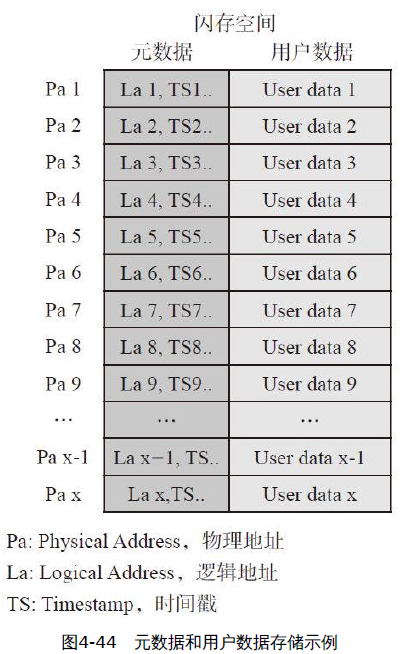

映射表的恢復原理其實很簡單，只要全盤掃描整個閃存空間，就能獲得所有的映射關係，最終完成整個映射表的重構。

原理簡單，但實現起來還有一些問題需要考慮，比如

- 如何解決數據新舊問題
  - SSD可以依賴Meta data中的時間戳來區分新舊數據的
- 重構速度問題
  - 全盤掃描有一個問題，就是映射表恢復很慢，所耗的時間與SSD容量成正比
  - SSD定期把SSD中RAM的數據（包括映射表和緩存的用戶數據）和SSD相關的狀態信息（諸如閃存塊擦寫次數、閃存塊讀次數、閃存塊其他信息等）寫入到閃存中去
  - Checkpoint（檢查點，譯為快照）
  - 從快照C處到X處新產生的映射關係丟失。由於之前絕大多數的映射關係都被快照C保存，因此需要重建的映射關係僅僅是快照C之後產生的映射關係，這部分關係的恢復，僅需掃描一些局部的物理空間

    

<h2 id="4.7">4.7 壞塊管理</h2>

壞塊來源

- 出廠壞塊（Factory Bad Block）：閃存從工廠出來，就或多或少的有一些壞塊。
- 增長壞塊（Grown Bad Block）：隨著閃存的使用，一些初期好塊也會變成壞塊。變壞的原因，主要是擦寫磨損。

一般來說，剛出廠的閃存都被擦除，裡面的數據是全0xFF。但是對壞塊來說，閃存廠商會打上不同的標記。

- 拿TOSHIBA某型號閃存來說，它是這樣標記出廠壞塊的，如圖4-47所示

    

  - 在出廠壞塊的第一個閃存頁和最後一個閃存頁的數據區第一個字節和Spare區第一個字節寫上一個非0xFF的值。

用戶在使用閃存的時候，首先應該按照閃存文檔，掃描所有的閃存塊，把壞塊剔除出來，建立一張壞塊表


有些閃存廠商，它會把壞塊信息存儲在閃存內部某個地方（掉電不丟失），用戶在建立壞塊表的時候，沒有必要掃描所有的閃存塊來識別壞塊，只需讀取閃存的那個特定區域。

- 如Micron，它的閃存內部有個叫OTP（One Time Programming）的區域，出廠壞塊信息可以存在裡面

增長壞塊的出現會通過讀寫擦等操作反映出來。比如讀到UECC（Uncorrectable Error Correction Code，數據沒有辦法通過ECC糾錯恢復）、擦除失敗、寫失敗，這都是一個壞塊出現的症狀

壞塊管理策略

1. 略過（Skip）策略

- 用戶根據建立的壞塊表，在寫閃存的時候，一旦遇到壞塊就跨過它，寫下一個Block。

- Die 1上有個Block B是壞塊，則寫完Block A時，接下來便會跨過Block B寫到Die 2的Block C上面去。

    

2. 替換（Replace）策略

- 當某個Die上發現壞塊時，它會被該Die上的某個好塊替換

- 用戶在寫數據的時候，不是跨過這個Die，而是寫到替換塊上面去

- 除正常用戶使用的閃存塊，還需額外保留一部分好的閃存塊，用於替換用戶空間的壞塊。整個Die上閃存塊就劃分為兩個區域：用戶空間和預留空間，如圖4-50所示

    

- SSD內部需維護一張重映射表（Remap Table）：壞塊到替換塊的映射，比如圖4-51的B→B'

    

略過策略的劣勢在於性能不穩定。以4個Die為例，略過策略可能導致Die的並行度在1和4個Die之間，而替換策略並行度總是4個Die

替換策略有木桶效應，如果某個Die質量比較差，則整個SSD可用的閃存塊則受限於那個壞的Die

<h2 id="4.8">4.8 SLC cache</h2>

SLC相對MLC和TLC來說，有更好的讀寫性能和更長的壽命（Endurance）


有些SSD拿它來做Cache使用，讓SSD具有更好的突發性能（Burst Performance）

SLC Cache，不是說單獨拿SLC閃存來做Cache，而是把MLC或者TLC裡面的一些閃存塊配置成SLC模式來訪問，而這個特性一般的MLC或者TLC都是支持的。

1. 性能考慮
2. 防止Lower Page數據被帶壞
3. 解決閃存的缺陷
4. 更多的數據寫入量

消費級SSD和移動存儲產品（比如eMMC、UFS等）使用SLC Cache

- 使用SLC Cache具有更好的突發性能
- 一般都沒有電容保護，使用SLC Cache能保證Lower Page數據不丟失

企業級SSD不使用使用SLC Cache

- 它追求的是穩態速度，它不希望SSD一下子速度飆升（寫SLC），然後一下子速度急劇下降（寫TLC）
- 一般都配有電容，能保證閃存的正常寫入，它不存在Lower Page數據被帶壞的問題，所以沒有必要採用SLC Cache這種手段來保護數據

SLC Cache寫入策略：

1. 強制SLC寫入：

- 用戶寫入數據時，必須先寫入到SLC閃存塊，然後通過GC搬到MLC或者TLC閃存塊
- 能保護Lower Page數據
- 一方面要把SLC的數據搬到MLC或者TLC，以騰出SLC空間供新用戶數據的寫入，同時又要把用戶數據寫入到SLC，性能肯定比只寫MLC或者TLC慢

2. 非強制SLC寫入：

- 用戶寫入數據時，如果有SLC閃存塊，則寫入到SLC閃存塊，否則直接寫到MLC或者TLC閃存塊
- 不能保護Lower Page數據
- 有更好的後期寫入性能，因為在SLC閃存塊耗盡的情況下，用戶數據直接寫入到MLC或者TLC

雖然GC（數據搬移）還是存在Lower Page數據被帶壞的可能，但如果我們在目標閃存塊沒有被寫滿前，不把源閃存塊擦除，這樣即使Lower Page數據被帶壞，它還是能通過讀源閃存塊恢復數據

根據SLC閃存塊的來源：

1. 靜態SLC Cache：拿出一些Block專門用做SLC Cache
2. 動態SLC Cache：所有的MLC或者TLC都有可能挑來當SLC
Cache，SLC和TLC不分家
3. 兩者混合：即既有專門的SLC閃存塊，還能把其他通用閃存塊拿來當SLC Cache

<h2 id="4.9">4.9 Read Disturb(RD) & Data Retention(DR)</h2>

Read Disturb與Data Retention都能導致數據丟失，但原理與固件處理方式不一樣

Read Disturb

- 對一個閃存塊來說，每次讀其中的一個閃存頁，都需要在其他字線（Wordline）上加較高的電壓以保證晶體管導通，有點像在做輕微的"寫入（Program）"
- 隨著次數越多，電子進入浮柵極過多，從而導致比特翻轉：1→0。當出錯比特數超出ECC的糾錯能力時，數據就會丟失。
- 如果我們能保證某個閃存塊讀的次數低於某個閾值，在比特發生翻轉之前（或者翻轉的比特低於某個值時），就對這個閃存塊上的數據進行一次刷新
  - 把閃存塊上的數據搬到別的閃存塊上
  - 先搬到別的閃存塊上，然後擦除原閃存塊後，再复制回來
- FTL應該有記錄每個閃存塊讀次數的一張表
  - 每讀一次該閃存塊，對應的讀次數加1
  - FW檢測到某個閃存塊讀的次數超過某個閾值，就刷新該閃存塊
- 刷新動作，有Block（阻塞）和Non-block（非阻塞）兩種處理方式，現在的FTL一般都採用非阻塞的刷新處理方式

Data Retention

- 絕緣氧化層把存儲在浮柵極的電子關在裡面，但是，隨著時間的推移，還是有電子從裡面跑出來
- 當跑出來的電子達到一定數量時，就會使存儲單元的比特發生翻轉：0→1（注意，RD是使1翻轉為0），當出錯比特數超出ECC的糾錯能力，數據就丟失
- FTL在SSD上電或者平時運行時，每隔一段時間對閃存空間進行掃描，當發現比特翻轉超出一定閾值時，跟RD處理一樣，進行數據刷新

<h2 id="4.10">4.10 Host Based FTL & Device Based FTL</h2>


Device Based是個通用的架構：

- CPU製造商提供PCIe或者SATA支持
- 主板和服務器製造商為SSD提供接口和槽位
- 操作系統開發商提供SSD標準化驅動程序
- SSD製造商只需要製造出符合SATA、SAS或NVMe標準的SSD

Device Based存在以下缺點：

- FTL架構通用，不能針對具體應用做定制化
- 控制器芯片功能複雜，設計難度大，研發成本高
- 閃存更新很快，有新的使用特性，需要控制器芯片做出修改，但是芯片改版成本很高
- 企業級應用需要高性能、大容量，通用控制器芯片支持的最大性能和容量有限制。

Host Based SSD：

- 一般的模式是把閃存的讀寫接口直接開放給驅動程序，這樣驅動程序就能自行管理閃存內部資源
- 控制器大都採用可編程邏輯器件FPGA，功能比較簡單，主要實現ECC糾錯和閃存時序控制。
- 主機驅動直接管理閃存陣列，控制器只是起到ECC糾錯算法和物理協議轉換的作用


<h1 id="5">五、PCIe介紹</h1>

<h2 id="5.1">5.1 PCIe的速度</h2>


- 表中的帶寬，比如PCIe3.0×1，帶寬為2GB/s，是指雙向帶寬，即讀寫帶寬。如果單指讀或者寫，該值應該減半，即1GB/s的讀速度或者寫速度。
  - PCIe是串行總線
  - PCIe1.0 & PCIe2.0: 8/10編碼
  - PCIe3.0: 128/130編碼

鏈接速度（×1、×2、×4）指PCIe連接的通道（Lane），PCIe是可以最多有32個Lane的

兩個設備之間的PCIe連接，叫作一個Link，如圖5-2所示


SATA是什麼工作模式如圖5-3所示


- 和PCIe一樣，SATA也有獨立的發送和接收通道，但與PCIe工作模式不一樣，同一時間，只有一條通道可以進行數據傳輸，這種工作模式稱為半雙工模式
- PCIe猶如我們的手機，雙方可以同時講話，而SATA就是對講機了，一個人在說話，另外一個人就只能聽不能說。
- 和SATA單通道不同，PCIe連接可以通過增加通道數擴展帶寬，彈性十足。通道數越多，速度越快。不過，成本越高，佔用更多空間與更耗電
- 現有的PCIe SSD一般最多使用4通道，如PCIe3.0x4，雙向帶寬為8GB/s，讀或者寫帶寬為4GB/s。

PCIe是從PCI發展過來的，PCIe的“e”是express的簡稱，表示“快”

- PCI使用並口傳輸數據，而PCIe使用的是串口傳輸
- PCI並行總線，單個時鐘週期可以傳輸32bit或64bit，在實際時鐘頻率比較低的情況下，並口因為可以同時傳輸若干比特，速率確實比串口
- 隨著技術的發展，要求數據傳輸速率越來越快，要求時鐘頻率也越來越快，但是，並行總線時鐘頻率不是想快就能快的
- 採用並行傳輸，接收端必須等最慢的那個bit數據到了以後，才能鎖住整個數據
- 如果使用多條Lane傳輸數據（串行中又有並行），這個問題又回來了，不過PCIe有將其處理好

<h2 id="5.2">5.2 PCIe拓撲結構</h2>

設備抽象為一個點，傳輸介質抽象為一條線

PCI採用的是總線型拓撲結構

- 一條PCI總線上掛著若干個PCI終端設備或者PCI橋設備，大家共享該條PCI總線，哪個人想說話，必須獲得總線使用權，然後才能發言

    

PCIe則採用樹形拓撲結構

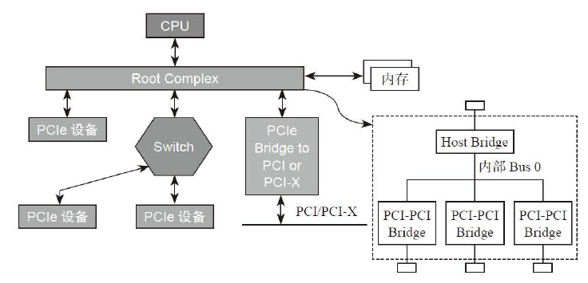

- Root Complex（RC）是樹的根，它為CPU代言，與整個計算機系統其他部分通信，比如CPU通過它訪問內存，通過它訪問PCIe系統中的設備。
- PCIe Endpoint，就是PCIe終端設備，比如PCIe SSD、PCIe網卡等，這些Endpoint可以直接連在RC上，也可以通過Switch連到PCIe總線上。
- Switch用於擴展鏈路，提供更多的端口用以連接Endpoint

Switch擴展了PCIe端口，並為掛在它上面的設備（Endpoint或者Switch）提供路由和轉發服務

- 靠近RC的那個端口，我們稱為上游端口（Upstream Port）
- 分出來的其他端口，我們稱為下游端口（Downstream Port）
- 一個Switch只有一個上游端口，可以擴展出若干個下游端口
- 下游端口可以直接連接Endpoint，也可以連接Switch，擴展出更多的PCIe端口
- 每個Switch內部，也是有一根內部PCIe總線的，然後通過若干個Bridge，擴展出若干個下游端口

    

雖然PCIe採用點到點通信，即理論上任何兩個Endpoint都可以直接通信，但實際中很少這樣做，因為兩個不同設備的數據格式不一樣，除非這兩個設備是同一個廠商的

通常都是Endpoint與RC通信，或者Endpoint通過RC與另外一個Endpoint通信

<h2 id="5.3">5.3 PCIe分層結構</h2>

PCIe定義了下三層：事務層（Transaction Layer）、數據鏈路層（Data Link Layer）和物理層（Physical Layer，包括邏輯子模塊和電氣子模塊）


PCIe傳輸的數據從上到下，都是以數據包（Packet）的形式傳輸的，每層數據包都是有其固定的格式。

- 事務層的主要職責是創建（發送）或者解析（接收）TLP（Transaction Layer Packet）、流量控制、QoS、事務排序等。
- 數據鏈路層的主要職責是創建（發送）或者解析（接收）DLLP（Data Link Layer Packet）、Ack/Nak協議（鏈路層檢錯和糾錯）、流控、電源管理等。
- 物理層的主要職責是處理所有的Packet數據物理傳輸，發送端數據分發到各個Lane傳輸（Stripe），接收端把各個Lane上的數據匯總起來（De-stripe），每個Lane上加擾（Scramble，目的是讓0和1分佈均勻，去除信道的電磁干擾EMI）和去擾（De-scramble），以及8/10或者128/130編碼解碼等。


發送方打包與接收方解包的TLP過程


每個Endpoint都需要實現這三層，每個Switch的Port也需要實現這三層

Switch的主要功能是轉發數據，為什麼還需要實現事務層？ Switch必須實現這三層，因為數據的目的地信息是在TLP中的，如果不實現這一層，就無法知道目的地址，也就無法實現數據尋址路由。


<h2 id="5.4">5.4 PCIe TLP類型</h2>

主機與PCIe設備之間，或者PCIe設備與設備之間，數據傳輸都是以Packet形式進行的

根據軟件層的不同請求，事務層產生四種不同的TLP請求：

- Memory：訪問內存空間
- IO：訪問IO空間
- Configuration：配置空間
- Message：
  - 過去一些由邊帶信號線傳輸的數據，比如中斷信息、錯誤信息等，現在就交由Message來傳輸了。
  - Message請求是PCIe新加的。在PCI或者PCI-X時代，像中斷、錯誤以及電源管理相關信息，都是通過邊帶信號（Sideband Signal）進行傳輸的
  - PCIe幹掉了這些邊帶信號線，所有的通信都是走帶內信號，即通過Packet傳輸

新的PCIe設備（區別於LegacyPCIe設備）只支持內存映射，之所以還存在訪問IO空間的TLP，完全是為了照顧那些老設備。以後IO映射的方式會逐漸取消，為減輕學習壓力，我們以後看到IO相關的東西，大可忽略掉

如果需要對方響應(返回一個Completion TLP來作為響應)的，我們稱之為Non-Posted TLP

- Configuration和IO訪問，無論讀寫，都是Non-Posted的，這樣的請求必須得到設備的響應
- Memory Read


如果不指望對方給響應(返回一個Completion TLP來作為響應)的，我們稱之為Posted TLP

- Message TLP
- Memory Write

    

除了Endpoint之外，還有Switch這個PCIe設備，因此在Configuration中以Type0與Type1來區分


對Read Request來說，響應者通過Completion TLP返回請求者所需的數據，這種CompletionTLP包含有效數據；

對Write Request（現在只有ConfigurationWrite了）來說，響應者通過Completion TLP告訴請求者執行狀態，這樣的Completion TLP不含有效數據。

PCIe裡面所有的TLP=Request TLP+Completion TLP


一個TLP最多只能攜帶4KB有效數據

- 如果PCIe設備C需要讀16KB的數據，則RC必須返回4個CplD給PCIe設備C
- PCIe設備C只需發1個MRd就可以

<h2 id="5.5">5.5 PCIe TLP結構</h2>

TLP主要由三部分組成：Header、Data（可選，取決具體TLP類型）和ECRC（可選）

TLP都是始於發送端的事務層（Transaction layer），終於接收端的事務層。


- 事務層根據上層請求內容，生成TLP Header。 Header內容包括發送者的相關信息、目標地址（該TLP要發給誰）、TLP類型（諸如前面提到的Memory Read、Memory Write）、數據長度（如果有的話）等。
- Data Payload域，用以放有效載荷數據。該域不是必需的，因為並不是每個TLP都必須攜帶數據
- ECRC（End to End CRC）域，它對之前的Header和Data（如果有的話）生成一個CRC，在接收端根據收到的TLP重新生成Header和Data（如果有的話）的CRC，與收到的CRC比較，一樣則說明數據在傳輸過程中沒有出錯，否則就有錯。它也是可選的，可以設置不加CRC。

一個Header大小可以是3DW，也可以是4DW。以4DW的Header為例


- 深色區域為所有TLP Header公共部分，所有Header都有這些；其他則跟具體的TLP相關。
- Fmt：Format，表明該TLP是否帶有數據，Header是3DW還是4DW。
- Type：TLP類型，上一節提到的，包括Memory Read、Memory Write、Configuration Read、Configuration Write、Message和Completion等。
- TC：Traffic Class，TLP也分三六九等，優先級高的先得到服務。 TC：3bit，說明可以分為8個等級，0～7，
- Attr：Attrbiute，屬性
- TH：TLP Processing Hints。
 -TD：TLP Digest，之前說ECRC可選，如果這個bit置起來，說明該TLP包含ECRC，接收端應該做CRC校驗。
- EP：Poisoned Data，“有毒”的數據，遠離。
- AT：Address Type，地址種類。
- Length：Payload數據長度，10個bit，最大為1024，單位為DW，所以TLP最大數據長度是4KB；該長度總是DW的整數倍，如果TLP的數據不是DW的整數倍（不是4Byte的整數倍），則需要用到Last DW BE和1st DW BE這兩個域。

TLP格式和類型域編碼


Memory TLP


- TLP的源和目標。因為不同的TLP類型，尋址方式不同，因此要結合具體TLP來看。
- 對一個PCIe設備來說，它開放給主機訪問的設備空間首先會映射到主機的內存空間，主機如果想訪問設備的某個空間，TLP Header當中的地址應該設置為該訪問空間在主機內存的映射地址。
- 對4GB內存空間，32bit的地址用1DW就可以表示，該地址位於Byte8-11；而4GB以上的內存空間，需要用2DW表示地址，該地址位於Byte8-15。
- Memory TLP的目標是通過內存地址告知的，而源則是通過“Requester ID”告知的。每個設備在PCIe系統中都有唯一的ID，該ID由總（Bus）、設備（Device）、功能（Function）三者唯一確定

Configuration TLP


- Endpoint和Switch的配置（Configuration）格式不一樣，分別由Type 0和Type 1來表示。
- Number+Device+Function就唯一決定了目標設備
- Ext Reg Number+Register Number相當於配置空間的偏移

Message TLP

- 取代PCI時代的邊帶信號傳輸，用於傳輸中斷、錯誤、電源管理等信息，

Completion TLP

- 有Non-Posted Request TLP，才有Completion TLP

<h2 id="5.6">5.6 PCIe配置和地址空間</h2>

配置空間：

- 每個PCIe設備都有這樣一段空間，主機軟件可以通過讀取它獲得該設備的一些信息，也可以通過它來配置該設備
- 整個配置空間就是一系列寄存器的集合，由兩部分組成：64B的Header和192B的Capability數據結構。
- PCIe把整個配置空間由256B擴展成4KB，前面256B保持不變（見圖5-28）

    

地址空間 BAR（Base Address Register）

- Endpoint Configuration（Type 0）提供了最多6個BAR
- Switch（Type 1）來說只有2個


CPU只能直接訪問主機內存（Memory）空間（或者IO空間），不能對PCIe等外設進行直接操作，可以透過RC去辦。比如，

- 如果CPU想讀PCIe外設的數據，先叫RC通過TLP把數據從PCIe外設讀到主機內存，然後CPU從主機內存讀數據；
- 如果CPU要往外設寫數據，則先把數據在內存中準備好，然後叫RC通過TLP寫入到PCIe設備

上電的時候，系統把PCIe設備開放的空間（系統軟件可見）映射到內存地址空間，CPU要訪問該PCIe設備空間，只需訪問對應的內存地址空間。 RC檢查該內存地址，如果發現該內存空間地址是某個PCIe設備空間的映射，就會觸發其產生TLP，去訪問對應的PCIe設備，讀取或者寫入PCIe設備。

對於PCIe設備，系統軟件是如何為其分配映射空間的（見圖5-32）


- 上電時，系統軟件首先會讀取PCIe設備的BAR0，得到數據
- 然後系統軟件往該BAR0寫入全1
- BAR寄存器有些bit是只讀的，是PCIe設備在出廠前就固定好的bit，寫全1進去，如果值保持不變，就說明這些bit是廠家固化好的，這些固化好的bit提供了這塊內部空間的一些信息：
  - 低12位沒變，表明該設備空間大小是4KB（2的12次方字節）
  - 低4位表明了該存儲空間的一些屬性（IO映射還是內存映射？32bit地址還是64bit地址？能否預取？
- 系統軟件根據這些信息，在系統內存空間找到這樣一塊地方來映射這4KB的空間，把分配的基地址寫入到BAR0（見圖5-35）。

    

- 系統軟件依次讀取BAR1、BAR2……直到BAR5，完成所有內部空間的映射。

前面說每個PCIe設備都有一個配置空間，其實這樣的說法是不准確的，而是每個PCIe設備至少有一個配置空間。一個PCIe設備可能具有多個功能（Function），比如既能當硬盤，還能當網卡，每個功能對應一個配置空間。


因此，在整個PCIe系統中，只要知道了Bus No. + DeviceNo. + Function No.，就能找到唯一的Function。尋址基本單元是功能，它的ID由Bus + Device + Function組成（BDF）

- 一個PCIe系統，可以最多有256條Bus，每條Bus上最多可以掛32個設備，而每個設備最多又能實現8個Function，每個Function對應4KB的配置空間
- 上電時，這些配置空間都需要映射到主機的內存地址空間（PCIe域，非DRAM區域）。這塊內存地址映射區域大小為：256×32×8×4KB=256MB

只有RC才能發起Configuration的訪問請求，其他設備是不允許對別的設備進行Configuration讀寫的。

<h2 id="5.7">5.7 TLP的路由</h2>

PCIe共有三種路由方式：

- 基於地址（Memory Address）路由
- 基於設備ID（Bus Number + Device Number + Function Number）路由
- 基於隱式（Implicit）路由


地址路由

- Switch負責路由和TLP的轉發，而路由信息是存儲在Switch的Configuration空間的
- BAR0和BAR1沒有什麼好說，跟前節講的Endpoint的BAR意義一樣，存放Switch內部空間在主機內存空間映射基址。
- Switch有一個上游端口（靠近RC）和若干個下游端口，每個端口其實是一個Bridge，都有一個Configuration
  - 每個Configuration描述了其下面連接設備空間映射的範圍，分別由Memory Base和Memory Limit來表示
  - 對上游端口，其Configuration描述的地址範圍是它下游所有設備的映射空間範圍
  - 對每個下游端口的Configuration，描述了連接它端口設備的映射空間範圍

- Memory Read或者Memory Write TLP的Header裡面都有一個地址信息，該地址是PCIe設備內部空間在內存中的映射地址（見圖5-40）。

    

- 當一個Endpoint(一個Switch上游端口)收到一個Memory Read或者Memory WriteTLP，它會把TLP Header中的地址跟Configuration當中所有的BAR寄存器比較，如果TLP Header中的地址落在這些BAR的地址空間，那麼它就認為該TLP是發給它的，於是接收該TLP，否則就忽略，如圖5-41所示。

    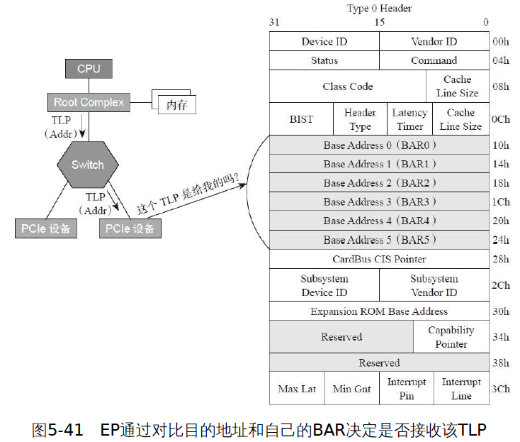

- 當TLP不屬於一個Switch上游端口時，查看這個地址是否落在其下游設備的地址範圍內（是否在Memory Base和Memory Limit之間），如果是，說明該TLP是發給它下游設備的，因此它要完成路由轉發；如果地址不落在下游設備的地方範圍內，說明該TLP不是發給它下游設備的，則不接受該TLP，如圖5-42所示。

    

設備ID路由

- ID = Bus Number + DeviceNumber + Function Number（BDF）能唯一找到某個設備的某個功能
- 使用ID路由的TLP，其TLP Header中含有BDF信息（見圖5-43）

    

  - 當一個Endpoint收到一個這樣的TLP，它用自己的ID和收到TLP Header中的BDF比較，如果是給自己的，就收下TLP，否則就拒絕。
  - 不是一個Switch對應一個Configuration空間（Type1Header），而是Switch的每個Port都有一個Configuration空間（Type 1Header）。

    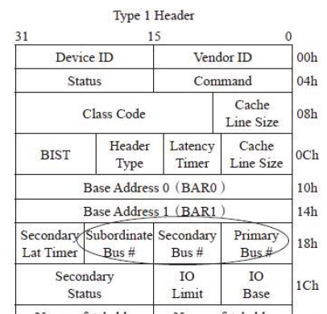

  - 看三個寄存器：Subordinate Bus Number、Secondary Bus Number和Primary Bus Number，如圖5-45所示。

    

  - 對一個Switch來說：
    - 每個Port靠近RC（上游）的那根Bus叫作Primary Bus，其Number寫在其Configuration Header中的Primary Bus Number寄存器
    - 每個Port下面的那根Bus叫作Secondary Bus，其Number寫在其Configuration Header中的Secondary Bus Number寄存器
    - 對上游端口，Subordinate Bus是其下游所有端口連接的Bus編號最大的那根Bus
    - Subordinate Bus Number寫在每個Port的Configuration Header中的 Subordinate Bus Number寄存器。

  - 當一個Switch收到一個基於ID尋址的TLP，首先檢查TLP中的BDF是否與自己的ID匹配，如匹配，說明該TLP是給自己的，收下；否則，檢查該TLP中的Bus Number是否落在Secondary Bus Number和Subordinate Bus Number之間。如果是，說明該TLP是發給其下游設備的，然後轉發到對應的下游端口；如果是其他情況，則拒絕這些TLP。

隱式路由

- 只有Message TLP才支持隱式路由。Message TLP還支持地址路由和ID路由，但以隱式路由為主。
- 有些Message是與RC通信的，RC是該TLP的發送者或者接收者，因此沒有必要明明白白地指定地址或者ID，這種路由方式稱為隱式路由。
- Message TLP的Header總是4DW，如圖5-47所示

    

- Type域低3位決定了Message TLP路由方式

    

  - 當一個Endpoint收到一個Message TLP，檢查TLP Header，如果是RC的廣播Message（011b）或者該Message終結於它（100b），它就接受該Message
  - 當一個Switch收到一個Message TLP，檢查TLP Header，如果是RC的廣播Message（011b），則往它每個下游端口復制該Message然後轉發
  - 如果下游端口收到發給RC的Message，則往上游端口轉發

<h2 id="5.8">5.8 數據鏈路層</h2>

數據鏈路層借助DLLP（Data Link Layer Packet，數據鏈路層的數據包）保證了TLP在數據總線上的正常傳輸，並使用了握手協議（Ack/Nak）和重傳（Retry）機制來保證數據傳輸的一致性和完整性。還包括TLP流量控制和電源管理等功能

- 發送端：數據鏈路層接收上層傳來的TLP，它給每個TLP加上Sequence Number（序列號，下文都用“序列號”來闡述）和LCRC（Link CRC），然後轉交給物理層。
- 接收端：數據鏈路層接收物理層傳來的TLP，檢測CRC和序列號，如果有問題，會拒絕接收該TLP，即不會傳到它的事務層，並且通知發送端重傳；如果該TLP沒有問題，數據鏈路層則去除TLP中的序列號和LCRC，交由它的事務層，並通知發送端TLP正確接收。


數據鏈路層只處理端到端的數據傳輸，僅限於相鄰的兩個端口

- 不需要包含路由信息，即不需要告訴我這個DLLP是哪個設備發起的，以及要發送給哪個目標設備。
- 與事務層TLP傳輸不同，一個TLP，可以翻山越嶺（經過若干個Switch），從一個設備傳輸到相隔很遠的設備

數據鏈路層主要有四大類型DLLP：

- 用以確保TLP傳輸完整性的DLLP：ACK/NAK；
- 流控相關的DLLP；
- 電源管理相關的DLLP；
- 廠家自定義DLLP。

    

DLLP大小為6B（物理層上加上頭尾，傳輸的是8B），格式如圖5-51所示。不同類型的DLLP，格式相同，內容不一樣。


(1) ACK/NAK協議


數據鏈路層通過ACK/NAK協議來保證每個TLP的正確傳輸，其基本原理為：TLP發送端的數據鏈路層為每個TLP加上序列號和LCRC，在該TLP被接收端正確收到之前，它會一直保持在一個叫Replay Buffer的接口裡面。

- TLP接收端的數據鏈路層接收到該TLP後，做CRC校驗和序列號檢查，如果沒有問題，TLP接收端（可能）會生成和發送ACK DLLP，TLP發送方接收到ACK後，知道TLP被正確接收，因此它會把相關的TLP從Replay Buffer中清除；
- TLP接收方檢測到TLP有錯誤，則會生成和發送NAK DLLP，TLP發送方接收到NAK後，知道有TLP傳輸出錯，會重新發送Replay Buffer相關的TLP給對方。
- TLP傳輸出錯往往是瞬態的，重傳基本能保證TLP傳輸正確。
- TLP接收方只有收到正確的TLP才會去掉序列號和LCRC，並把TLP交給它的事務層。

在接收端，當成功收到一個TLP後，它的序列號加1，設置為下一個期望接收到的TLP序列號。

校驗失敗 --> 重發
校驗成功：CRC沒有問題，接下來就檢查TLP的序列號

- TLP發送端接收到該ACK，知道TLP 12和它之前所有的TLP都被成功接收，因此TLP 10、TLP 11和TLP 12會從Replay Buffer清掉。
- TLP接收端發現收到的TLP序列號為13，與預期不符（預期為TLP 12），說明TLP 12在半路丟包。接收端會發一個NAK，其中AckNak_SEQ_NUM設為11（即上一個成功被接收的TLP序列號）。 TLP 11和它之前會從Replay Buffer清掉，並重發TLP 12和它後面的TLP。
- TLP接收端發現收到的TLP序列號為10，與預期不符（預期為TLP 12）。 TLP上次正確接收到的是TLP 11。因為一個TLP在一定時間內沒有收到ACK，它會自動重發所有Hold在Replay Buffer中的TLP。 TLP接收端如果收到重複的TLP包，它會默默扔掉這些重複的TLP，並發送ACK


<h2 id="5.9">5.9 物理層</h2>

- 發送端：數據鏈路層生成DLLP，交由物理層，物理層加起始（SDP）和結束標誌（GEN 1/2加END，GEN3則沒有），然後物理傳輸到對方。
- 接收端：物理層對DLLP掐頭去尾，交由數據鏈路層，數據鏈路層對DLLP進行校驗，不管正確與否，DLLP都終於這層。

物理層由電氣模塊和邏輯模塊組成：

電氣模塊：

- PCIe是採用串行總線傳輸數據，使用的是差分信號，即用兩根信號線上的電平差表示0或1
- 與單端信號傳輸相比，差分信號抗干擾能力強，能提供更寬的帶寬（跑得更快）
- 抗干擾能力強，因而可以用更快的速度進行數據傳輸，從而提供更寬的帶寬

邏輯模塊：


- 物理層從數據鏈路層獲得TLP或者是DLLP，然後放到TxBuffer裡
- 物理層給TLP或者DLLP加入頭（Start code）和尾（End code、Gen 3沒有尾巴）
- 給每個TLP或者DLLP加上邊界符號，這樣接收端就能把TLP或者DLLP區分開
- TLP或者DLLP數據會分派到每個Lane上獨立傳輸。這個過程叫Byte Stripping，類似於串並轉換
- 數據進入每條Lane後，分別加串擾（Scramble），目的是減少電磁干擾（EMI），手段是讓數據與隨機數據進行異或操作，輸出偽隨機數據，然後再發送出去
- 加擾後的數據進行8/10編碼（Gen3是128/130編碼），讓數據流中的0和1個數相當，保持直流平衡；嵌入時鐘信息，PCIe不需要專門的時鐘進行信號傳輸
- 最後進行並串轉換，發送到串行物理總線上去


- 接收端逆向操作

PCIe的三層

- 事務層產生TLP，經過數據鏈路層和物理層傳輸給接收方
  - 傳輸應用層或者命令層（事務層的頂頭上司）數據
- 數據鏈路層產生DLLP，經過物理層傳輸到對方
  - ACK/NAK、流控和電源管理
- 物理層，不僅僅為上層TLP和DLLP做嫁衣，其實它也有自己的數據包定義，稱為Ordered Sets，簡稱OS
  - 物理層用以管理鏈路的，比如鍊路訓練（LinkTraining）、改變鏈路電源狀態等

    

<h2 id="5.10">5.10 PCIe Reset</h2>

總線規定了兩個複位方式：Conventional Reset和Function Level Reset（FLR）


Fundamental Reset：由硬件控制，會重啟整個設備，一般發生在整個系統Reset的時候（比如重啟電腦），

Fundamental Reset有兩種：
- Cold Reset：Power Off/On Device的Vcc（Vaux一直在）
- Warm Reset（Optional）：保持Vcc的情況下由系統觸發，比如改變系統的電源管理狀態可能會觸發設備的Warm Reset，PCIe協議沒有定義具體如何觸發Warm Reset，而是把決定權交給系統

PERST#（PCIe Express Reset）信號


如果這塊PCIe設備支持PERST#信號：

- 一個系統上電時，主電源穩定後會有“Power Good”信號
- 這時ICH就會發PERST#信號給下面掛的PCIe SSD
- 如果系統重啟，Power Good信號的變化會觸發PERST#的Assert和De-Assert，就可以實現PCIe設備的Cold Reset
- 如果系統可以提供Power Good信號以外的方法觸發PERST#，就可以實現Warm Reset，PERST#信號會發送給所有PCIe設備，設備可以選擇使用這個信號，也可以不理它

如果這塊PCIe設備不支持PERST#信號：

- 上電時它會自動進行Fundamental Reset
- 不支持PERST#信號的設備，必須能自己觸發Fundamental Reset。比如，偵測到3.3V後就觸發Reset（當設備發現供電超過其標準電壓時，必須觸發Reset）。

Hot Reset：通過Assert TS1的Symbol 5的Bit[0]實現（見圖5-60）


- 當PCIe SSD出現問題時，可以通過軟件觸發Hot Reset使其恢復
- PCIe設備收到兩個連續的帶Hot Reset的TS1後，經過2ms的timeout：
  - LTSSM經過Recovery和Hot Reset State，最終停在Detect
  State（Link Training的初始狀態）；
  - 設備所有的State Machine、硬件邏輯、Port State和Configuration Register（Sticky bit除外）全部回到初始值。
- LTSSM(Link Training and Status State Machine )是PCIe最為核心的一個狀態機

- 軟件還可以通過設置設備的Link Control Register（鏈路控制寄存器）–Link disable bit把設備disable掉（見圖5-61）

    

  - 當設備的Link Disable bit被置上以後，會進入LTSSM Recovery State，開始向RC發送帶Disable bit的TS1（這個動作只能由EP發起，RC端這個bit是reserve的），如圖5-62所示。

    

  - RC端收到這樣的TS1以後，其物理層會發送LinkUp=0的信號給鏈路層，之後所有的Lane都會進入Electrical Idle。
  - 2ms timeout後，RC會進入LTSSM Detect mode，但是設備會一直停留在LTSSM的Disable狀態，等待重出江

FLR（Function Level Reset）：

- 不是所有的設備都支持FLR，需要檢查Device Capabilities Register（設備能力寄存器）的Bit28進行確認

    

- 如果設備支持FLR，那麼軟件就可以通過Device Control Register（設備控制寄存器）的Bit15來進行Function Reset了，（見圖5-64）

    

FLR會把對應Function的內部狀態，寄存器重置，但是以下寄存器不會受到影響：

- Sticky bits——Cold Reset和Warm Reset都拿它們沒轍
- HwInit類型的寄存器。在PCIe設備中，有效配置寄存器的屬性為HwInit，這些寄存器的值由芯片的配置引腳決定，後者上電複位後從EEPROM中獲取。 Cold Reset和Warm Reset可以復位這些寄存器，然後從EEPROM中重新獲取數據，但是使用FLR方式不能複位這些寄存器。
- 一些特殊的配置寄存器。比如Captured Power、ASPM Control、Max_Payload_Size或者Virtual Channel
- FLR不會改變設備的LTSSM狀態

軟件在啟動FLR前，要注意是否有還沒完成的CplD

- 要么等這些CplD完成再開始FLR
- 要么啟動FLR以後等100ms以後再重新初始化這個Function

如果不處理好，可能會導致Data Corruption——前一批事務要求的數據因為FLR的影響被誤傳給了後一批事務。

- 確保其他軟件在FLR期間不會訪問這個Function
- 把Command Register清空，讓Function自己待著
- 輪循Device Status Register（設備狀態寄存器）的bit5（Transactions Pending）直到被Clear（這個bit=1代表還有未完成的CplD），如圖5-65所示，或者等待到Completion Timeout的時間，如果Completion Timeout沒有被Enable，等100ms

    

- 初始化FLR然後等100ms
- 重新配置Function並Enable

在FLR過程中：

- 這個Function對外不能被使用
- 不能保留之前的任何可以被讀取的信息（比如內部的Memory需要被清零或者改寫）
- 回复要求FLR的Cfg Request，並開始FLR
- 對於發進來的TLP可以回复UC（Unexpected Completion）或者直接丟掉
- FLR應該在100ms之內完成，但是其後的初始化還需要花一些時間，在初始化過程中如果收到Cfg Request，可以回复CRS（Configuration Retry Status）

總結Reset退出：

- 從Reset狀態退出後，必須在20ms內開始Link Training
- 軟件需要給Link充分的時間完成Link Training和初始化，至少要等上100ms才能開始發送Cfg Request
- 如果軟件等了100ms開始發Cfg Request，但是設備還沒初始化完成，設備會回复CRS
- 這時RC可以選擇重發Cfg Request或者上報CPU說設備還沒準備好
- 設備最多可以有1s時間（從PCI那繼承來的），之後必須能夠正常工作，否則System/RC則可以認為設備掛了

<h2 id="5.11">5.11 PCIe Max Payload Size和Max Read Request Size</h2>

在Device Control Register（設備控制寄存器）裡，如圖5-66所示，分別由bit[14∶12]和bit[7∶5]控制


**1. Maximum Payload Size（簡稱MPS）**

- 控制一個TLP可以傳輸的最大數據長度

PCIe協議允許一個最大的Payload可以到4KB，但是規定了在整個傳輸路徑上的所有設備，都必須使用相同的MPS設置，同時不能超過該路徑上任何一個設備的MPS能力值

系統的MPS值設置是在上電以後的設備枚舉配置階段完成的
PCIe SSD自身的MPS capability則是在其PCIe core初始化階段設置的

- 以主板上的PCIe RC和PCIe SSD為例，它們都在Device Capability Register裡聲明自己能支持的各種MPS
- OS的PCIe驅動偵測到他們各自的能力值，然後挑低的那個設置到兩者的Device Control Register中

**2. Maximum Read Request Size**

- 用於控制一個Memory Read的最大Size，最大4KB（以128Byte為單位）

在配置階段，OS的PCIe驅動也會配置另外一個參數Maximum Read Request Size

Read Request Size是可以大於MPS的

- 例如給一個MPS=128Byte的PCIe SSD發一個512Byte的Read Request，PCIe SSD可以通過返回4個128Byte的Cpld，或者8個64Byte的Cpld來完成這個Request的響應。

為了提高特別是大Block Size Data的傳輸效率，可以盡量把Read Request Size設得大一點，用更少的次數傳遞更多的數據。

<h2 id="5.12">5.12 PCIe SSD熱插拔</h2>

PCIe SSD最早是Fusion-IO推出來的，以閃存卡的形式被互聯網公司和數據中心廣泛使用，閃存卡一般作為數據緩存來使用，有以下缺點：

- 插在服務器主板的PCIe插槽上，數量有限
- 通過PCIe插槽供電，單卡容量受到限制
- 在PCIe插槽上，容易出現由於散熱不良導致宕機的問題
- 不能熱插拔，如果發現PCIe閃存卡有故障，必須要停止服務，關閉服務器，打開機箱，拔出閃存卡

U.2PCIe SSD類似於傳統的盤位式SATA、SAS硬盤，可以直接從服務器前面板熱插拔


傳統SATA、SAS硬盤通過HBA和主機通信，所以也是通過HBA來管理熱插拔

- 主機匯流排配接器（host bus adapter，HBA）是以電腦為主機系統，連接其他網路或儲存裝置的電腦硬體

PCIe SSD直接連到CPU的PCIe控制器，熱插拔需要驅動直接管理
一般熱插拔PCIe SSD需要幾方面的支持：

- PCIe SSD：
  - 硬件支持，避免SSD在插盤過程中產生電流波峰導致器件損壞
  - 控制器要能自動檢測到拔盤操作，避免數據因掉電而丟失
- 服務器背板PCIe SSD插槽：通過服務器廠家了解是否支持U.2SSD熱插拔
- 操作系統：要確定熱插拔是操作系統還是BIOS處理
- PCIe SSD驅動：不管是Linux內核自帶的NVMe驅動，還是廠家提供的驅動

拔出PCIe SSD的基本流程如下：

1. 配置應用程序，停止所有對目標SSD的訪問。如果某個程序打開了該SSD中的某個目錄，也需要退出；
2. umount目標SSD上的所有文件系統；
3. 卸載SSD驅動程序，從系統中刪除已註冊的塊設備和disk；
4. 拔出SSD。

<h2 id="5.13">5.13 SSD PCIe链路性能损耗分析</h2>

**1. Encode和Decode**

Gen1或者Gen2，正常的1個Byte數據，經過8bit/10bit轉換在實際物理鏈路上傳輸的時候就變成了10bit，也就是一個Symbol，8bit/10bit轉換會帶來20%的性能損耗

Gen3，由於是128/130編碼，這部分性能損耗可以忽略

**2. TLP Packet Overhead**


PCIe必須靠Transaction Layer（事務層或傳輸層）、Link Layer（鏈路層）和PHY（物理層）來保證傳輸數據包（Payload）的可靠性

每個TLP會帶來20～30Byte的額外開銷

**3. Traffic Overhead**

PCIe協議為了進行時鐘偏差補償，會發送Skip，作用有點像SATA協議的ALIGN

Gen1/Gen2一個Skip是4Byte，Gen3是16Byte，Skip是定期發送的

PCIe協議不允許在TLP中間插入Skip Order-set，只能在兩個TLP的間隔中間發

**4. Link Protocol Overhead**

PCIe協議中，RC（主機）和EP（PCIe SSD）之間發送的每一個TLP，都需要對方告知接收的情況

PCIe要求每一個TLP，都需要對方發送ACK確認，但是允許對方接收幾個TLP以後再發一個ACK確認，這樣可以減少ACK發送的數量，對性能有所幫助。

**5. Flow control**

自帶一個流控機制，目的是防止接收方receiver buffer overflow

RC跟EP之間通過交換一種叫UpdateFC的DLLP來告知對方自己目前receive buffer的情況，顯然發送這個也會佔用帶寬，從而對性能產生影響

**6. System Parameters**

System Parameters主要有三個：

- MPS（Max Payload Size）
- Max Read Request Size
- RCB（Read Completion Boundary）

RC允許使用多個CplD回復一個Read Request，而這些回复的CplD通常以64Byte或128Byte為單位（也有32Byte的），原則就是在Memory裡做到地址對齊。

$$
Bandwidth=[（Total Transfer Data Size）/（Transfer Time）]
$$

已知條件：

```Text
200個MemWr TLP；
MPS=128；
PCIe Gen1x8。
```

準備活動：

```Text
計算Symbol Time，2.5Gbps換算成1個Byte傳輸時間是4ns；
8個Lane，所以每4ns可以傳輸8個Byte；
TLP傳輸時間：[（128Bytes Payload+20Byte overhead）/8Byte/Clock]×[4ns/Clock]=74ns；
DLLP傳輸時間：[8Bytes/8Byte/Clock]×[4ns/Clock]=4ns
```

假設：

```Text
每5個TLP回复1個ACK；
每4個TLP發送一個FC Update。
```

正式計算：

```Text
總共的數據：200×128Byte=25600Byte；
傳輸時間：200×74ns+40×4ns+50×4ns=15160ns；
性能：25600Bytes/15160ns=1689MB/s。
```

可將MPS調整到了512B。重新計算，結果增加到了1912MB/s，看到這個數字可知，以前的SATA SSD可以退休了

<h1 id="6">六、NVMe介紹</h1>

<h2 id="6.1">6.1 AHCI到NVMe</h2>

HDD和早期的SSD：SATA接口 + AHCI（Advanced Host Controller Interface）系統接口協議標準

- AHCI支持NCQ（Native CommandQueuing）功能和熱插拔技術，NCQ最大深度為32，即主機最多可以發32條命令給HDD或者SSD執行

整個系統的性能瓶頸在硬盤端（低速，高延時），而不是在協議和接口端，隨著SSD技術的飛速發展，AHCI和SATA已經不能滿足高性能和低延時SSD的需求

由 PCIe接口 + NVMe（Non-Volatile Memory Express，是非易
失性存儲器標準）系統接口協議標準 的SSD就此誕生

需要指出的是，在移動設備上，NVMe也佔有一席之地。蘋果自iPhone 6s開始，其存儲設備上跑的就是NVMe協議標準。未來移動存儲的方向，筆者認為不是UFS，當然更不會是eMMC，而是NVMe

---

市面上常見的手機快閃記憶體標準共有 eMMC、UFS 與 NVMe

- Android 手機主要採用 eMMC 與 UFS 標準
- NVMe 則是蘋果 iPhone 所使用的快閃記憶體標準

eMMC（embedded MultiMedia Card）：

- 由 MMC 協會針對手機或平板電腦訂立的快閃記憶體標準
- 由 MMC 記憶卡發展而來，採用「並行傳輸」技術製成，讀寫必須分開執行，雖然僅提供單路讀寫功能，但仍具備體積小、高度集成與低複雜度的優勢
- eMMC 5.1 標準，連續讀取速度約為 250MB/s

UFS（Universal Flash Storage）：

- 由 JEDEC 於 2011 年推出，採用全新「串行傳輸」技術，可同時讀寫操作
- UFS 3.1 標準，連續讀取速度約為 1,700MB/s


NVMe（NVM Express）：

- 原先是運用在 MacBook 上的主流固態記憶體標準之一，具備高效率、低負載、低延時的特性
- 蘋果自 2015 年起首度將 NVMe 導入 iPhone 6S 系列中，連續讀取速度約為 900MB/s
- 早期 Android 手機多是使用 eMMC 5.1 標準，因此在連續讀取速度方面，iPhone 擁有絕對領先的優勢，直至 UFS 3.0 問世後兩者差距才逐漸縮小

---

NVMe和AHCI相比，它的優勢主要體現在以下幾點：

1. 低時延（Latency）

- 造成硬盤存儲時延的三大因素：

  - 存儲介質層面：閃存（Flash）比傳統機械硬盤速度快太多
  - 控制器方面：PCIe主控與CPU直接相連，而不像傳統方式，要通過南橋控制器中轉再連接CPU
  - 軟件接口方面：
    - NVMe縮短了CPU到SSD的指令路徑 --> NVMe減少了對寄存器的訪問次數
    - 使用了MSI-X中斷管理
    - 並行&多線程優化 --> NVMe減少了各個CPU核之間的鎖同步操作

- SATA接口對數據操作時，數據會先從硬碟讀取到內存，再將數據提取至CPU內部進行計算，計算後在反饋給內存，最後寫入至硬碟
- PCIe接口的數據會直接通過總線與CPU直連，省去內存調用硬碟的過程，傳輸速率與速度都提升

2. 高性能（Throughput&IOPS）

- 隊列深度：可以在端口隊列中等待服務的I/O請求數量

  - SAS和SATA可以分別處理254和32的隊列深度
  - 使用SAS和SATA，排隊的I/O請求數量很容易成為瓶頸。為了避免I/O請求由於超出隊列深度而失敗，你必須創建許多HDD的LUN，以便所有I/O都能夠快速進行

- AHCI只有一個命令隊列，最多同時只能發32條命令

- $IOPS=隊列深度/IO延遲$，故IOPS的性能與隊列深度有正關係

- 目前高端的企業級PCIe SSD，其隊列深度可能要達到128，甚至是256才能夠發揮出最高的IOPS性能。

- 在NVMe標準下，最大的隊列深度可達64K

3. 低功耗

- NVMe加入了自動功耗狀態切換和動態能耗管理功能

<h2 id="6.2">6.2 NVMe總述</h2>

NVMe是一種主機（Host）與SSD之間通信的協議，它在協議棧中隸屬高層，如圖6-3所示。


NVMe作為命令層和應用層協議，理論上可以適配在任何接口協議上。但NVMe協議的原配是PCIe。

NVMe是為SSD所創建的協議, 而AHCI是為傳統HDD服務的。


NVMe制定了主機與SSD之間通信的命令，以及命令如何執行的。 NVMe有兩種命令，如圖6-6所示：

- 一種叫Admin命令，用以主機管理和控制SSD
- 另外一種就是I/O命令，用以主機和SSD之間數據的傳輸


跟SATA規範中定義的命令相比，NVMe的命令個數少了很多，完全是為SSD量身定制的


主機又是怎麼把這些命令發送給SSD執行呢？

NVMe有三寶：SQ和CQ位於主機的內存中，DB則位於SSD的控制器內部

- Submission Queue（SQ）
- Completion Queue（CQ）
- Doorbell Register（DB）


- NVMe子系統一般就是SSD

- SSD作為一個PCIe Endpoint（EP）通過PCIe連著Root Complex（RC），然後RC連接著CPU和內存

NVMe三寶的用途：

- SQ位於主機內存中，主機要發送命令時，先把準備好的命令放在SQ中，然後通知SSD來取

- CQ也是位於主機內存中，一個命令執行完成，成功或失敗，SSD總會往CQ中寫入命令完成狀態

- DB位於SSD的控制器內部，主機發送命令時，不是直接往SSD中發送命令，而是把命令準備好放在自己的內存中，那怎麼通知SSD來獲取命令執行呢？主機就是通過寫SSD端的DB寄存器來告知SSD的

NVMe是如何處理命令的?


1. 主機寫命令到SQ
2. 主機寫SQ的DB，通知SSD取指
3. SSD收到通知後，到SQ中取指
4. SSD執行指令
5. 指令執行完成，SSD往CQ中寫指令執行結果
6. SSD發中斷通知主機指令完成
7. 收到中斷，主機處理CQ，查看指令完成狀態
8. 主機處理完CQ中的指令執行結果，通過DB回复SSD：指令執行結果已處理

<h2 id="6.3">6.3 SQ、CQ和DB</h2>

主機往SQ中寫入命令，SSD往CQ中寫入命令完成結果。

- SQ與CQ的關係，可以是一對一的關係，也可以是多對一的關係，但不管怎樣，它們是成對的：有因就有果，有SQ就必然有CQ

有兩種SQ和CQ：

- 一種是Admin SQ/CQ：用以主機管理控制SSD
- 一種是IO SQ/CQ：用以主機與SSD之間傳輸數據

系統中只有1對Admin SQ/CQ，IO SQ/CQ卻可以有很多，多達65535對（64K減去1對Admin SQ/CQ），如圖6-11所示


主機端每個CPU核（Core）可以有一個或者多個SQ，但只有一個CQ

1. 性能需求，一個CPU核中有多線程，可以做到一個線程獨享一個SQ
2. QoS (Quality of Service，服務質量)需求

    ```Text
    同時下載與觀看電影，將看電影所需的命令放到高優先級的SQ，
    迅雷下載所需的命令放到低優先級的SQ，因此電腦就能把有限的資源優先滿足需求, 
    即看電影不會卡頓，便是好的QoS
    ```

實際系統中用多少個SQ，取決於系統配置和性能需求，可靈活設置I/O SQ個數，可參考下表的配置


NVMe Spec對Admin SQ/CQ和IO SQ/CQ有不同的約定：

- 系統中只有一對Admin SQ/CQ，則可以有最多64K對IO SQ/CQ;
- Admin SQ/CQ的隊列深度是2~4K；而IO SQ/CQ的隊列深度是2~64K;

注: Admin/IO command (SQ)大小為64Bytes，對應的Completion (CQ)大小為16Bytes。

- Admin SQ和CQ是一對一的，而IO SQ和CQ可以一對一，也可以多對一。多個SQ可以支持多線程工作，不同SQ之間可以賦予不同的優先級;
- Admin和IO的SQ/CQ均放在Host端Memory中；
- SQ由Host來更新，CQ則由NVMe Controller更新。

Note:

- AHCI只有一個命令隊列，且隊列深度是固定的32
- PCIe接口，可以有1、2、4、8、12、16、32條lane，而SATA只有單一lane

在NVMe Spec中定義SQ/CQ均是循環隊列，除了隊列深度、隊列內容，還有隊列的頭部（Head）和尾部（Tail）


隊伍頭部的那個正在被服務或者等待被服務，一旦完成，就離開隊伍，尾巴決定新來的人站的位置

DB是在SSD端的寄存器，記錄SQ和CQ的頭和尾巴的位置，每個SQ或者CQ，都有兩個對應的DB：

- Head DB
- Tail DB

隊列生產者/消費者（Producer/Consumer）模型。生產者往隊列的尾部寫入東西，消費者從隊列的頭部取出東西：

1. 開始假設SQ1和CQ1是空的，Head=Tail=0

    

2. 主機往SQ1寫入三個命令後，更新SSD控制器端的 SQ1 Tail DB 寄存器，值為3，通知SSD控制器：有新命令

    

3. SD控制器收到通知後，把SQ1的三個命令都取回來執行。 SSD控制器會把Head調整為3並寫入本地的 SQ1 Head DB 寄存器

    

4. SSD執行完了兩個命令，更新CQ1對應的Tail DB寄存器，值為2。同時發消息給主機：有命令完成

    

5. 主機收到SSD的通知（中斷信息），於是從CQ1中取出那兩條完成信息，處理完畢後往SSD CQ1 Head DB寄存器中寫入CQ1的head，值為2

    

對SQ來說：

- SSD是消費者，所以SQ head DB由SSD自己維護；
- 主機是生產者，所以SQ Tail DB由主機來更新
- SSD結合SQ的頭和尾，就知道還有多少命令在SQ中等待執行了

對CQ來說：

- SSD是生產者，所以CQ Tail DB由自己更新
- 主機是消費者，所以CQ Head DB由主機更新
- SSD根據CQ的頭和尾，就知道CQ還能不能，以及能接受多少命令完成信息

DB也有通知作用：

- 主機更新SQ Tail DB的同時，也是在告知SSD有新的命令需要處理
- 主機更新CQ Head DB的同時，也是在告知SSD，你返回的命令完成狀態信息我已經處理

主機對DB只能寫（還僅限於寫SQ Tail DB和CQ Head DB），不能讀取DB。在這個限制下，我們看看主機是怎樣維護SQ和CQ的?

- SQ Tail DB沒有問題，主機是生產者，對新命令來說，它清楚自己應該站在隊伍哪裡
- 但是SQ Head DB呢？主機發了取指通知後，它並不清楚SSD什麼時候去取命令、取了多少命令
  - SSD往CQ中寫入命令狀態信息的同時，還把SQ Head DB的信息告知了主機

    

- CQ Head DB，主機是消費者，知道它隊列的頭部
- 但是CQ Head DB呢？SSD怎麼告訴主機呢？
  - 還是通過SSD返回命令狀態信息獲取
  - SSD在往CQ中寫入命令完成條目時，會把“P”寫成1，CQ是在主機端的內存中，主機可以檢查CQ中的所有內容，主機記住上次隊列的尾部，然後往下一個一個檢查“P”，就能得出新的隊列尾部了

    

<h2 id="6.4">6.4 尋址雙雄：PRP和SGL</h2>

核心思想：我是誰？我從哪裡來？我要去哪裡？

- 我是數據，我從主機端來，要到SSD去
  - 主機如果想往SSD上寫入用戶數據，需要告訴SSD寫入什麼數據，寫入多少數據，以及數據源在內存中的什麼位置
- 我是數據，我從SSD來，要去主機端
  - 主機如果想讀取SSD上的用戶數據，同樣需要告訴SSD需要什麼數據，需要多少數據，以及數據最後需要放到主機內存的哪個位置上去

在主機向SSD發送的Write/Read命令中都會有這些資訊

Write：

- 每筆用戶數據對應著一個叫作LBA（Logical Block Address）的東西，Write命令通過指定LBA來告訴SSD寫入的是什麼數據
- SSD收到Write命令後，通過PCIe去主機的內存數據所在位置讀取數據，然後把這些數據寫入閃存中，同時生成LBA與閃存位置的映射關係

Read：

- SSD根據LBA，查找映射表（寫入時生成的），找到對應閃存物理位置，然後讀取閃存獲得數據。通過PCIe把數據寫入主機指定的內存中。這樣就完成了主機對SSD的讀訪問

是主機在與SSD的數據傳輸過程中，主機是被動的一方，SSD是主動的一方：

- 主機需要數據，是SSD主動把數據寫入主機的內存中
- 主機寫數據，同樣是SSD主動去主機的內存中取數據，然後寫入閃存

主機有兩種方式來告訴SSD數據所在的內存位置：

- PRP（Physical Region Page，物理區域頁）
- SGL（Scatter/Gather List，分散/聚集列表）

PRP：


- NVMe把主機端的內存劃分為一個一個物理頁（Page），頁的大小可以是4KB，8KB，16KB，…，128MB

- PRP Entry本質就是一個64位內存物理地址，只不過把這個物理地址分成兩部分：頁起始地址和頁內偏移
- 最後兩比特是0，說明PRP表示的物理地址只能四字節對齊訪問
- 一個 PRP Entry 描述的是一個物理頁空間

    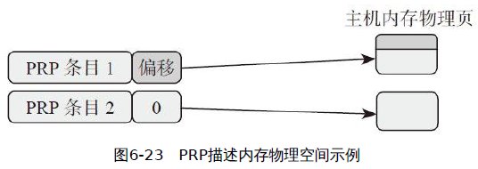

- 若干個PRP Entry連接起來，就成了PRP鍊錶（List），如圖6-24所示

    

- PRP鍊錶中的每個PRP Entry的偏移量都必須是0，PRP鍊錶中的每個PRP Entry都是描述一個物理頁。它們不允許有相同的物理頁

- 每個NVMe命令中有兩個域：PRP1和PRP2，主機就是通過這兩個域告訴SSD數據在內存中的位置或者數據需要寫入的地址，如表6-2所示。

    

- 一個PRP1指向PRP鍊錶的示例，如圖6-25所示

    


對Admin命令來說，它只用PRP告訴SSD內存物理地址；

對I/O命令來說，除了用PRP，主機還可以用SGL的方式來告訴SSD數據在內存中寫入或者讀取的物理地址，如表6-3所示。


主機在命令中會告訴SSD採用何種方式：

- CDW0[15：14] = 00b，就是PRP的方式
- CDW0[15：14] = 01b，就是SGL的方式

SGL：

- SGL（Scatter Gather List）是一個數據結構, 是個鏈表(List)，用以描述一段數據空間，這個空間可以是數據源所在的空間，也可以是數據目標空間
- SGL由一個或者多個SGL段（Segment）組成，而每個SGL段又由一個或者多個SGL描述符（Descriptor）組成
- SGL描述符是SGL最基本的單元，它描述了一段連續的物理內存空間：起始地址+空間大小。
- 每個SGL描述符大小是16字節。一塊內存空間，可以用來放用戶數據，也可以用來放SGL段，根據這段空間的不同用途，SGL描述符也分幾種類型，如表6-4所示

    

  - 數據塊描述符：描述的這段空間是用戶數據空間
  - 段描述符：前面一個段就需要有個指針指向下一個段，這個指針就是SGL段描述符，它描述的是它下一個段所在的空間
  - 末段描述符：讓SSD在解析SGL的時候，碰到SGL末段描述符，就知道鍊錶只剩下一個段
  - 位桶描述符：它只對主機讀有用，用以告訴SSD，你往這個內存寫入的東西我是不要的

    

- 舉例：假設主機需要從SSD中讀取13KB的數據，其中真正只需要11KB數據，這11KB的數據需要放到3個大小不同的內存中，分別是：3KB、4KB和4KB

    

無論是PRP還是SGL，本質都是描述內存中的一段數據空間，這段數據空間在物理上可能是連續的，也可能是不連續的

NVMe1.0的時候只有PRP，SGL是NVMe1.1之後引入的

SGL和PRP本質的區別在哪？

- PRP描述的是物理頁
- SGL可以描述任意大小的內存空間

    

NVMe over PCIe (目前所講的都是NVMe跑在PCIe上)：

- Admin命令只支持PRP
- I/O命令可以支持PRP或者SGL

NVMe over Fabrics：所有命令只支持SGL

<h2 id="6.5">6.5 Trace分析</h2>

PCIe定義了下三層，NVMe定義了最上層，構成一個完整的主機與SSD通信的協議


- 在NVMe層，我們能看到的是64字節的命令、16字節的命令返回狀態，以及跟命令相關的數據

- 在PCIe的事務層，我們能看到的是事務層數據包（Transaction Layer Packet），即TLP

PCIe事務層作為NVMe最直接的服務者，不管你NVMe發給我的是命令，還是命令狀態，或者是用戶數據，我統統幫你放進包裹，打包後交給下一層，即數據鏈路層繼續處理，如圖6-30所示。


PCIe事務層傳輸的是TLP，它就是個包裹，一般由包頭和數據組成，當然也有可能只有包頭沒有數據。 NVMe傳下來的數據都是放在TLP的數據部分的（Payload）

TLP可分為以下幾種類型：

- Configuration Read/Write
- I/O Read/Write
- Memory Read/Write
- Message
- Completion

在NVMe命令處理過程中，PCIe事務層基本只用Memory Read/Write TLP來為NVMe服務

主機發送一個Read命令，PCIe是如何服務的？


1. 主機準備了一個Read命令給SSD

    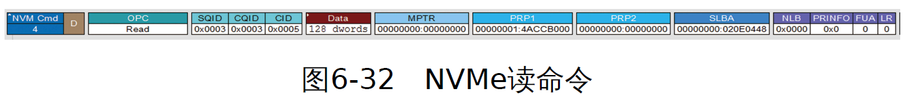

   - 主機需要從起始LBA 0x20E0448（SLBA）上讀取128個DWORD（512字節）的數據到內存地址是0x14ACCB000

   - 這個命令放在編號為3的SQ裡（SQID=3），CQ編號也是3（CQID=3）

2. 主機通過寫SQ的Tail DB，通知SSD來取命令

    

   - PCIe是通過一個Memory Write TLP來實現主機寫SQ的Tail DB的
   - 一個主機，下面可能連接著若干個Endpoint，主機怎樣才能準確更新該SSD控制器中的Tail DB寄存器
   - 在上電的過程中，每個Endpoint（在這裡是SSD）的內部空間都會通過內存映射（Memory Map）的方式映射到主機的內存（Memory）地址空間中，SSD控制器當中的寄存器會被映射到主機的內存地址空間，當然也包括Tail DB寄存器
   - 主機在用MemoryWrite寫的時候，Address只需設置該寄存器在主機內存中映射的地址，就能準確寫入該寄存器

3. SSD收到通知，去主機端的SQ中取指令

    

   - SSD是通過發一個Memory Read TLP到主機的SQ中取指令
   - PCIe需要往主機內存中讀取16個DWORD的數據 (因為每個NVMe命令的大小是64個字節)
   - SSD往主機發送了一個Memory Read的請求，主機通過Completion的方式把命令數據返回給SSD

4. SSD執行讀命令，把數據從閃存中讀到緩存中，然後把數據傳給主機

    

   - 數據從閃存中讀到緩存中，這是SSD內部的操作，跟PCIe和NVMe沒有任何關係，因此，我們捕捉不到SSD的這個行為
   - SSD通過Memory Write TLP把主機命令所需的128個DWORD數據寫入主機命令所要求的內存中去。 SSD每次寫入32個DWORD，一共寫了4次

5. SSD往主機的CQ中返回狀態

    

   - SSD是通過Memory Write TLP把16個字節的命令完成狀態信息寫入主機的CQ中

6. SSD採用中斷的方式告訴主機去處理CQ

    

   - NVMe/PCIe有四種方式給SSD中斷主機：

     - Pin-Based Interrupt
     - Single Message MSI
     - Multiple Message MSI
     - MSIX

   - 本書使用MSI-X中斷方式，不是通過硬件引腳的方式，而是和正常的數據信息一樣，通過PCIe打包把中斷信息告知主機

   - SSD還是通過Memory Write TLP把中斷信息告知主機，這個中斷信息長度是1DWORD

7. 主機處理相應的CQ

   - 在主機端內部發生的事情，在Trace上我們捕捉不到這個處理過程

8. 更新SSD端的CQ Head DB，告知SSD CQ處理完畢

    

   - 主機還是通過Memory Write TLP更新SSD端的CQ Head DB

事務層基本都是通過Memory Write和Memory Read TLP傳輸NVMe命令、數據和狀態等信息

<h2 id="6.6">6.6 NVMe中端到端的數據保護功能</h2>

一端是主機的內存空間，一端是SSD的閃存空間，保護的是用戶數據

主機與SSD之間，數據傳輸的最小單元是邏輯塊（Logical Block，LB），每個邏輯塊大小可以是512/1024/2048/4096等字節，主機在格式化SSD的時候，邏輯塊大小就確定了，之後兩者就按這個邏輯塊大小進行數據交互


主機與SSD之間傳輸數據：


- 數據從主機到NVM（Non-Volatile Memory，目前一般是閃存，後面我就用閃存來代表NVM），首先要經過PCIe傳輸到SSD的控制器，然後控制器把數據寫入閃存

- 主機想從閃存上讀取數據，首先要由SSD控制器從閃存上獲得數據，然後經過PCIe把數據傳送給主機

NVMe透過元數據（Meta Data）提供了一個端到端的數據保護功能來確保主機與閃存之間數據的完整性

元數據有兩種存在方式：

- 作為邏輯塊數據的擴展，和邏輯塊數據放一起傳輸

    

- 邏輯塊數據和元數據分別傳輸

    

- Note: NVMe over Fabrics只支持元數據和邏輯數據放一起

元數據（Meta Data）數據格式：


- Guard：16比特的CRC（Cyclic Redundancy Check），它是邏輯塊數據算出來的。能夠檢測出數據是否有錯。
- Application Tag：這塊區域對控制器不可見，為主機所用
- Reference Tag：將用戶數據和地址（LBA）相關聯，防止數據錯亂。保證數據不會出現張冠李戴的問題，比如我讀LBA x，結果卻讀到了LBA y的數據。

    

帶數據保護信息數據寫流程


- 主機數據通過PCIe傳輸到SSD控制器時，SSD控制器會重新計算邏輯塊數據的CRC，與保鏢的CRC比較，如果兩者匹配，說明數據傳輸是沒有問題的；

- 檢測Reference Tag，看看這個沒有CRC問題的數據是不是該主機寫命令對應的數據

- SSD控制器會把邏輯塊數據和PI一同寫入閃存中

帶數據保護信息數據讀流程


- SSD控制器讀閃存的時候，會對讀上來的數據進行CRC校驗，如果寫入的時候帶有PI，這個時候就能檢測出讀上來的數據是否正確，從而決定這個數據要不要傳給主機
- 雖然寫入閃存中的數據是受ECC保護，但在SSD內部，數據從控制器到閃存之間，一般都要經過DRAM或者SRAM，在之前SSD控制器寫入閃存，或者這個時候從閃存讀數據到SSD控制器，可能就會發生比特翻轉之類的小概率事件，從而導致數據不正確。
- 檢測Reference Tag

主機往SSD寫入/讀取數據，半程帶保鏢的情況


檢錯信息副作用：

- 每個數據塊需要額外的至少8字節的數據保護信息，有效帶寬減少：數據塊越小，帶寬影響越大
- SSD控制器需要做數據校驗，影響性能

<h2 id="6.7">6.7 Namespace</h2>

NVMe SSD主要由SSD控制器、閃存空間和PCIe接口組成

如果把閃存空間劃分成若干個獨立的邏輯空間，每個空間邏輯塊地址（LBA）範圍是0到N-1（N是邏輯空間大小），這樣劃分出來的每一個邏輯空間我們就叫作NS

- SATA SSD：一個閃存空間只對應著一個邏輯空間
- NVMe SSD：一個閃存空間對應多個邏輯空間。

每個NS都有一個名稱與ID，系統就是通過NS的ID來區分不同的NS。都有一個4KB大小的數據結構來描述它。該數據結構描述了該NS的大小，整個空間已經寫了多少，每個LBA的大小，端到端數據保護相關設置，以及該NS是屬於某個控制器還是幾個控制器可以共享等


一個NVMe命令一共64字節，其中Byte[7：4]指定了要訪問的NS，如表6-5所示


NS由主機創建和管理，每個創建好的NS，從主機操作系統角度看來，就是一個獨立的磁盤，用戶可在每個NS做分區等操作


NS更多是應用在企業級，可以根據客戶不同需求創建不同特徵的NS，也就是在一個SSD上創建出若干個不同功能特徵的磁盤（NS）供不同客戶使用。

NS的另外一個重要使用場合是：SR-IOV (Single Root-IO Virtualization)

- 允許在虛擬機之間高效共享PCIe設備，並且它是在硬件中實現的，可以獲得能夠與本機性能媲美的IO性能
- 單個IO資源（單個SSD）可由許多虛擬機共享

一個NVMe子系統，除了可以有若干個NS，除了可以有若干個控制器，還可以有若干個PCIe接口


多NS，多控制器，多PCIe接口，給NVMe SSD開發者以及存儲架構師帶來很大的發揮空間

<h2 id="6.8">6.8 NVMe over Fabrics</h2>

NVMe是針對新型的Non-Volatile Memory（比如閃存、3D XPoint等）而量身定制的

NVMe SSD目前的主要應用之一是全閃存陣列，但是PCIe接口並不適合存儲設備的橫向擴展（Scale Out）：想像一下如何把幾百塊NVMe SSD通過PCIe接入一個存儲池中


<h1 id="7">七、SSD測試</h1>

<h2 id="7.1">7.1 主流SSD測試軟件介紹</h2>

<h3 id="7.1.0">7.1.0 名詞介紹</h3>

線程指的是同時有多少個讀或寫任務在並行執行

- CPU裡面的一個核心同一時間只能運行一個線程
- 一個核心，要想運行多線程，只能使用時間切片，每個線程跑一段時間片，所有線程輪流使用這個核心。
- Linux使用Jiffies來代表一秒鐘被劃分成了多少個時間片，一般來說Jiffies是1000或100，所以時間片就是1毫秒或10毫秒。

一般電腦發送一個讀寫命令到SSD只需要幾微秒，但是SSD要花幾百微秒甚至幾毫秒才能執行完這個命令。

同步模式：

- 如果發一個讀寫命令，然後線程一直休眠，等待結果回來才喚醒處理結果

- 一般企業級SSD內部有8～16個數據通道，每個通道內部有4～16個並行邏輯單元（LUN，Plane），所以同時間可以執行32～256個讀寫命令。同步模式就意味著，只有其中一個並行單元在工作，很浪費SSD性能

異步模式：

- 大部分情況下SSD讀寫採用的是異步模式。就是用幾微秒發送命令，發完線程不會傻傻地在那裡等，而是繼續發後面的命令
- 如果前面的命令執行完了，SSD通知會通過中斷或者輪詢等方式告訴CPU，由CPU來調用該命令的回調函數來處理結果
- SSD裡面幾十上百個並行單元都能分到活干，效率暴增

隊列深度：

- 在異步模式下，CPU不能一直無限地發命令到SSD
- 太多命令會很佔內存，會導致系統掛掉
- 隊列深度64就是說，系統發的命令都發到一個大小為64的隊列，如果填滿了就不能再發

Offset：

- 測試讀寫的時候設置Offset就可以從某個偏移地址開始測試

Linux讀寫SSD等塊設備使用的是BIO（Block-IO），這是個數據結構，包含了數據塊的邏輯地址LBA，數據大小和內存地址等

<h3 id="7.1.1">7.1.1 FIO</h3>

一般Linux系統是自帶FIO的

https://github.com/axboe/fio 下載最新版本源代碼編譯安裝：`./configure;make && make install`

`fio -rw=randwrite -ioengine=libaio -direct=1 –thread –numjobs=1 -iodepth=64 -
filename=/dev/sdb4 -size=10G -name=job1 -offset=0MB -bs=4k -name=job2 -
offset=10G -bs=512 --output TestResult.log`

- -rw：讀寫模式
  - 隨機寫測試randwrite
  - 順序讀read
  - 順序寫write
  - 隨機讀randread
  - 混合讀寫
- -ioengine：異步或同步模式
  - 異步模式libaio
  - 同步模式sync
- -direct=1：是否使用directIO
- -thread/-fork：
  - pthread_create創建線程
  - fork創建進程
- –numjobs=1：每個job是1個線程
- -iodepth=64：隊列深度64
- -filename=/dev/sdb4：數據寫到/dev/sdb4這個盤（塊設備）
- -size=10G：每個線程寫入數據量是10GB
- -name=job1：一個任務的名字，名字隨便起，重複也沒關係
- -offset=0MB：從偏移地址0MB開始寫
- -bs=4k：每一個BIO命令包含的數據大小是4KB。一般4kB IOPS測試，就是在這裡設置
- --output TestResult.log：日誌輸出到TestResult.log

用FIO做數據校驗：

- 用-verify=str來選擇校驗算法，有md5、crc16、crc32、crc32c、crc32c-intel、crc64、crc7、sha256、sha512、sha1等
- do_verify=1就意味著寫完再讀校驗，這種會很佔內存，因為FIO會把每個數據塊的校驗數據保存在內存裡
- do_verify=0時只寫校驗數據，不做讀校驗

FIO配置文件：可以用配置文件把這些參數寫進去，只需要 `fio test.log` 就能執行測試任務

<h3 id="7.1.2">7.1.2 AS SSD Benchmark</h3>

測試連續讀寫、4K對齊、4KB隨機讀寫和響應時間的表現，並給出一個綜合評分，有兩種模式可選，即MB/s與IOPS


AS SSD Benchmark在測試時一共會生成和寫入5GB的測試數據文件，所有3個測試傳輸率項目都是去讀寫這些數據文件來換算速度的

運行AS SSD基準測試至少需要2GB的空閒空間

<h3 id="7.1.3">7.1.3 ATTO Disk Benchmark</h3>

可以用來檢測硬盤、U盤、存儲卡及其他可移動磁盤的讀取及寫入速率

件使用了不同大小的數據測試包，數據包按512B、1K、2K直到8K進行讀寫測試，測試完成後數據用柱狀圖的形式表達出來，體現文件大小比例不同對磁盤速度的影響

ATTO默認測試全0數據


<h3 id="7.1.4">7.1.4 CrystalDiskMark</h3>

測試硬盤或者存儲設備的小巧工具，測試存儲設備大小和測試次數都可以選擇

測試項目里分為，持續傳輸率測試（塊單1024KB），隨機512KB傳輸率測試，隨機4KB測試，隨機4KB QD32（隊列深度32）測試


<h3 id="7.1.5">7.1.5 PCMark Vantage</h3>

PCMark Vantage可以衡量各種類型PC的綜合性能

測試內容可以分為以下三個部分：

- 處理器測試
- 圖形測試
- 硬盤測試

<h3 id="7.1.6">7.1.6 PCMark Vantage</h3>

IOMeter是一個單機或者集群的I/O子系統測量和描述工具

用戶可以按照測試需求去配置測試磁盤數據范圍、隊列深度、數據模式（可壓縮或者不可壓縮，有些版本支持，有些老版本不支持）、測試模式（隨機或者順序訪問）、讀寫測試比例、隨機和順序訪問比例，以及測試時間等。


- 啟動程序，在Windows上單擊IOMeter圖標；
- 在Disk Targets頁中選擇一個驅動器；
- 在Access Specifications頁中選擇一個需要的測試項目；
- 在Results Display頁中設置Update Frequency
（Seconds），即設置多長時間統計一次測試結果，如果不設置，不但在測試期間不顯示測試結果，而且在測試結束後在測試結果文件中也沒有數據；
  - Total I/Os per Second：數據存取速度，該值越大越好；
  - Total MBs per Second：數據傳輸速度，該值越大越好；
  - Average I/O Response Time：平均響應時間，該值越小越好；
  - CPU Utilization：CPU佔用率，越低越好；
- 單擊工具欄中的Start Tests按鈕，選擇一個測試結果輸出文件後開始一個測試（一般一次測試運行10分鐘即可）；
- 測試完成後單擊“stop”按鈕停止所有測試；
- 查看測試結果，由於IOMeter沒有提供一個GUI的查看測試報告的工具。可以使用Excel打開測試結果文件“csv”，然後利用Excel的圖標工具整理測試結果

<h2 id="7.2">7.2 驗證與確認</h2>

測試在英文裡則會對應N個詞：Simulation、Emulation、Verification、Validation、Test、QA。

芯片設計的過程

1. 需求：老大們商量這顆主控要實現什麼功能
2. 架構：Architecture出設計圖
3. 設計：ASIC把各種內部、外部IP攢起來
4. 下線（Tape-out, Tapeout）一詞指的是積體電路（IC）或印刷電路板（PCB）設計的最後步驟，也就是送交製造
5. 芯片回來

設計階段：

- 使用Emulator（以後介紹）或者FPGA進行測試的過程，叫Verification，為了幫助ASIC
把事情做對
- 通過升級Emulator的database或者更新FPGA的bit file把新的RTL(register-transfer level, 暫存器傳輸級)交給測試再驗證一遍，一直到做對為止

在芯片回來階段：

- 使用開發板進行測試的過程，叫Validation，確保ASIC把事情給做對
- 相同的問題，如果是Validation階段才發現，則只能通過重新TapeOut（含mental fix）或者讓固件"打掩護"了

<h2 id="7.3">7.3 測試儀器</h2>

<h3 id="7.3.1">7.3.1 Emulator</h3>

SSD主控芯片設計階段：

- RTL Simulation
- Emulator或者者FPGA

Simulation和Emulation的區別：

- Simulator是做仿真，基於軟件，重點是實現芯片的功能並輸出結果
- Emulator是做模擬，用硬件實現，通過模擬實現芯片的內部設計，從而實現功能並輸出結果

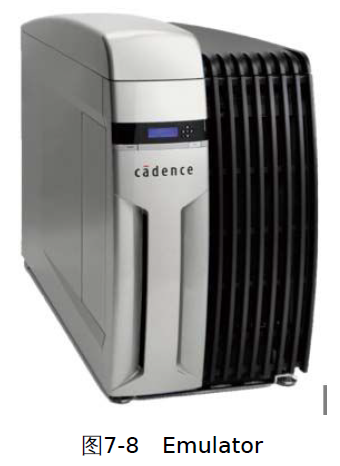

在設計SSD主控芯片時，Emulator和FPGA都可以用於ASIC Verification，那這兩者區別有哪些？

- 價格：Emulator大概百萬美元級別，FPGA大概是數千到萬美元級別；
- 能力：Emulator的邏輯可以到數十億門級別，FPGA大概是百萬門級別。一塊FPGA可能只能模擬前段（PCIe+NVMe），後端（閃存Controller）可能需要另外一塊FPGA
- Debug：Emulator可以比較方便地導出ASIC工程師所需要的信號並抓取硬件邏輯波形，而FPGA在連接協議分析儀、邏輯分析儀方面比較方便；
- 速度：Emulator雖然好，但是速度比FPGA要慢得多
- 檔次：FPGA是個公司就能有，Emulator則絕對是實力的彰顯

Emulator（或FPGA）的另一個好處是，固件團體可以使用這些工具提前開始開發，不用等芯片回來以後，先經歷"不死也要脫層皮"的Bringup階段，然後才開始"遇到問題不知道硬件原因還是代碼原因的"開發階段。

<h3 id="7.3.2">7.3.2 協議分析儀</h3>

前端協議分兩大類：SATA/SAS和PCIe

SSD主控一般分前、中、後三段：

- 前端就是SATA/SAS和PCIe這些配上AHCI或者NVMe
- 中段就是FTL
  - FTL是純軟件實現，測這個基本上不需要什麼設備
- 後端就是閃存控制器
  - 後端跟閃存打交道，主要用邏輯分析儀

介紹兩種協議分析儀（Analyzer）：

- SATA/SAS Analyzer
  - SATA Host和SATA SSD之間傳輸命令和數據
  - SerialTek SATA/SAS Analyzer

    

  - 主機和SSD之間的示意圖

    

  - SATA Trace示例

    


- PCIe Analyzer

  - 使用PCIe Analyzer可以測量PCIe的物理層、鏈路層、事務層。跟示波器不同，Analyzer可以基於PCIe協議將鏈路上所有Lane上發生的事務都解析出來，並且還提供Trigger（觸發）的功能

    

    

對於Analyzer的一大挑戰就是在鏈路電源狀態切換的過程能夠快速適應，越早實現正確的抓包並解析越好

<h3 id="7.3.3">7.3.3 Jammer</h3>

為了保證健壯性，ASIC和固件工程師們要花大量的精力，腦補各種錯誤可能性，在RTL和FW中加入相應的錯誤處理（Error Handling）的流程

搞測試的就是平時給ASIC和固件找麻煩，以SATA SSD為例，可以用一種工具——Jammer

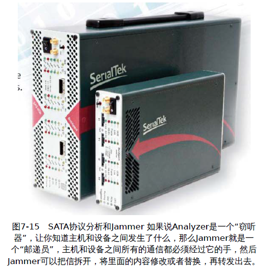

Jammer還有別的用處，當你想知道某種場景（Scenario）發生以後主機或者設備的反應時，可以通過Jammer來知道答案

<h2 id="7.4">7.4 回歸測試</h2>

回歸測試（Regression Test）：

- 確保新的代碼沒有影響原有功能
- 從現有功能的測試用例中選取部分或者全部出來進行測試
  - 那些經常失敗的項目，比如壓力測試；
  - 用戶肉眼可見的功能，比如跑Benchmark；
  - 核心功能的測試；
  - 那些目前正在進行或者剛完成的功能；
  - 數據完整性測試——R/W/C；
  - 邊界值測試。

<h2 id="7.5">7.5 DevSlp測試</h2>

新的測試要求主要是關注DevSlp狀態的進出是否正常，要實現這個必須具備兩點：

- 能讓設備進入DevSlp
- 進去以後能夠偵測到DevSlp的狀態

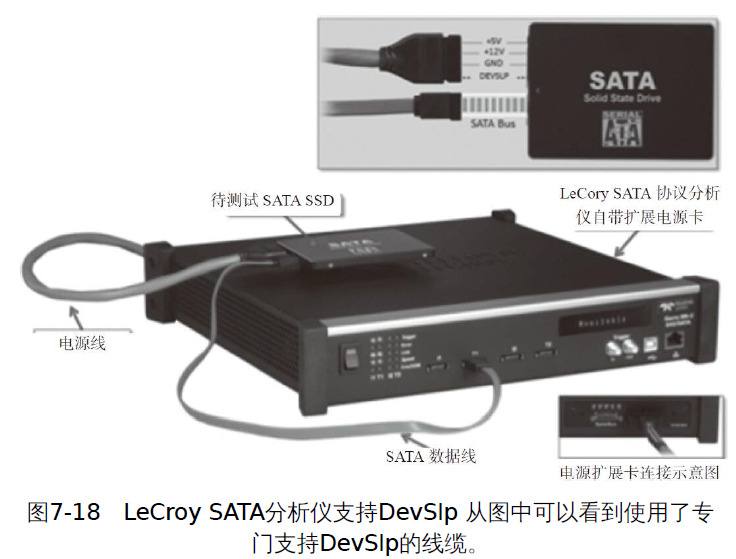

針對DevSlp的case：

- IPM-12：Entering DevSlp Interface power state（進入DevSlp模式）

  1. 先讓SSD進入DevSlp狀態
  2. 保持DevSlp信號有效的情況下，持續向SSD發包，確保SSD不會回應發過去的包
  3. 檢查各種時間參數是否在規定範圍內

    

    

- IPM-13：DevSlp interface power state exit latency（DevSlp模式退出時延）
  - 退出DevSlp並不需要完整的上電流程，而是使用COMWAKE信號讓SATA鏈路快速進入PHY Ready狀態
  - DETO：協議規定設備從DevSlp狀態下退出需要在20ms內完成

<h2 id="7.6">7.6 PCIe InterOP</h2>

PCI-SIG會提供Compliance Workshop，各公司可以把自己的產品拿去測試，包括：

- Electrical Testing：電氣化測試，重點測試物理層的發送端和接收端。
- Configuration Testing：PCIe設備配置空間測試。
- Link Protocol Testing：設備鏈路層協議相關測試。
- Transaction Protocol Testing：事務層協議測試。
- Platform BIOS Testing：平台BIOS測試。

如果能走完這一套流程，說明PCIe接口基本上沒有問題，PCI-SIG會將其放置[Integrators List](https://pcisig.com/developers/integrators-list)

Interoperability Test：各家公司可以把自家產品拿出來跟其他公司的產品放到一起，看互相之間組隊有沒有問題

>PCIe SSD最高到Gen3x4（鏈路速度Gen3，帶寬為x4）
某開發版 RC最高到Gen3x16

- 通過Link Capability Register（鏈路能力寄存器）了解雙方各自的鏈路速度[3：0]和帶寬[9：4]，如圖7-21所示

    

- 把PCIe SSD插到某公司的開發板，開機，檢查你的PCIe SSD被OS識別到（過程中可能會提示安裝驅動）

- 檢查Link Status Register確定link狀態是Gen3x4，如圖7-22所示

    

- 若PCIe SSD還支持其他lane width，重複上述步驟

- Speed和Width正確還不夠，還需要做一下簡單的數據傳輸，確保數據能順利通過PCIe Bus，透過PCI-SIG提供的[PCITree](http://www.pcitree.de/)來查看PCIe Register

以上都順利通過，把你們倆的交手記錄上傳到PCISIG的服務器上

<h2 id="7.7">7.7 WA(Write Amplification)測試</h2>

$$
WA=閃存寫入的數據量/主機寫入的數據量
$$

閃存寫入的數據量 和 主機寫入的數據量 可以從SMART信息裡得知

- S.M.A.R.T，全稱叫Self-Monitoring, Analysis, and Reporting Technology 自我監測，分析和報告技術


<h2 id="7.8">7.8 耐久度測試</h2>

JEDEC固態技術協會 有兩份SSD Endurance測試的協
議：

- JESD 218A：測試方法
- JESD 219：workload

基本測項：

- TBW：总写入数据量。
- FFR（Function Failure Requirement）：整个写入过程中产生
的累计功能性错误。
- Data Retention：长时间不使用（上电）情况下保持数据的能
力。
- UBER（Uncorrectable Bit Error Rate）：UBER=number of
data errors/number of bits read

企業級和消費級SSD在耐久度的要求上是不同的，體現在：

- 工作時間
- 工作溫度
- UBER
- Retention溫度以及時間


<h2 id="7.9">7.9 認證Certification</h2>

SATA-IO Plugfest和IW（Interoperability Workshop）

- IW的對像是量產產品，由SATA-IO主導，有固定的測試流程和項目，並且測試結果需要提交SATA-IO，通過測試的設備可以加入Integrators List
- Plugfest的對像是開發階段的產品，廠商之間互相玩耍，測什麼，怎麼測，大家自己說了算，測試結果不用提交給SATA-IO

---

PCIe SIG Compliance Program

https://pcisig.com/developers/compliance-program

- Electrical Testing：針對平台和卡的Tx和Rx電器性能進行測試
- Configuration Testing：PCIe configuration space測試（Tool：PCIE CV）
- Link Protocol Testing：針對設備進行鏈路層協議測試
- Transaction Protocol Testing：針對設備進行傳輸層協議測試
- Platform BIOS Testing：針對平台BIOS進行測試，判斷其能否識別並正確配置設備

通過PCIe SIG的測試同樣可以加入Integrators List

---

UNH-IOL(University of New Hampshire
InterOperability Laboratory) NVMe Test

https://www.iol.unh.edu/testing/storage/nvme/testsuites

- NVMe Conformance Test Suite
- NVMe Interoperability Test Suite

NVMe的測試工具：

https://www.iol.unh.edu/solutions/testtools/interact

- IOL INTREACT PC EDITION Software：基於UNH-IOL自己的NVMe Conformance Test Suite開源項目的工具，圖形界面上手容易
- IOL INTERACT Teledyne-LeCroy EDITION Software：高級版本，必須配合LeCroy的PCIe Exerciser和Analyzer使用，能夠自動跑完NVMe Conformance Test Suite裡面要求的測試，而且能夠自動抓取trace以供分析。

<h2 id="7.10">7.10 SSD Performance測試</h2>

全球網絡存儲工業協會（英語：Storage Networking Industry Association，縮寫：SNIA）給Client SSD與Enterprise SSD都制定了PerformanceTest（性能測試）的規範

https://www.snia.org/

名詞認知：

- FOB：Fresh Out of Box，指的是剛開封、全新的盤，並不是這塊盤在未來正常使用過程中的真實能力
- Transition：經過一段時間的讀寫，趨向於穩定狀態，這個過程稱為轉換狀態
- Steady State：數值穩定在一個區間，Performance相關的數據，例如Throughput（吞吐量）、IOPS、Latency（延遲）都必須在Steady State下獲取

    

Steady State（穩定態）的判斷原則是：這段時間內性能波動不超過±10%

概念介紹：

- Purge（擦除）：每次進行Performance測試前都必須進行，消除測試前的其他操作（讀寫及其他測試）帶來的影響，從而保證每次測試時盤都是從一個已知的、相同的狀態下開始，可以理解為：讓盤回到FOB狀態

- Precondition：通過對盤進行IO使其逐步進入Steady State的過程，分兩步進行

  - Workload Independent Preconditioning（WIPC）：第一步，讀寫時不使用測試的Workload
  - Workload Dependent Preconditioning（WDPC）：第二步，讀寫時使用測試的Workload

- Active Range：測試過程中對盤上LBA發送IO命令的範圍，如所示

    

- Data pattern：Performance測試必須使用隨機數據（向閃存中寫入的數據

<h1 id="8">八、SSD電源管理</h1>

SSD（Solid State Drive），即固態硬盤，是一種以半導體閃存（NAND Flash）作為介質的存儲設備

<h2 id="8.1">8.1 SATA省電模式Partial和Slumber</h2>

SATA鏈路電源管理，可以讓SATA鏈路的PHY進入低功耗模式，與硬盤或者SSD其他部分（CPU、DDR、後端）的電源管理是完全獨立的

- Partial模式：PHY處於低功耗狀態，退出時間要求＜10μs。 Partial是讓部分物理層（PHY）電路進入休眠模式，能夠在10μs內被喚醒
- Slumber模式：PHY處於更低功耗狀態，退出時間要求＜10ms。與Partial模式相比，Slumber關閉更多的電路，因此它的恢復要慢一些，恢復時間大約為10ms

    

主機和設備都可以發起，分別稱為：

- HIPM（Host Initiated Power Management）
- DIPM（Device Initiated Power Management）

Listen Mode（偵聽模式）：AHCI支持讓沒有接盤的端口進入偵聽模式，此時該端口的功耗水平相當於Slumber，但是該端口可以識別新接入的盤。

Auto Partial to Slumber：可以讓鏈路不需要回到Active狀態，直接從Partial進入Slumber模式。

<h2 id="8.2">8.2 SATA超級省電模式DevSlp</h2>

從SATA 3.2開始，SATA有了一個新的功能DevSlp（Device Sleep，設備睡眠）

DevSlp是一個信號，通過發送這個信號讓盤進入一個非常省電的狀態

Partial/Slumber省電模式下，盤都必須讓自己的傳輸電路保持在工作模式，以便在SATA主機需要的時候能把盤喚醒。如圖8-2所示

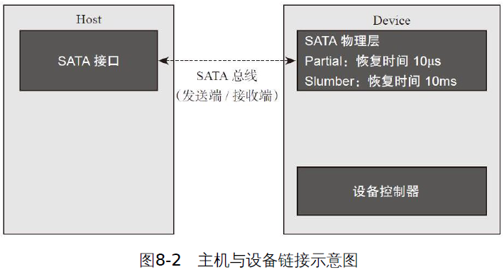

DevSlp就是把這個傳輸電路完全關掉，然後專門加了一個低速的管腳來負責接收喚醒通知，如圖8-3所示


DevSlp模式效果如圖8-4所示，功耗降低到了5mW左右，而恢復時間進一步延長至20ms


原本標準的2.5/3.5寸SATA接口上已經沒有多餘的管腳了，SATA3.2把管腳3單獨拿出來用於DevSlp，而原本管腳1、管腳2和管腳3是用於3.3V管腳供電的

主機和設備都必須支持該功能才可以工作，主機置位DevSlp信號前需要確保：[OOB(Out-Of-Band)](https://blog.csdn.net/zdx19880830/article/details/105931509)結束以後通過Identify Device命令獲得的設備回复支持DevSlp

DevSlp的進入/退出流程

- DMDT（DEVSLP Minimum Detection Time）：設備在DevSlp置位後需要在10us內檢測到；
- DETO（Device Sleep Exit Timeout）：設備必須在20ms（或者Identify Device Data log裡規定的時間）內檢測到OOB信號；
- 雙方使用COMWAKE或者COMRESET/COMINIT重新建立連接


<h2 id="8.3">8.3 SATA終極省電模式RTD3</h2>

DevSlp雖然功耗小，恢復時間也還行，但是進入DevSlp的時候Vcc還在，這樣還是會有功耗，因此要求設備在長期Idle後要把Power完全關掉

主機也就是系統處於S0的情況下，如何讓SATA SSD進入D3Cold狀態，這個就是Runtime D3，簡稱RTD3

ACPI規定的Device Power State：

- D0：設備處於工作狀態，所有功能可用，功耗最高，所有設備都必須支持；
- D0active：設備完成配置，隨時準備工作；
- D1和D2是介於D3和D0之間的中間狀態；
- D3Hot：設備進入D3，Vcc還在，設備可被軟件枚舉；
- D3Cold：設備完全切斷電源，重新上電時系統需要重新初始化設備

系統電源狀態（SATA SSD作為系統盤）：

- S0：工作模式，操作系統可以管理SATA SSD的電源狀態，D0或者D3都可以；
- S1：低喚醒延遲的狀態，系統上下文不會丟失（CPU和芯片組），硬件負責維持所有的系統上下文；
- S2：與S1相似，不同的是處理器和系統Cache上下文會丟失（操作系統負責維護Cache和處理器上下文），收到喚醒要求後，從處理器的複位向量開始執行；
- S3：睡眠模式（Sleep），CPU不運行指令，SATA SSD斷電，除了內存之外的所有上下文都會丟失，硬件會保存一部分處理器和L2Cache配置上下文，從處理器的複位向量開始執行；
- S4：休眠模式（Hibernation），CPU不運行指令，SATA SSD斷電，內存內容寫入SSD，所有的系統上下文都會丟失，操作系統負責上下文的保存與恢復；
-S5：Soft off state，與S4相似，但操作系統不會保存和恢復系統上下文，消耗很少的電能，可通過鼠標鍵盤等設備喚醒。

<h2 id="8.4">8.4 PCIe省電模式ASPM</h2>

(Hardware Initiated) ASPM = Hardware Initiated Active State Power Management

- 主控自己觸發的，不需要主機或者固件干涉

ASPM定義的低功耗模式有兩種：L0s和L1（見圖8-9深色部分）

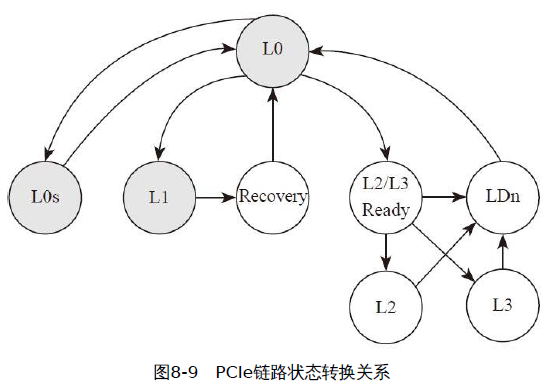

- L0：正常工作狀態；
- L0s：低功耗模式，恢復時間短；
- L1：更低功耗模式，恢復時間較長；
- L2/L3Ready：斷電前的過渡狀態；
- L2：鏈路處於輔助供電模式，極省電；
- L3：鏈路完全沒電，功耗為0；
- LDn：剛上電，LTSSM還未完成前鏈路所處狀態。

是否支持ASPM，你需要查看它的Link Capabilities Register（鏈路能力寄存器）的bit 11:10 （只讀屬性）：


- 00b：保留。
- 01b：支持L0s。
- 10b：保留。
- 11b：支持L0s和L1。

控制開關要查看鏈路控制寄存器的bit1：0（可讀寫屬性）：


- 00b：禁用
- 01b：L0s使能
- 10b：L1使能
- 11b：L0s和L1均使能

<h2 id="8.6">8.6 NVMe動態電源管理</h2>

Enterprise NVM Express dynamic power management interface


NVMe協議裡給出了動態電源管理的框圖：


- 功耗目標和性能目標作為系統應用層面的輸入，發送給主機端的NVMe驅動

<h2 id="8.7">8.7 Power Domain</h2>

由於筆電相對於桌機是使用電池與結構相對緊湊，為了使電池壽命叫較好，會希望SSD功率低, 結構緊湊

主控把芯片內部的模塊劃分成了幾個部分，學名叫Power Domain，簡稱PD：


整個節能邏輯的大致如下：

1. 主機一段時間沒有讀寫，觸發SSD的PCIe鏈路進入ASPM，退出延遲非常短；
2. 主機繼續Idle，PCIe鏈路進入ASPM Substate，SSD仍處於工作模式，退出延遲也很短；
3. 主機繼續Idle，主控操作PD#1（關閉NVMe模塊、各級FIFO、ECC模塊、閃存控制器等），SSD進入Idle Mode，退出延遲明顯延長；
4. 主機繼續Idle，主控操作PD#2，將CPU進入睡眠模式，DRAM進入Self Refresh模式，進入最高節能模式，退出延遲最長；

主控會設置一個溫度閾值來控制發熱：

- 當芯片溫度接近閾值時，主動降低時鐘頻率，使溫度降低
- 等溫度回到指定範圍，再把時鐘調回正常工作頻率

    

<h1 id="9">九、ECC原理</h1>

閃存都無法保證存儲的數據會永久穩定，所以需要ECC（糾錯碼）去給閃存糾錯

ECC能力的強弱直接影響到SSD的使用壽命和可靠性

<h2 id="9.1">9.1 信號和噪音</h2>

有信息傳遞的地方就有噪聲

- 增強信號和噪聲的強度比
- 增加信號冗餘

實際通信中，我們用information bits表示有效信息長度，channel use表示實際通信中傳輸的信息長度。Code rate可以反映冗餘程度，定義：

$$
Code rate=（information bits）/（channel use）
$$

- Code rate越高，冗餘越小
- Code rate越低，冗餘越大

每一種實際的信息傳輸通道都有一個參數C，如果Code rate＜C，有效信息傳遞的錯誤率可以透過糾錯編碼（Error correction code）要在理論上趨近於0

<h2 id="9.2">9.2 通信系統模型</h2>

所有的信息傳播都少不了通信系統，一個完整的通信系統模型：

- 信息由信息源產生
- 由發送器發送出信號
- 通過包含噪聲的信號傳輸通道（Channel，信道）
- 接收器接收信號
- 接收器提取出信息發送到目的地。


在二進制編碼的系統中，有兩種常見的Channel模型：

- BSC（Binary Symmetric Channel，二進制對稱信道）
  - BSC出錯（接收者收到的0不一定是0，可能發送者發送的是1；同樣，收到的1不一定是1，可能發送者發送的是0）
  - 二進制信號由0、1組成，由於Channel噪聲的影響，0、1各有相同的概率p翻轉，即0變1，1變0。信號仍然保持不變的概率為1-p
  - 原始信號“101001101010”變為“111001111000”

    

- BEC（Binary Erasure Channel，二進制擦除信道）
  - BEC丟bit（接收者如果收到0（1），那麼發送者發送的肯定是0（1）；如果傳輸發生錯誤，接收者則接收不到信息）。
  - BEC模型認為在信號傳輸中，無論是0還是1都有一定概率變為一個無法識別的狀態
  - 原始信號“101001101010”變為“1x10011x10x0”（x表示未知狀態）

    

SSD裡的Channel模型一般採用BSC，即認為閃存信號發生了一定概率的位翻轉（bit-flip），為了使得信息從源頭（source）在經過噪聲的信道後能夠準確到達目的地，我們要對信息進行編碼，通過增加冗餘的方式保護信息。


- Source發出的信息可用k bit的信息x表示，經過編碼器（Encoder）轉化為n bit信號c
- 發送器把信號發送出去，經過Channel後，接收器收到信號n bit信號y，經過解碼器（Decoder）轉成k bit信息x'

<h2 id="9.3">9.3 糾錯編碼的基本思想</h2>

糾錯編碼的核心設計思想是通過增加冗餘信息，使得原始信息的編碼之間有足夠大的區別。

<h3 id="9.3.1">9.3.1 編碼距離</h3>

距離指的是漢明距離，即兩個信號之間有多少bit不同，與編碼的集合相比

- 信號（0，1，1）與（0，0，0）的距離為2
- 信號（1，1，1）與（0，0，0）的距離為3

有4個信息，為00，01，10，11，如何插入冗餘

重複法：

- 00變為00000000
- 01變為01010101
- 10變為10101010
- 11變為11111111

接收的到信號為00010000，我們發現跟這個信號最相似的是00000000，距離為1

<h3 id="9.3.2">9.3.2 線性糾錯碼的基石 -- 奇偶校驗</h3>

信號校驗的基本模型是：對信號進行某種特定的處理後，得到期望的結果是為校驗通過，否則校驗失敗

H表示對信號y進行處理，處理結果用CR表示


在二進制的世界裡，最基礎的校驗方法是奇偶校驗，即Parity-Check


- 長度為16的二進制數據：1000100111011011，其中1的個數為9，故CR=1

- 異或（即xor）運算，符號為⊕，運算方式是先進行加法運算，然後用運算結果對2取餘數（mod（2））

    

- 把二進制的每一個bit依次進行xor運算，奇數個bit 1的結果為1，偶數個bit 1的結果為0

    

利用奇偶校驗可以構造最簡單的校驗碼——單bit校驗碼SPC（即single bit parity check code）

- 把長度為n的二進制信息增加1bit yn+1變成y'，在y'構成了y的單bit校驗碼，式子又稱作奇偶校驗方程

    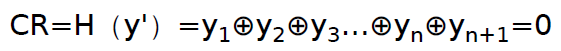

- y'中任意一個bit如果發生bit反轉，無論從0到1，還是1到0，校驗方程CR=1
- SPC可以探知任意單bit的反轉。對於偶數個bit反轉SPC無法探知。而且校驗方程無法知道bit反轉的位置，所以無法糾錯

因此透過增加SPC的個數，增加冗餘的校驗信息。同一個bit被好幾個校驗方程保護，當它出現錯誤時就不會被漏掉。

<h3 id="9.3.3">9.3.3 校驗矩陣H和生成矩陣G</h3>

用+代替⊕

多個校驗方程可以表示為校驗矩陣H，有了H就可以確定所有正確的碼字

- H矩陣裡每一列可以表示一個校驗方程
- 列裡的1的位置i表示信號中第i bit參與校驗方程

對於所有信息$x(x_0, x_1, x_2, x_3, x_4, x_5...)$，只要滿足 $Hx^T=0$ ，x就是正確的碼字。如果不滿足，則x不屬於正確的碼字，認為在傳輸的過程中x出現了錯誤。

- 長度為4的信號，$x（x_0, x_1, x_2, x_3）$

- 有兩個校驗方程：

$$
x_0⊕x_2=0 \\
x_1⊕x_2⊕x_3=0
$$

- 以矩陣來表示：

$$
x^T=\left\{
\begin{matrix}
x_0 \\
x_1 \\
x_2 \\
x_3
\end{matrix}
\right\}
$$

$$
H=\left\{
\begin{matrix}
1 & 0 & 1 & 0 \\
0 & 1 & 1 & 1
\end{matrix}
\right\}
$$

$$
Hx^T=\left\{
\begin{matrix}
x_0 + x_2 \\
x_1 + x_2 + x_3
\end{matrix}
\right\}
$$

- H矩陣裡每一列可以表示一個校驗方程
- 列裡的1的位置i表示信號中第i bit參與校驗方程
- 所有滿足奇偶校驗方程的x組成了一個編碼集合
- 編碼長度為n bit，有r個線性獨立的校驗方程，則可以提供k=（n–r）個有效信息bit和r個校驗bit

原始信號u經過一定的線性變換可以生成糾錯碼c，完成冗餘的添加

線性變換可以寫成矩陣的形式，這個矩陣就是生成矩陣G，表示為 $c=uG$

- c為n bit信號
- u為k bit信號
- G為k×n大小的矩陣

- 由H矩陣可以推導出生成矩陣G。

<h2 id="9.4">9.4 LDPC碼原理簡介</h2>

LDPC以其強大的糾錯能力，得到了廣大工程師的青睞，是目前最主流的糾錯碼

<h3 id="9.4.1">9.4.1 LDPC是什麼</h3>

LDPC全稱是Low Density Parity-Check Code，即低密度奇偶校驗碼

特徵是低密度，也就是說校驗矩陣H裡面的1的分佈比較稀疏


LDPC又分為正則LDPC（regular LDPC）和非正則LDPC（irregular LDPC）編碼：

- 正則LDPC保證：校驗矩陣每列有固定J個1，每行有固定K個1
- 非正則LDPC沒有上述限制

<h3 id="9.4.2">9.4.2 Tanner圖</h3>

H矩陣可以直觀地表示為Tanner圖，Tanner圖由節點和連線組成

節點有兩種：

- b節點（bit node）
  - 信號編碼長度為n，其中每一個bit用一個b節點表示
  - b節點用圓形表示
- c節點（check node）
  - 校驗方程個數為r，每一個校驗方程用一個c節點表示
  - c節點用方塊表示

如果某個b節點$b_i$參與了某個c節點$c_j$的校驗方程，則把b節點$b_i$和c節點$c_j$連起來


<h2 id="9.5">9.5 LDPC解碼</h2>

LDPC的解碼方法：

- 硬判決解碼（hard decision decode）
  - Bit-flipping算法
- 軟判決解碼（soft decision decode）
  - 和積信息傳播算法

<h3 id="9.5.1">9.5.1 Bit-flipping算法</h3>

核心思想：如果信號中有一個bit參與的大量校驗方程都校驗失敗，那麼這個bit有錯誤的概率很大

- 校驗矩陣的稀疏性把信號的每個bit盡量隨機地分散到多個校驗方程中去
- Bit-flipping算法運用消息傳遞方法，通過不斷迭代達到最終的糾錯效果

給定一個n bit信號$y（y_1, y_2, … , y_n）$，校驗矩陣H。畫出H矩陣對應的Tanner圖。 n bit信號對應n個b節點，r個c節點：

1. 每個b節點向自己連接的c節點發送自己是0還是1。初始是第i個bit發送初始值yi

2. 每個c節點收到很多b節點的信息，每個c節點代表一個校驗方程

   - 如果方程滿足，c節點將每個b節點的消息原封不動地發送回去
   - 如果校驗失敗，c節點將每個b節點發來的消息取反後，發送回去

3. 每個b節點跟好多c節點相連，b節點收到所有來自c節點的消息後，採用投票法來更新這一輪輸出的消息。參加投票的包含每個bit的初始值。投票的原則是少數服從多數

4. b節點更新好後，若所有的校驗方程滿足或者迭代次數超過上限，則停止，否則重複步驟1繼續迭代

範例：輸入信號y=[1 0 1 0 1 1]

1. 步驟1如圖9-7所示，實線箭頭表示傳遞的信息為1，虛線箭頭表示傳遞的信息為0：

    

2. 步驟2，c節點給各個b節點發回消息。滿足校驗方程的c節點原封不動返回消息，不滿足則取反返回，如圖9-8所示

    

3. 步驟3，投票法表決並重新更新b節點的值，如圖9-9所示

    

4. 步驟4，重新檢查節點，發現校驗方程滿足，結束，如圖9-10所示

    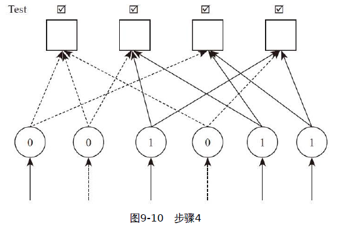

因為校驗矩陣的結構，如果同時改變很多b節點的話，可能無法收斂

將梯度下降法應用到Bit-flipping算法中。通過構造目標函數，目標函數包括校驗方程最小誤差，以及與原信號最大相似，來更新b節點

- 先進行多個bit的翻轉，等校驗方程失敗的個數小到一定程度後，再進行單個bit翻轉


<h3 id="9.5.2">9.5.2 和積信息傳播算法（sum-product message passing，簡稱和積算法）</h3>

在貝葉斯網絡、馬爾可夫隨機場等概率圖模型中用於推斷的一種信息傳遞算法

廣泛應用於人工智能和信息處理領域

一個非常經典的應用就是LDPC碼

概率論：

[聯合概率、邊緣概率、條件概率之間的關係&貝葉斯公式](https://blog.csdn.net/tick_tock97/article/details/79885868)

[聯合概率、邊緣概率、條件概率](https://zhuanlan.zhihu.com/p/53005534)

- 條件概率 $P（A|B）$，表示在事件B的條件下，發生事件A的概率

  - $P（B|A）=P（A，B）|P（A）$
其中P（A）、P（B）分別表示隨機事件A、B發生的概率

- 聯合概率P（A，B），表示事件A和事件B共同發生的概率
  - $P（A，B）=P（A|B）·P（B）=P（B|A）·P（A）$
  - 貝葉斯公式：$P（B|A）=P（A，B）|P（A）=P（A|B）·P（B）|P（A）$

- 邊緣概率P（A），從多元隨機變量中的概率分佈得出的只包含部分變量的概率分佈
  - 聯合概率 $P（A，B，C，D）= f（A，B，C，D）$，則邊緣概率P（A）的概率要把B，C，D所有取值都遍歷一遍

    $$
    P（A）=Σ_BΣ_CΣ_D f（A，B，C，D）    \\
    P（A|B=1）=Σ_CΣ_D f（A，B=1，C，D）
    $$

- 貝葉斯公式：解決的是一些原因X無法直接觀測、測量，而我們希望通過其結果Y來反推出原因X的問題
  - 先驗概率：知道原因推結果的，P(原因)、P(結果|原因)等
  - 後驗概率：根據結果推原因的，P(原因|結果)等

- 聯合概率、邊緣概率與條件概率之間的關係

    $$
    P(X=a|Y=b) = \frac{P(X=a, Y=b)}{P(Y=b)}
    $$

貝葉斯網絡（Bayesian networks）：推理性圖模型

> w、x、y、z分別表示4個隨機事件
> w表示一個人是否吸煙
> x表示其職業和煤礦是否相關
> y表示其是否患有咽炎
> z表示其是否得肺部腫瘤


$$
P（w，x，y，z）=P（w）P（x）P（y|w）P（z|w，x）
$$

- 只要知道了P（w）、P（x）和P（y|w）、P（z|w，x），那麼網絡模型就構建出來了

    ```Text
    P（w）表示一個人抽煙的概率 -> 可以用社會平均統計數據
    P（x）表示職業和煤礦相關的概率 -> 可以用社會平均統計數據
    P（y|w）表示吸煙與否的條件下得咽炎的概率
        P（y|w=1）表示吸煙者得咽炎的概率
        P（y|w=0）表示不是吸煙者得咽炎的概率
    P（z|w，x）表示考慮是否吸煙和是否在煤礦工作的情況下肺部得腫瘤的概率
    ```

- 這個網絡建立起來後，當w，x，y，z發生任意一件或者幾件事情的時候，我們可以求其他事件的後驗概率

因子圖(factor graph)：

- 是一種無向概率圖模型，包含變量節點與因子節點
- 變量節點和因子節點之間有無向邊相連
- 與某個因子節點相接的變量節點，為該因子的變量
- 定義在因子圖上的聯合概率分布可以表示為各個因子的連乘積

    

- 貝葉斯網絡用因子圖表示

    

- 基於Factor Graph可以用sum-product算法可以高效的求各個變量的邊緣分佈

聯合概率可以表示為：

$$
P（A，B，C，D，E，F，G）∝f（A，B，C，D，E，F，G）
\\
=f1（A，B，C）f2（B，D，E）f3（C，F）f4（C，G）
$$

上式$f_i$中叫作約束方程。 $f_i（S_i）$表示第i個因子，用$S_i$來表示其約束的隨機變量組合


用因子圖來表示，乘–加變換為加–乘後，計算複雜度降低，再求解邊緣概率就比較簡單

$$
Σ_i(xy_i)=xΣ_i(y_i)
$$

求邊緣概率的過程就是一個乘積然後相加的過程，所以叫和積（sum-product）

最終的邊緣概率$P（X_i）=Kf（X_i）$，K為歸一化因子。如果$f（X_i=1）＜f（X_i=0）$，我們輸出$X_i$為0，否則輸出1

......
看不懂暫略
......

<h2 id="9.6">9.6 LDPC編碼</h2>

LDPC是一種以解碼為特點的編碼，由於LDPC的性質主要由H矩陣決定，一般先確定H矩陣後，反推回生成矩陣G

H矩陣構建時候，應當注意：

1. 保持稀疏。每行每列裡1的個數要固定，或者接近固定
2. 考慮到生成矩陣的計算複雜度
3. 保持隨機性

<h2 id="9.7">9.7 LDPC在SSD中的應用</h2>

- NAND糾錯模型
- LDPC在SSD中的糾錯流程

<h3 id="9.7.1">9.7.1 NAND會出錯</h3>

糾錯能力是一個SSD質量的重要指標

在存儲密度不斷增加的同時，器件尺寸變小，存儲單元電氣耦合性變得很複雜。比如氧化層變得很薄，比如讀取單個bit需要的讀電壓控制能力更精密等

因此NAND flash更容易出錯，或者說NAND上的噪聲增加

RBER（Raw Bit Error Rate）是衡量NAND質量的重要參數

- 給定RBER，可以比較各種糾錯算法的有效性

    

<h3 id="9.7.2">9.7.2 NAND糾錯模型</h3>

通過調節不同的閾值電壓來對NAND進行多次讀取，可以獲得額外的信息（得到閾值電壓在哪個區間），如圖9-28所示。利用概率論的知識，可以建立統計模型


圖9-28所示的左右兩條曲線分別為$p（Y|X=1）$和$p（Y|X=0）$的曲線。根據之前和積算法的介紹，我們感興趣的是：$P（X|Y=A），P（Z|Y=B），P=（X|Y=C），P（X|Y=D）$。知道這幾個概率後，LDPC軟判決算法（如和積算法）就可以工作了。

<h3 id="9.7.3">9.7.3 LDPC糾錯流程</h3>

LDPC在SSD中的糾錯流程如圖9-29所示

- NAND硬判決、數據傳輸到控制器，以及硬判決解碼這幾個過程的速度都很快
- 軟判決要讀很多次，傳輸數據很多次，所以會對SSD的性能產生不好的影響


為了提高性能，一種普遍的優化是，把LDPC軟判決的分辨率變成動態可調，這樣只有在最壞的情況下，才需要最高的分辨率去讀。


