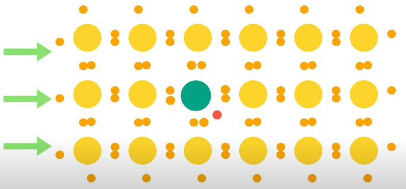
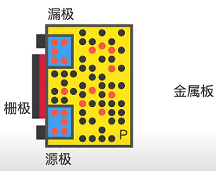
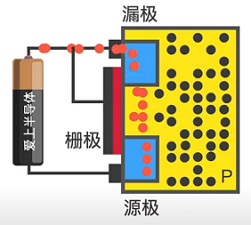
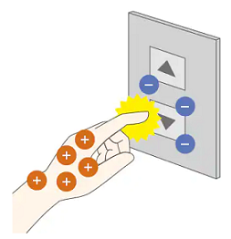
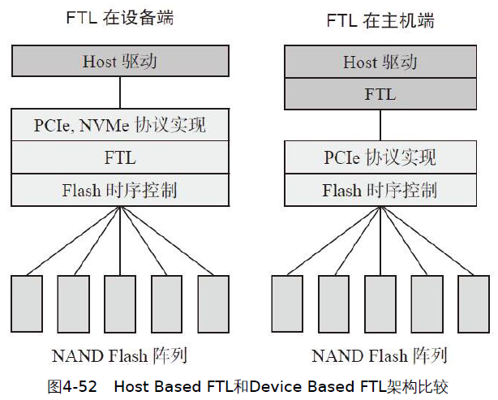

```
Author: Antony_Weng <weng851107@gmail.com>

This file is only used for the record of the learning process, only used by myself and the file has never been leaked out.
If there is related infringement or violation of related regulations, please contact me and the related files will be deleted immediately. Thank you!
```

# 深入浅出ssd-固态存储核心技术原理与实战

- [深入浅出ssd-固态存储核心技术原理与实战.pdf](./深入浅出ssd-固态存储核心技术原理与实战.pdf)

    

- [Pre-Knowledge](#0)
  - [Diode 二極體(管)](#0.1)
  - [Transistor 三極體（電晶體）](#0.2)
    - [功能](#0.2.1)
    - [原理](#0.2.2)
    - [特性](#0.3.3)
  - [MOSFET](#0.3)
    - [功能](#0.3.1)
    - [原理](#0.3.2)
    - [特性](#0.3.3)
- [一、SSD總述](#1)
  - [1.1 引言](#1.1)
  - [1.2 SSD vs. HDD](#1.2)
  - [1.4 SSD 基本工作原理](#1.4)
  - [1.5.1 基本信息剖析](#1.5.1)
  - [1.5.2 性能剖析](#1.5.2)
  - [1.5.3 壽命（Endurance）剖析](#1.5.3)
  - [1.5.4 數據可靠性剖析](#1.5.4)
  - [1.5.5 功耗剖析](#1.5.5)
  - [1.6 接口型態](#1.6)
  - [1.7.2 SSD、HDD應用場合](#1.7.2)
- [二、SSD主控和全閃存陣列](#2)
  - [2.1 SSD系統架構](#2.1)
- [三、SSD儲存介質：閃存](#3)
  - [3.1 閃存物理結構](#3.1)
  - [3.1.2 SLC、MLC和TLC](#3.1.2)
  - [3.1.3 閃存晶片架構](#3.1.3)
  - [3.1.4 讀、寫、擦原理](#3.1.4)
  - [3.1.5 三維閃存](#3.1.5)
  - [3.1.6 Charge Trap閃存 & 3.1.7 3D XPoint](#3.1.6)
  - [3.2.1 異步時序](#3.2.1)
  - [3.2.2 同步時序](#3.2.2)
  - [3.2.3 閃存命令集](#3.2.3)
  - [3.2.4 閃存尋址](#3.2.4)
  - [3.2.5 讀、寫、擦時序](#3.2.5)
  - [3.2.6 ONFI與Toggle協議之爭](#3.2.6)
  - [3.1 閃存存在的問題](#3.1)
    - [3.3.1.1 閃存壞塊](#3.3.1.1)
    - [3.3.1.2 讀干擾](#3.3.1.2)
    - [3.3.1.3 寫干擾](#3.3.1.3)
    - [3.3.1.4 存儲單元間的耦合](#3.3.1.4)
    - [3.3.1.5 電荷洩漏](#3.3.1.5)
  - [3.3.2 壽命](#3.3.2)
  - [3.3.3 閃存測試](#3.3.3)
  - [3.3.4 MLC使用特性](#3.3.4)
  - [3.3.5 讀干擾](#3.3.5)
  - [3.3.6 閃存數據保存期](#3.3.6)
  - [3.4 閃存數據完整性](#3.4)
    - [3.4.2 重讀](#3.4.2)
    - [3.4.3 ECC糾錯碼](#3.4.3)
    - [3.4.4 RAID](#3.4.4)
    - [3.4.5 數據隨機化](#3.4.5)
- [四、SSD核心技術：FTL(Flash Translation Layer，閃存轉換層)](#4)
  - [4.2 映射管理](#4.2)
  - [4.3 垃圾回收](#4.3)
  - [4.4 Trim](#4.4)
  - [4.5 磨損平衡](#4.5)
  - [4.6 掉電恢復](#4.6)
  - [4.7 壞塊管理](#4.7)
  - [4.8 SLC cache](#4.8)
  - [4.9 Read Disturb(RD) & Data Retention(DR)](#4.9)
  - [4.10 Host Based FTL & Device Based FTL](#4.10)
- [五、PCIe介紹](#5)


<h1 id="0">Pre-Knowledge</h1>

<h2 id="0.1">Diode 二極體(管)</h2>

- P型半導體 + N型半導體 = 二極體

    

- 將其通電，即會產生電場，電場方向與受力方向相反

    

    

  - 當P端接正極：自由電子能向左移動與電洞結合，在電源的作用下可以形成電流

    

  - 當N端接正極：自由電子因為電場，而受力向右無法和電洞結合，無法形成電流，而造成截止

    

- 二極體的單向導電性

    

<h2 id="0.2">Transistor 三極體(管)（電晶體(管)）</h2>

<h3 id="0.2.1">功能：</h3>

- 當基極(B)沒有電流時，三極管會是截止非導通的狀態

    

- 當基區(B)有電流時，三極管會是導通的狀態

    

<h3 id="0.2.2">原理：</h3>

**N型半導體**

- 將磷原子摻進硅原子中，此時多出來的那顆電子，只要些許的能量就可以成為自由電子

    

- 因為自由電子帶負電，故取名為N型半導體

    

**P型半導體**

- 將硼原子摻進硅原子中，此時會缺少一個電子，即多一個電洞，帶正電，會吸引電子，故取名為P型半導體

    

**電晶體**

- 三極體可以理解為兩個二極體以P作為重疊進行相接

    

- 三個部分分別為**發射區(E)**、**基區(B)**、**收集區(C)**，且與二極體相接不相同的地方為它各區的濃度不相同，已發射區(E)最高，且基區(B)最薄

    

    

- 當三極體與電源，不論正接或反接，就是截止非導通的狀態

    

    

- 為了使三極體能夠導通，故需要在BE極也加上一個電源

    

    

- 接上電源的BE二極體會使電子由E極流向B極，但由於B區的電洞密度不大，故址會有些許的電流由B極流向E極，形成**基極電流**，而大部分的電子會吸引到了集電區(C)，形成**集電極電流**，也就是**輸出電流**

    

    

    

<h3 id="0.3.3">特性：</h3>

- 當基極電流越大，流入基區的電子越多，進而流入集電區的電子更多，因此會有更大的集電極電流，這就是三極體利用**小電流控制大電流**的原理

    

    

- 基區(B)作的很薄，是因為讓發射區(E)的電子更容易地進入集電區(C)

    

- 基區(B)的電動濃度很低，是為了使基極電流越小，也使電子更容易地進入集電區(C)

    

<h2 id="0.3">MOSFET</h2>

<h3 id="0.3.1">功能：</h3>


- 當柵極(G)沒有施加電壓時，漏極(D)至源極(S)會被截斷

    

- 當柵極(G)施加電壓時，電流由漏極(D)至源極(S)會導通

    

<h3 id="0.3.2">原理：</h3>

**二極體：**

- P型半導體 + N型半導體 = 二極體

    

- 將其通電，即會產生電場，電場方向與受力方向相反

    

    

  - 當P端接正極：自由電子能向左移動與電洞結合，在電源的作用下可以形成電流

    

  - 當N端接正極：自由電子因為電場，而受力向右無法和電洞結合，無法形成電流，而造成截止

    

**電晶體：**

- 金屬氧化物半導體場效電晶體(Metal-Oxide-Semiconductor Field-Effect Transistor，縮寫：MOSFET)：

  - 以NPN相接，形成兩個二極體，且方向相反，在兩個N型半導體引出兩個電極，分別作為漏極(D)與源極(S)

    

  - 將其接上電後，MOSFET會是截止的(NP會是截止，PN會是導通)

    

  - 為了能使其導通，加上一層絕緣層以及金屬層，作為柵極(G)

    

    

    

  - 將柵極(G)與正極相連形成一個開關，當close的時候，柵極(G)會對內產生一個電場，隨著電場大小吸引電子與排斥電洞，

    

    

  - 當電子數量到達一定程度時，可將兩個N型半導體之間視為一個N溝道(一個N型半導體)，此時因為外在電壓可以造成電子移動，形成電流導通

    

    

    

  - 當柵極(G)與正極為open的時候，是截止不導通的

    

<h3 id="0.3.3">特性：</h3>

1. 柵極(G)與源極(S)之間的阻抗非常大且流入柵極(G)的電流極小，因為絕緣層的原因

    

2. 由於柵極(G)與源極(S)之間的阻抗非常大且流入柵極(G)的電流極小，使得柵極會有高壓的狀態，容易會有靜電擊穿的發生，造成絕緣層的效果失效，進一步使的N型半導體之間的電子會通過柵極(G)往正極跑至源級(S)形成電流由柵極(G)往源極(S)的導通

    

    

    

**Note：靜電擊穿**

- 靜電(static electricity)，是一種處於靜止狀態的電荷

- 由於電子行業的迅速發展，體積小、集成度高的器件得到大規模生產，從而導致導線間距越來越小，絕緣膜越來越薄，致使耐擊穿電壓也愈來愈低。

- 電子行業中靜電障害可分為兩類：
  - 由靜電引力引起的浮游塵埃的吸附
  - 由靜電放電引起的介質擊穿

- 介質擊穿分熱擊穿、化學擊穿和電擊穿三種形式：
  - 熱擊穿
    - 介質工作時，當損耗產生的熱量大於介質向周圍散發的熱量時，介質的溫度迅速升高，導電隨之增加，直至介質的熱損壞。
    - 可見熱擊穿的核心問題是散熱問題。
  - 化學擊穿
    - 在高壓下，強電場會在介質表面或內部的缺陷小孔附近產生局部空氣碰撞電離，引起介質電輝，生成化學物質--臭氧和二氧化碳，使絕緣性能降低，致使介質損壞。
  - 電擊穿
    - 在強電場中，隨著電場強的增強，電荷不斷積累，當達到一定程度時，電介質會失去極化特徵而成為導體，最後產生介質的熱損壞現象，這種現象稱為電介質的擊穿。
    - 可見電擊穿的本質是電荷積聚所致，因而防止電荷積聚就可防止電擊穿。
    - 一般把擊穿的臨界電壓稱為擊穿電壓, 臨界場強稱為擊穿場強。

**Note：靜電**

- 無論是什麼物體，都會帶有正、負兩種電。

- 正電與負電數量相同，可說是已取得平衡的良好狀態。專業術語稱此為「電中性的狀態」。

    

- 取得平衡的良好狀態並無法永遠維持，一旦發生某個現象，平衡就會輕易被破壞。而這個現象就是當不同的兩個物體相互「碰撞」，其中一方的負電將會轉移到另一方。

- 因「物體」不同，其吸引負電的力道不同所產生的相對關係。當兩個物體相互碰撞時，負電將會移動到吸引負電力道較強的一方。

    

- 此失去平衡的狀態就稱作「靜電」。帶有靜電的狀態，以專業的說法就是「有帶電」。靜電有帶正電的「正靜電」與帶負電的「負靜電」。

- 負電返回正電端的現象稱為「放電」。換句話說，放電就是「釋放負電」，這時候在「物體」與「物體」之間會有電流流動。

    


<h1 id="1">一、SSD總述</h1>

SSD（Solid State Drive），即固態硬盤，是一種以半導體閃存（NAND Flash）作為介質的存儲設備

<h2 id="1.1">1.1 引言</h2>

SATA2.5吋與3.5吋，以及M.2接口的尺寸
Note: 傳統HDD2.5吋


SSD是用固態電子存儲芯片陣列製成的硬盤，主要部件為控制器和存儲芯片

SSD硬件包括幾大組成部分：主控、閃存、緩存芯片DRAM（可選，有些SSD上可能只有SRAM，並沒有配置DRAM）、PCB（電源芯片、電阻、電容等）、接口（SATA、SAS、PCIe等），其主體就是一塊PCB


SSD內部運行固件（Firmware，FW）負責調度數據從接
口端到介質端的讀寫，還包括嵌入核心的閃存介質壽命和可靠性管理調度算法，以及其他一些SSD內部算法

SSD的三大技術核心 = SSD控制器 + 閃存 + 固件

### 儲存介質

存儲介質按物理材料的不同可分為三大類：光學存儲介質、半導體存儲介質和磁性存儲介質

- 光學存儲介質，就是大家之前都使用過的DVD、CD等光盤介質，靠光驅等主機讀取或寫入
- HDD是以磁性存儲介質來存儲數據
- SSD採取半導體芯片作為存儲介質


閃存

- 浮柵晶體管（Floating Gate Transistor）
- 相比MOSFET就多了個Floating Gate，懸浮在中間，所以叫浮柵
- 它被高阻抗的材料包裹，和上下絕緣，能夠保存電荷，而電荷通過量子隧道效應進入浮柵

    

<h2 id="1.2">1.2 SSD vs. HDD</h2>

HDD = 馬達 + 磁頭 + 磁盤, 機械結構
SSD = 閃存介質 + 主控, 半導體存儲芯片結構


1. 性能好

- 性能測試工具包括 連續讀寫吞吐量（Throughput）工具 和 隨機讀寫IOPS工具 兩種

    

2. 功耗低

- 工作功耗HDD為6～8W，SATA SSD為5W，待機功耗SSD可降低到毫瓦（mW）級別

    

- 科學地比較功耗的方法應該是Power/IOPS，也就是比較單位IOPS性能上的功耗輸出，該值越低越好

3. 抗震防摔

- SSD內部不存在任何機械部件，相比HDD更加抗震

4. 無噪聲

- 客觀上，由於結構上沒有馬達的高速運轉，SSD是靜音的

5. 尺寸小巧多樣

- HDD一般只有3.5寸和2.5寸兩種形式

- SSD除了3.5寸和2.5寸，還有更小的可以貼放在主板上的M.2形式，甚至可以小到芯片級，例如BGASSD的大小只有16mm×30mm

<h2 id="1.4">1.4 SSD 基本工作原理</h2>

從主機PC端開始，用戶從操作系統應用層面對SSD發出請求，文件系統將讀寫請求經驅動轉化為相應的符合協議的讀寫和其他命令，SSD收到命令執行相應操作，然後輸出結果

SSD的輸入是 命令（Command），輸出是 數據（Data） 和 命令狀態（Command Status）


SSD主要有三大功能模塊組成：

- 前端接口和相關的協議模塊
- 中間的FTL層（Flash Translation Layer）模塊
- 後端和閃存通信模塊

SSD通過諸如SATA、SAS和PCIe等接口與主機相連，實現對應的ATA、SCSI和NVMe等協議


SSD是怎麼進行讀寫的，以寫為例

- 主機通過接口發送寫命令給SSD，SSD接收到該命令後執行，並接收主機要寫入的數據
- 數據一般會先緩存在SSD內部的RAM中，FTL會為每個邏輯數據塊分配一個閃存地址，當數據湊到一定數量後，FTL便會發送寫閃存請求給後端，然後後端根據寫請求，把緩存中的數據寫到對應的閃存空間。
- SSD內部維護了一張邏輯地址到物理地址轉換的映射表

由於閃存不能覆蓋寫，閃存塊需擦除才能寫入

主機發來的某個數據塊，它不是寫在閃存固定位置，SSD可以為其分配任何可能的閃存空間寫入。透過 FTL 完成邏輯數據塊到閃存物理空間的轉換或者映射。

- 假設SSD容量為128GB，邏輯數據塊大小為4KB，所
以該SSD一共有128GB/4KB=32M個邏輯數據塊
- 每個邏輯塊都有一個映射，即每個邏輯塊在閃存空間都有一個存儲位置
- 閃存地址大小如果用4字節表示，那麼存儲32M個邏輯數據塊在閃存中的地址則需要32M×4B=128MB大小的映射表。

一個SSD在前端協議及閃存確定下來後，差異化就體現在FTL算法上了。 FTL算法決定了性能、可靠性、功耗等SSD的核心參數。

<h2 id="1.5.1">1.5.1 基本信息剖析</h2>

### SSD容量

以字節（Byte）為單位

同樣一組數據，二進制比十進制會多出7%的容量，例如：

- 十進制128GB：128×1000×1000×1000=128000000000字節
- 二進制128GB：128×1024×1024×1024=137438953472字節

裸容量：以二進制為單位的容量
用戶容量：以十進制為單位的容量

SSD可以利用這多出來的7%空間管理和存儲內部數據，比如把這部分額外的空間用作FTL映射表存儲空間、垃圾回收所需的預留交換空間、閃存壞塊的替代空間等。

7%多餘空間也可以轉換為OP概念（Over Provisioning）

$$
OP=\frac{(SSD裸容量-用戶容量)}{用戶容量}
$$

### 介質信息

閃存分SLC、MLC、TLC（甚至QLC），它指的是一個存儲單元存儲的比特數
- SLC（Single-Level Cell）即單個存儲單元存儲1bit的數據。 SLC速度快，壽命長（5萬～10萬次擦寫壽命），但價格超貴（約是
MLC 3倍以上的價格）。
- MLC（Multi-Level Cell）即單個存儲單元存儲2bit的數據。 MLC速度一般，壽命一般（約為3k～10k次擦寫壽命），價格一般。
- TLC（Trinary-Level Cell）即單個存儲單元存儲3bit的數據，也
有閃存廠家叫8LC，速度慢，壽命短（約500～1500次擦寫壽命），
價格便宜。

    

### 外觀尺寸


<h2 id="1.5.2">1.5.2 性能剖析</h2>

### 性能指標

IOPS（Input Output Operations Per Second，反映的是隨機讀寫性能）
- 設備每秒完成IO請求數，一般是小塊數據讀寫命令的響應次數，比如4KB數據塊尺寸。 IOPS數字越大越好。

吞吐量（Throughput，單位 MB/s，反映的是順序讀寫性能）：
- 每秒讀寫命令完成的數據傳輸量，也叫帶寬（Bandwidth），一般是大塊數據讀寫命令，比如512KB數據塊尺寸。吞吐量越大越好。

Response Time/Latency（響應時間/時延，單位ms或μs）：

- 每個命令從發出到收到狀態回复所需要的響應時間，時延指標有平均時延（Average Latency）和最大時延兩項（Max Latency）。響應時間越小越好。

### 訪問模式

Random/Sequential：隨機（Random）和連續（Sequential）數據命令請求。
- 何為隨機和連續？指的是前後兩條命令LBA地址是不是連續的

Block Size：塊大小，即單條命令傳輸的數據大小，性能測試從4KB～512KB不等。
- 隨機測試一般用小數據塊，比如4KB；
- 順序測試一般用大塊數據，比如512KB。

Read/Write Ratio：讀寫命令數混合的比例

<h2 id="1.5.3">1.5.3 壽命（Endurance）剖析</h2>

衡量SSD壽命主要有兩個指標，

- DWPD（Drive Writes Per Day）：即在SSD保質期內，用戶每天可以把盤寫滿多少次；
- TBW（Terabytes Written）：在SSD的生命週期內可以寫入的總的字節數。

200GB SSD五年使用期限內對應的壽命是3600TB，平均到每天可以寫入3600TB/（5×365）=1972GB，這塊盤本身200GB，1972GB相當於每天寫入10次，也就是規范書說的10Drive Writes Per Day，簡稱10DWPD。 DWPD為5年的壽命期內每天可以滿盤寫入的次數。

TBW就是在SSD的生命週期內可以寫入的總的字節數

$$
總寫入量TBW=Capacity(單盤容量)\frac{NAND PE Cycles(NAND寫擦除壽命)}{WA(寫放大)}
$$

- NAND PE Cycles：SSD使用的閃存標稱寫擦除次數，如3K、5K。
- Capacity：SSD單盤用戶可使用容量。
- WA：寫入放大係數，這跟SSD FW的設計和用戶的寫入的數據類型（順序寫還是隨機寫）強相關。

TBW和DWPD的計算公式：

$$
DWPD=\frac{TBW}{Years(SSD盤標示使用年限)*365*Capacity(單盤容量)}
$$

<h2 id="1.5.4">1.5.4 數據可靠性剖析</h2>

衡量SSD可靠性的關鍵指標

- UBER：Uncorrectable Bit Error Rate，不可修復的錯誤比特率
  - UBER是一種數據損壞率衡量標準，等於在應用了任意特定的錯誤糾正機制後依然產生的每比特讀取的數據錯誤數量佔總讀取數量的比例（概率）
- RBER：Raw Bit Error Rate，原始錯誤比特率
  - RBER反映的是閃存的質量。所有閃存出廠時都有一個RBER指標。 RBER指標也不是固定不變的，閃存的數據錯誤率會隨著使用壽命（PE Cycle）的增加而增加

    

  - RBER還跟閃存內部結構也有關係，Upper Page的RBER比Lower Page的RBER要高兩個數量級。

    

- MTBF：Mean Time Between Failure，平均故障間隔時間
  - MTBF指標反映的是產品的無故障連續運行時間


閃存有天然的數據比特翻轉率

- 擦寫磨損（P/E Cycle）
- 讀取乾擾（Read Disturb）
- 編程干擾（Program Disturb）
- 數據保持（Data Retention）發生錯誤

<h2 id="1.5.5">1.5.5 功耗剖析</h2>

SSD的功耗類型：

- 空閒（Idle）功耗：
  - 當主機無任何命令發給SSD，SSD處於空閒狀態但也沒有進入省電模式時，設備所消耗的功耗。
- Max active功耗：
  - 最大功耗是SSD處於最大工作負載下所消耗的功耗，SSD的最大工作負載條件一般是連續寫
- Standby/Sleep功耗：
  - 在Standby和Sleep狀態下，設備應盡可能把不工作的硬件模塊關閉，降低功耗。一般消費級SSD Standby和Sleep功耗為100～500mW。
- DevSleep功耗：
  - SATA和PCIe新定義的一種功耗標準，目的是在Standby和Sleep基礎上再降一級功耗
  - 配合主機和操作系統完成系統在休眠狀態下（如Hibernate），SSD關掉一切自身模塊，處於極致低功耗模式，甚至是零功耗。一般是10mW以下。

對於主機而言，它的功耗狀態和SSD作為設備端是一一對應的，而功耗模式發起端是主機，SSD被動執行和切換對應功耗狀態。

系統Power State（SATA SSD作為OS盤）：

- S0：工作模式
- S1：是低喚醒延遲的狀態, 硬件負責維持所有的系統上下文。
- S2：與S1相似，從處理器的reset vector開始執行。
- S3：睡眠模式（Sleep），CPU不運行指令，SATA SSD關閉，
除了內存之外的所有上下文都會丟失。
- S4：休眠模式（Hibernation），CPU不運行指令，SATA SSD
關閉，DDR內容寫入SSD中，所有的系統上下文都會丟失，OS負責上
下文的保存與恢復。
- S5：Soft off state，與S4相似，但OS不會保存和恢復系統上下
文。消耗很少的電能，可通過鼠標鍵盤等設備喚醒。

SSD功耗最大的是ASIC主控和閃存模塊

- 特定應用積體電路（英語：Application Specific Integrated Circuit，縮寫：ASIC）
- 控制SSD溫度是固件設計要考慮的，就是設計降溫處理算法

    

<h2 id="1.5.6">1.5.6 SSD系統兼容性</h2>

BIOS和操作系統的兼容性

- SSD上電加載後，主機中的BIOS作為第一層軟件和SSD進行交互。第一步，和SSD發生鏈接，SATA和PCIe走不同的底層鏈路鏈接

- 主機端和SSD連接成功後發出識別盤的命令（如SATA Identify）來讀取盤的基本信息，基本信息包括產品part number、FW版本號、產品版本號等，BIOS會驗證信息的格式和數據的正確性，

- 接著BIOS會讀取盤其他信息，如SMART，直到BIOS找到硬盤上的主引導記錄MBR，加載MBR
  - S.M.A.R.T指的是自我監控分析與報告技術，也是一種內建於硬碟和 SSD 中的監控功能
  - 主開機紀錄（Master Boot Record，縮寫：MBR），又叫做主引導磁區，是電腦開機後存取硬碟時所必須要讀取的首個磁區

- MBR開始讀取硬盤分區表DPT，找到活動分區中的分區引導記錄PBR(Partition Boot Record)，並且把控制權交給PBR……最後，SSD通過數據讀寫功能來完成最後的OS加載

啟動順序： BIOS -> MBR -> DPT -> PBR

從測試角度來看，系統兼容性認證包括以下各個方面：

- OS種類（Windows、Linux）和各種版本的OS；
- 主板上CPU南北橋芯片組型號（Intel、AMD）和各個版本；
- BIOS的各個版本；
- 特殊應用程序類型和各個版本（性能BenchMark工具、Oracle數據庫……）

電信號兼容性和硬件兼容性

- SSD工作時，主機提供的電信號處於非穩定狀態，比如存在抖動、信號完整性差等情況，但依然在規範誤差範圍內，此時SSD通過自身的硬件設計（比如power regulator）和接口信號完整性設計依然能正常工作，數據也依然能正確收發

容錯處理

- SSD盤若能容錯並返回錯誤狀態給主機，提供足夠的日誌來幫助主機軟硬件開發人員調試就更好了。這裡的錯誤包括接口總線上的數據CRC錯誤、丟包、數據命令格式錯誤、命令參數錯誤等。

<h2 id="1.6">1.6 接口型態</h2>

SSD接口形態和尺寸的英文是SSD Form Factor


mSATA是前些年出現的，與標準SATA相比體積大為縮小，主要應用於消費級筆記本領域。但待M.2出現後，基本上替代了mSATA，革了它的命。

M.2原名是NGFF（Next Generation Form Factor），它是為超極本（Ultrabook）量身定做的新一代接口標準，主要用來取代mSATA接口，具備體積小巧、性能主流等特點。


U.2Form Factor（SFF-8639）起步於PCIe SSD 2.5寸盤形態制定的接口，到後來統一了SATA、SAS和PCIe三種物理接口，從而減小了下游SSD應用場合的接口復雜度，是一種新型連接器FormFactor，目前標準還在更新中。

BGA SSD

- 隨著製程和封裝技術的成熟，當今一個PCB 2.5寸大小的存儲器可以放到一個16mm×20mm BGA封裝中，這就是BGA uSSD

    

- 目前（2017年）世界上最小尺寸的SSD，其與手機中的eMMC及UFS的尺寸一樣大小，但是容量要大得多

    


SDP(SATA Disk in Package)

- 指將SSD主控芯片、閃存芯片在封裝廠封裝成一體化模塊，經過開卡量產、測試後出廠。這種產品形態相當於SSD的半成品，只需要加上外殼就能成為完整的SSD產品

    

與傳統$PCBA$模式相比，$SDP^{TM}$具備哪些優勢？


U.2

- U.2俗稱SFF-8639，這是新生產物，採用非AIC(Add-In Card)形式，以盤的形態存在。開發U.2的目的是統一SAS、SATA、PCIe三種接口，方便用戶部署。

<h2 id="1.7.2">1.7.2 SSD、HDD應用場合</h2>

數據按照熱度的不同會採取不同的存儲方式，這樣可以平衡性能和成本的問題，俗稱性價比。在HDD和SSD二分天下的今天，SSD主要用於存放和用戶貼近的熱數據，其對總容量需求較小，性能優先；HDD主要用於存放和用戶較遠的溫（warm）數據或冷（cold）數據，其對總容量需求較大，價格優先

- 數據加速層：採用PCIe接口的高性能的SSD。
- 熱數據（頻繁訪問）層：採用普通SATA、SAS SSD。
- 溫數據層：採用高性能HDD。
- 冷數據層：採用HDD。
- 歸檔層：採用大容量價格低廉的HDD，甚至磁帶

SSD的研發模式，三方配合：主控廠商 + 閃存廠商 + 生產製造

<h1 id="2">二、SSD主控和全閃存陣列</h1>

SSD主要由兩大模塊構成——主控和閃存介質。
除了上述兩大模塊外，可選的還有緩存單元

主控是SSD的大腦，承擔著指揮、運算和協調的作用

- 實現標準主機接口與主機通信；
- 實現與閃存的通信；
- 運行SSD內部FTL算法。

<h2 id="2.1">2.1 SSD系統架構</h2>

SSD作為數據存儲設備，其實是一種典型的（System on Chip）單機系統，有主控CPU、RAM、操作加速器、總線、數據編碼譯碼等模塊，操作對象為協議、數據命令、介質，操作目的是寫入和讀取用戶數據。


前端（Host Interface Controller，主機接口控制器）跟主機打交道，接口可以是SATA、PCIe、SAS等


- SATA的全稱是Serial Advanced Technology Attachment（串行高級技術附件），是一種基於行業標準的串行硬件驅動器接口，是由Intel、IBM、Dell、APT、Maxtor和Seagate公司共同提出的硬盤接口規

    

- SAS（Serial Attached SCSI）即串行連接SCSI，是新一代的SCSI技術，和現在流行的Serial ATA（SATA）硬盤相同，都是採用串行技術以獲得更高的傳輸速度，並通過縮短連接線改善內部空間等

- SAS是並行SCSI接口之後開發出的全新接口，此接口的設計是為了改善存儲系統的效能、可用性和擴充性，並且提供與SATA硬盤的兼容性。SAS的接口技術可以向下兼容SATA

    

- PCIe（Peripheral Component Interconnect Express）是一種高速串行計算機擴展總線標準，旨在替代舊的PCI、PCI-X和AGP總線標準。

- PCIe屬於高速串行點對點多通道高帶寬傳輸，所連接的設備分配獨享通道帶寬，不共享總線帶寬，主要支持主動電源管理、錯誤報告、端對端的可靠性傳輸、熱插拔以及服務質量（QoS，Quality of Service）等功能。

- 數據傳輸速率高，目前最高的4.0版本可達到2GB/s（單向單通道速率）

- PCI Express也有多種規格，從PCI Express 1X到PCI Express 32X，意思就是1個通道到32個通道

    

    

主控CPU

- SSD控制器SoC模塊和其他嵌入式系統SoC模塊並沒有什麼本質的不同，一般由一顆或多顆CPU核組成，同時片上有I-RAM、DRAM、PLL、IO、UART、高低速總線等外圍電路模塊
- CPU負責運算、系統調度，IO完成必要的輸入輸出，總線連接前後端模塊。
- 的固件就運行在CPU核上，分別有代碼存儲區I-RAM和數據存儲區D-RAM
- 對稱多處理（SMP）多核共享OS和同一份執行代碼，共享一份I-RAM和D-RAM; 非對稱多處理（AMP)是多核分別執行不同代碼每核對應一份IRAM和D-RAM，每核獨立運行，沒有內存搶占導致代碼速度執行變慢的問題。
- SSD的CPU外圍模塊包括UART、GPIO、JTAG，這些都是程序必不可少的調試端口，另外還有定時器模塊Timer及其他內部模塊，比如DMA、溫度傳感器、Power regulator模塊等。

> Note: 
> JTAG是聯合測試工作群組（Joint Test Action Group）的簡稱，是在名為標準測試存取埠和邊界掃描結構的IEEE的標準1149.1的常用名稱。此標準用於驗證設計與測試生產出的印刷電路板功能。
> 在設計印刷電路板時，目前最主要用在測試積體電路的副區塊，而且也提供一個在嵌入式系統很有用的偵錯機制，提供一個在系統中方便的"後門"。當使用一些偵錯工具像電路內模擬器用JTAG當做訊號傳輸的機制，使得程式設計師可以經由JTAG去讀取整合在CPU上的偵錯模組。偵錯模組可以讓程式設計師偵錯嵌入式系統中的軟體。

後端（Flash Controller，閃存控制器）跟閃存打交道並完成數據編解碼和ECC

- ECC模塊是數據編解碼單元，由於閃存存儲天生存在誤碼率，為了數據的正確性，在數據寫入操作時應給原數據加入ECC校驗保護，這是一個編碼過程。
- 讀取數據時，同樣需要通過解碼來檢錯和糾錯，如果錯誤的比特數超過ECC糾錯能力，數據會以“不可糾錯”的形式上傳給主機
- 閃存控制器使用符合閃存ONFI(Open NAND Flash Interface)、Toggle標準的閃存命令，負責管理數據從緩存到閃存的讀取和寫入。
- 一個Die/LUN是一個閃存命令執行的基本單元
- Die/LUN是閃存通信的最小基本管理單元，配有下述的一套總線
- 從閃存控制器角度看，為了性能需求需要並發多個閃存Die/LUN，通常配置有多個通道（channel）。一個通道掛多少個閃存Die/LUN，取決於SSD容量和性能需求，Die/LUN個數越多，並發的個數越多，性能越好。
- 果一個通道上掛了多個閃存Die/LUN，每個Die共用每個通道上的一套總線，那閃存控制器通過選通信號CE#識別和哪個Die通信

閃存控制器和閃存連接引腳按照如下操作


- 外部接口：8個IO接口，5個使能信號（ALE、CLE、WE#、RE#、CE#），1個狀態引腳（R/B#），1個寫保護引腳（WP#）；
- 命令、地址、數據都通過8個IO接口輸入輸出；
- 寫入命令、地址、數據時，都需要將WE#、CE#信號同時拉低，數據在WE#上升沿被鎖存；
- CLE、ALE用來區分IO引腳上傳輸的是數據還是地址。


- 緩衝（Buffer）、DRAM
- 模塊之間通過AXI高速和APB低速總線互聯互通，完成信息和數據的通信
- 固件（Firmware）統一完成SSD產品所需要的功能，調度各個硬件模塊，完成數據從主機端到閃存端的寫入和讀取

<h1 id="3">三、SSD儲存介質：閃存</h1>

幾種存儲器特性對比


<h2 id="3.1">3.1 閃存物理結構</h2>

現在的固態硬盤一般都是使用閃存作為存儲介質，並且是NAND閃存

固態硬盤的工作原理很多也都是基於閃存特性的，比如：
- 閃存在寫之前必須先擦除，不能覆蓋寫，於是固態硬盤才需要垃圾回收（Garbage Collection，或者叫Recycle）
- 閃存每個塊（Block）擦寫次數達到一定值後，這個塊要么變成壞塊，要么存儲在上面的數據不可靠，所以固態硬盤固件必須做磨損平衡，讓數據平均寫在所有塊上，而不是盯著幾個塊拼命寫（不然很快固態硬盤就報廢了）。

閃存是一種非易失性存儲器，掉電了數據也不會丟失

閃存基本存儲單元（Cell）是一種類NMOS的雙層浮柵（Floating Gate）MOS管


- 在源極（Source）和漏極（Drain）之間電流單向傳導的半導體上形成存儲電子的浮柵，浮柵上下被絕緣層包圍，存儲在裡面的電子不會因為掉電而消失，所以閃存是非易失性存儲器。
- 寫操作是在控制極CG（Control Gate）加正電壓，使電子通過絕緣層進入浮柵極（Floating Gate，FG）。
- 擦除操作正好相反，是在襯底（Substrate）加正電壓，把電子從浮柵極（Floating Gate，FG）中吸出來


NAND 一個 plane 內部 MOS陣列，MOS管的 

- 漏極 BL = bit line，
- 柵極 WL = word line，
- 源極都連在一起，
- WL連接了若干個page，通過WL加不同電壓和不同時間長度進行各種操作，在BL端進行讀的操作。 
- Bit Line對應的一串MOS叫做string，Block的高度一般是一個string，但是很寬，很多個WL。


<h2 id="3.1.2">3.1.2 SLC、MLC和TLC</h2>

SLC(SingleLevel Cell)：一個存儲單元存儲1bit數據的閃存
MLC(Multiple Level Cell)：存儲2bit數據的閃存
TLC(Triple Level Cell)：存儲3bit數據的閃存


閃存芯片裡面存儲單元的閾值電壓分佈函數，橫軸是閾值電壓，縱軸是存儲單元數量

擦除之後，閃存讀出來的值為1，充過電之後，就是0。所以，如果需要寫1，就什麼都不用作；寫0，就需要充電到0。


一個存儲單元電子劃分得越多，那麼在寫入的時候，控制進入浮柵極的電子個數就要越精細，所以寫耗費的時間就越長；同樣的，讀的時候，需要嘗試用不同的參考電壓去讀取，一定程度上加長了讀取時間


<h2 id="3.1.3">3.1.3 閃存晶片架構</h2>

閃存芯片就是由成千上萬這樣的存儲單元按照一定的組織結構組成的。


一個Wordline對應著一個或若干個Page，具體是多少取決於是SLC、MLC或者TLC。

- SLC：一個Wordline對應1個Page
- MLC：一個Wordline對應2個Page，這兩個Page是一對（Lower Page和Upper Page）
- TLC：一個Wordline對應3個Page（Lower Page、Upper Page和Extra Page

一個Page有多大，那麼Wordline上面就有多少個存儲單元，就有多少個Bitline

一個Block當中的所有這些存儲單元都是共用一個襯底

一個閃存芯片有若干個DIE（或者叫LUN）
每個DIE有若干個Plane
每個Plane有若干個Block
每個Block有若干個Page
每個Page對應著一個或若干個Wordline
Wordline由成千上萬個存儲單元構成。


DIE/LUN是接收和執行閃存命令的基本單元。 
- LUN0和LUN1可以同時接收和執行不同的命令
- 但在一個LUN當中，一次只能獨立執行一個命令，你不能對其中某個Page寫的同時，又對其他Page進行讀訪問

一個LUN又分為若干個Plane，市面上常見的是1個或者2個Plane，現在也有4個Plane的閃存了。
- 每個Plane都有自己獨立的Cache Register和Page Register，其大小等於一個Page的大小。
- 主控在寫某個Page的時候，先把數據從主控傳輸到該Page所對應Plane的Cache Register當中，然後再把整個Cache Register當中的數據寫到閃存陣列
- 讀的時候則相反，先把這個Page的數據從閃存介質讀取到Cache Register，然後再按需傳給主控。
- Cache讀支持在傳輸前一個Page數據給主控的時候（Cache Register→主控），可以從閃存介質讀取下一個主控需要讀的Page的數據到Page Register（閃存介質→Page Register），這樣數據在閃存總線傳輸的時間就可以隱藏在讀閃存介質的時間裡
- Cache寫支持閃存寫前一個Page數據的同時（Page Register→閃存介質），傳輸下一個要寫的數據到Cache Register（主控→Cache Register），這樣數據在閃存總線傳輸可以隱藏在前一個Page的寫時間裡。

閃存寫入時間是指一個Page的數據從Page Register當中寫入閃存介質的時間，閃存讀取時間是指一個Page的數據從閃存介質讀取到Page Register的時間。

閃存一般都支持Multi-Plane（或者Dual-Plane）操作。
- 使用Dual-Plane操作，兩個不同Plane上的Page數據會在一個閃存讀取(寫入)時間加載到各自的Cache Register當中，這樣用一個讀取(寫入)時間讀取(寫入)到兩個Page的數據，讀取速度加快

一個Block當中的所有存儲單元是共用一個襯底（Substrate），當你對某襯底施加強電壓，那麼上面所有浮柵極的電子都會被吸出來。 ，所以閃存的擦除是以Block為單位的

<h2 id="3.1.4">3.1.4 讀、寫、擦原理</h2>

### 擦除

如下圖，擦除前，浮柵上有可能有電子，P well加20V電壓，經過足夠時間後，由於量子隧道效應，電子從浮柵到溝道裡面，完成一個block的擦除，閾值電壓都變成了-V T，狀態為“1” 。一個die上的MOS管都是用一個Pwell ，但是其它不用擦除的block ，柵極電壓是float ，不會有隧道效應。


### 寫入

如下圖，Erase後所有的Cell閾值電壓為-VT ，Program時電壓如下，要Program的Cell WL為高電壓，BL=0V ，由於量子隧道效應，電子從溝道到浮柵，成為“0” 。不program的cell BL為2V ，在溝道裡的效應阻礙了量子隧道效應發生。


### 讀取

要讀的cell WL = 0V ，-Vt的管子導通，BL端的傳感運放（Sense Amp ）能夠檢測到，所以讀到“1” ，而經過program的+Vt的管子不導通，Sense Amp讀為“0” 。


<h2 id="3.1.5">3.1.5 三維閃存</h2>

二維平面單元尺寸逐漸減小，單元間的相互干擾卻在逐漸增加。基於二二維平面單元尺寸逐漸減小，單元間的相互干擾卻在逐漸增加。基於二維平面單元結構的尺寸縮小已經無法進一步降低比特成本了，即達到了技術上的瓶頸。維平面單元結構的尺寸縮小已經無法進一步降低比特成本了，即達到了技術上的瓶頸。


- 2007年，BiCS（Bit Cost Scalable）技術（包含多堆疊柵極層結構）被提出
- 2009年，金屬柵極三維閃存技術（Terabit Cell Array Transistor，TCAT）被提出來

1）堆疊柵極層數目增加帶來的問題。正如前面所說，三維閃存通過增加堆疊柵極層的數目來提高比特密度，而且每一代堆疊柵極層數目都會增加30%～50%，這會帶來許多困難，比如串電流的減小，高層與低層單元特徵的差異性增大。


- 隨著堆疊柵極層數目的增加，每個Block的Page數目不斷增加。
- 在讀的過程中，對一個Block來說，累積的讀取數目增加，導致讀干擾會變嚴重。
- 為了降低讀干擾，需要降低讀參考電壓Vread，這樣就會導致串電流減小，使得提供給傳感運放的信號更微弱。
- 底層單元的通道孔小，所以耦合率更高，擦寫速度更快。但是，底層單元的柵極更薄，所以數據保存期更短。

    

2）單元模具厚度減小帶來的問題。跟二維閃存類似，隨著工藝一代一代迭代，最小尺寸也在不斷減小，所以單元模具厚度不斷減小，單元間的干擾也得到了增強。

<h2 id="3.1.6">3.1.6 Charge Trap閃存 & 3.1.7 3D XPoint</h2>

CT(Charge Trap)是閃存的一種技術

閃存不只有Floating Gate，還有Charge Trap。中文可以翻譯成電阱，CT像個陷阱一樣，把電荷困在裡面存起來。

Charge Trap(CT)與Floating Gate(FG)最大的不同是存儲電荷的元素不同

- FG是用導體存儲電荷
- CT是用高電荷捕捉（Trap）密度的絕緣材料（一般為氮化矽，SI3N4）來存儲電荷
- FG就像水，電子可在裡面自由移動；而CT就像是奶酪，電子在裡面移動是非常困難的


浮柵晶體管對浮柵極下面的絕緣層很敏感，該氧化物厚度變薄（製程不斷減小導致的）或者老化（Degradation，擦寫次數多了），浮柵極裡面存儲的電子進出變得容易

CT對隧道氧化層不敏感，當厚度變薄或者擦除導致老化時，對於CT中的電子影響不大

浮柵晶體管的浮柵極材料是導體，任何兩個彼此絕緣且相隔很近的導體間都會構成一個電容器(耦合電容)。因此，任何兩個存儲單元的浮柵極都構成一個電容器，一個浮柵極裡面電荷的變化都會引起別的存儲單元浮柵極電荷的變化


CT相比浮柵晶體管有很多優勢，如上面提到的，對隧道氧化層要求不是那麼苛刻；更小的存儲單元間距；隧道氧化層磨損更慢；更節能；工藝實現容易；可以在更小的尺寸上實現。但是，CT也不能完胜。在Read Disturb和Data Retention方面，CT閃存就不如浮柵極閃存。

CT技術現在主要是應用在3D閃存上


<h2 id="3.2.1">3.2.1 異步時序</h2>

閃存接口有同步異步之分，一般來說，

- 異步傳輸速率慢
- 同步傳輸速率快。

異步(Async)接口

- 沒有時鐘
- 每個數據讀由一次RE_n信號觸發
- 每個數據寫由一次WE_n信號觸發

同步(Sync)接口

- 有一個時鐘信號
- 數據讀寫和時鐘同步


- CLE：Command Latch Enable，CLE有效時IOx發送命令
- CE_n：Chip Enable
- WE_n：Write Enable，寫使能
- ALE：Address Latch Enable，ALE有效時IOx發送地址
- IOx：數據總線


- RE_n：讀使能
- R/B_n：Ready/Busy。閃存正在進行內部讀的時候，Busy_n有效，當操作完成且數據準備好之後，Ready有效，用戶可以來讀了

<h2 id="3.2.2">3.2.2 同步時序</h2>

同步時序最重要的兩個信號是 時鐘CLK 和 DQS(Data Strobe)

現在的閃存基本都採用了DDR（Double Data Rate）技術，就是說每個時鐘週期傳輸兩次數據


- CLK：時鐘。時鐘信號由用戶產生，在時鐘信號的上升沿和下降沿都有數據被觸發，實現DDR，意味著100MHz的時鐘頻率數據傳輸速率是200MT/s。
- W/R_n：Write/Read_n。寫的時候高電平，讀的時候低電平。
- DQS：Data Strobe。 DQS用來區分出每個數據傳輸週期，便於接收方准確接收數據。
  - 讀數據時，DQS由閃存產生，DQS上下沿和數據對齊。
  - 寫數據時，DQS由用戶產生，DQS中間對應數據的中間穩定區域。
  - DQS可以看成數據的同步信號。
- DQ[7：0]：數據總線

<h2 id="3.2.3">3.2.3 閃存命令集</h2>

每款閃存芯片都定義了其支持的命令，以ONFI 2.3協議為例，它定義的命令如下表所示


<h2 id="3.2.4">3.2.4 閃存尋址</h2>

圖3-36所示是一個Target，就是我之前說的一個可以獨立工作的邏輯芯片。它包含2個LUN，每個LUN有2個Plane，每個Plane有很多Block，每個Block又有很多Page。


為了訪問這些資源，閃存裡面使用了列地址（Row Address）和行地址（Column Address）

- Column Address：Page內部的偏移地址
- Row Address：如圖3-37所示，從高位到低位依次為LUN、Block和Page地址，至於具體位寬，則和每個芯片的容量有關。


Plane是在Block地址的最低位


<h2 id="3.2.5">3.2.5 讀、寫、擦時序</h2>

讀時序如圖3-39所示：

- 在用戶發送命令00～30h之間傳輸了所讀的地址，包括2個列地址和3個行地址
- 發完命令後，SR[6]（Status Register，狀態寄存器，bit 6）狀態轉為Busy
- 經過一段時間之後 SR[6]狀態轉為Ready，數據就可以讀了。


寫時序如圖3-40所示：

- 用戶發了80h命令之後，發送寫地址，一般列地址是0，因為要把一個Page寫滿，如果不從頭開始寫滿一個Page，往往會導致數據出錯。
- 發完地址tADL時間之後，開始傳輸數據到閃存的緩存。
- 數據傳完，發送命令10h，閃存芯片開始向介質寫入數據，SR[6]狀態為Busy，在寫操作完成後狀態轉為Ready。


擦除如圖3-41所示：

- 在命令60h和D0h之間發送LUN和Block行地址即可（因為擦除是以Block為單位）


<h2 id="3.2.6">3.2.6 ONFI與Toggle協議之爭</h2>

閃存不只涉及ONFI協議，還有Toggle協議

ONFI（Open NAND Flash Interface）聯盟


三星和東芝計劃一起研發新一代閃存產品，也就是後來的Toggle NAND


- Toggle同步模式下不用時鐘，寫數據用DQS差分信號跳變沿觸發，讀數據根據主控發的REN差分信號跳變沿發送讀請求，DQS跳變沿輸出數據。
- ONFI同步模式下有時鐘，數據、命令、地址都要與時鐘同步。但是DQS、Clock都不是差分信號，所以邊沿容易受干擾。
- ONFI 3.0裡面有NV DDR2模式，這就和Toggle一樣了，不再用Clock，用DQS和REN差分信號。

<h2 id="3.1">3.1 閃存存在的問題</h2>

<h3 id="3.3.1.1">3.3.1.1 閃存壞塊</h3>

當一個閃存塊接近或者超出其最大擦寫次數時，可能導致存儲單元永久性損傷，不能再使用。

隨著閃存工藝不斷向前發展，晶體管的尺寸越來越小，擦寫次數也變得越來越少。

閃存中的存儲單元先天就有一些是壞的，或者說是不穩定的。並且隨著閃存的不斷使用，壞的存儲單元越來越多。

用戶寫入閃存的數據，必須要有ECC糾錯碼保護，這樣即使其中的一些比特發生反轉，讀取的時候也能通過ECC糾正過來。但若出錯的比特數超過糾錯能力範圍，數據就會丟失，對這樣的閃存塊，我們應該棄之不再使用。

因此需要有壞塊管理機制

<h3 id="3.3.1.2">3.3.1.2 讀干擾</h3>

當你讀取一個閃存頁（Page）的時候，閃存塊當中未被選取的閃存頁的控制極都會加一個正電壓，以保證未被選中的MOS管是導通的

頻繁地在一個MOS管控制極加正電壓，就可能導致電子被吸進浮柵極，形成輕微寫，從而最終導致比特翻轉

不是永久性損傷，重新擦除閃存塊還能正常使用

讀干擾影響的是同一個閃存塊中的其他閃存頁，而非讀取的閃存頁本身


<h3 id="3.3.1.3">3.3.1.3 寫干擾</h3>

寫干擾（Program Disturb）也會導致比特翻轉

寫一個閃存頁的時候，數據是0和1混合的。

由於擦除過的閃存塊所有的存儲單元初始值是1，只有寫0的時候才真正需要操作。

如圖3-45所示，方框裡的單元是寫0，即需要寫的，圓圈裡的單元的代表寫1，並不需要寫操作。我們這裡把方框裡的單元稱為Programmed Cells，圓圈裡的單元稱為Stressed Cells。


寫某個閃存頁的時候，我們是在其Wordline控制極加一個正電壓（圖3-45中是20V）。 Programmed Cells所在的String是接地的；不需要寫的單元所在的String接一個正電壓（圖3-45中為10V）

Stressed Cell也會被輕微寫，產生非永久性損傷，經擦除後，閃存塊還能再次使用。

與讀干擾不同的是，寫干擾影響的不僅是同一個閃存塊當中的其他閃存頁，自身閃存頁也會受到影響。

<h3 id="3.3.1.4">3.3.1.4 存儲單元間的耦合</h3>

存儲單元之間的耦合影響（Cell-to-Cell interference）

浮柵極閃存存儲電荷的是導體，因此存儲單元之間存在耦合電容，這會使存儲單元內的電荷發生意外變化，最終導致數據讀取錯誤。

<h3 id="3.3.1.5">3.3.1.5 電荷洩漏</h3>

存儲在閃存存儲單元的電荷，如果長期不使用，會發生電荷洩漏。

同樣會導致非永久性損傷，擦除後閃存塊還能使用。

<h2 id="3.3.2">3.3.2 壽命</h2>

0 的區域表示被寫過的那些單元電壓分佈區間
1 的區域表示被擦過的那些單元電壓分佈區間

回憶一下讀數據的原理

- 要讀的單元柵極加0V電壓

- 這時擦過的晶體管閾值電壓是-Vt，導通，溝道有電流，Bitline端的傳感器能夠檢測到，讀到“1”。

- 而經過寫的晶體管閾值電壓是+Vt，不導通，溝道電流很小，讀為“0”。

隨著擦寫次數的增加，會發生3種故障：

- 擦過的晶體管(1的區域)閾值電壓變大，從-Vt向0V靠近，這樣讀的時候溝道電流變小，傳感器檢測不到，讀出錯。
- 寫過的晶體管(0的區域)閾值電壓變小，從+Vt向0V靠近，有可能會被誤檢測為擦過的狀態(1的區域)。
- 寫過的晶體管(0的區域)閾值電壓變大（如圖3-47所示，>5V，即使控制極加5V電壓，它也是截止的），有可能在其他的單元讀的時候，把整個Bitline都給關了。

浮柵晶體管對浮柵極下面的絕緣層（Tunnel氧化物）很敏感，該氧化物厚度變薄（製程不斷減小導致的）或者老化（Degradation，擦寫次數多了）對浮柵極裡面的電荷影響很大，會產生不少Charge Trap，這些陷阱會吃掉電子，導致寫之後，進入浮柵的電子數量會減少，最終的結局就是0和1兩個區間不斷靠近。


如圖3-48所示，上面是寫後的閾值電壓，下面是擦除後的閾值電壓

擦除後的閾值電壓在擦很多次之後顯著變高。所以，一般擦除之後會做校驗，方法是把所有的Wordline設為0V，再去檢測每個Bitline的電流。如果某個Bitline電流是0，就意味著有個單元的擦除閾值電壓接近0V，導致晶體管關斷。所以這個閃存塊應該標為壞塊。

<h2 id="3.3.3">3.3.3 閃存測試</h2>

固態硬盤出廠前要對每一塊閃存進行測試，測試方法如下：

- 測試每個CE是否可以正常操作，比如Reset、Read ID等；
- 對每個LUN、Plane進行讀寫測試，要考慮到一定的比特翻轉率，看看寫入的數據和讀出差距有多大。

<h2 id="3.3.4">3.3.4 MLC使用特性</h2>

擦除一個閃存塊的時間大概是幾毫秒

閃存的讀寫則是以閃存頁為基本單元的，一個閃存頁大小主要有4KB、8KB、16KB幾種

對MLC或者TLC來說，寫一個閃存塊當中的閃存頁，應該順序寫Page0、Page1、Page2、Page3……禁止隨機寫入。但對讀來說，沒有這個限制。 SLC也沒有這個限制。

對MLC來說，一個存儲單元存儲了2bit的數據，對應著兩個Page：Lower Page和Upper Page。因此寫一個閃存頁失敗，可能會導致另外一個閃存頁的數據損壞。

寫Lower Page時間短，寫Upper Page時間長，所以會看到有些閃存頁寫入速度快，有些閃存頁寫入速度慢。

兩條存儲行業的規矩：

- 一般在沒有盤內緩存的情況下，我們認為寫到硬盤的數據如果已經返回寫成功，那麼這個數據就是安全的。數據寫到物理介質上就可以放心了。
- 如果數據在寫的過程中發生了異常掉電，那麼該數據即使丟了也可以接受，畢竟用戶認為數據還沒寫完。

Lower Page數據損壞打破了這個常識，假如數據位於Lower Page上，後面有數據寫對應的Upper Page時發生了異常掉電，會導致Lower Page上已經寫好的數據也被破壞

應對的方法：

- 只寫Lower Page：成本比較高，只適合關鍵數據
- Lower Page和Upper Page一起寫：每次數據量多湊點，爭取Lower Page和Upper Page都寫（需要閃存支持One Pass Programming）。
- 定期填充Upper Page：消費級固態硬盤要求省電，所以會頻繁進入省電模式，可能安靜個幾百毫秒就自動休眠了。休眠之前檢查是不是有Lower Page寫過了，有Upper Page還沒寫的情況，就把Upper Page也寫一下。
- 寫Lower Page數據時，備份該數據到別的閃存塊上，直到它對應的Upper Page數據寫完

降低Lower Page數據損壞的危害？

- 一般是在固態硬盤內配備大電容，發生異常掉電後，大電容儲存的電量可以支撐幾十毫秒，保證正在進行寫操作的閃存把數據寫完。
- 現在主流的企業級固態硬盤控制器不僅能在大電容供電的時間內把閃存正在寫的數據寫完，還能把緩存裡的數據寫完，最後寫一些固態硬盤內部的關鍵管理數據，比如映射表等。

<h2 id="3.3.5">3.3.5 讀干擾</h2>

讀干擾為什麼會導致性能下降？

讀干擾會導致浮柵極進入電子。由於有額外的電子進入，會導致晶體管閾值電壓右移（Data Retention問題導致閾值電壓左移），如圖3-50所示。會導致讀到錯誤的數據

閾值電壓右移的速度，也就是讀干擾影響數據的程度

- 與讀該閃存塊上數據的次數有關，讀得越多，右移越多，影響越大
- 與閃存塊的擦除次數有關，擦寫次數越多，絕緣效果越差，電子進入浮柵極就越容易，讀干擾的影響也就越大。


減小Vpass（加在沒有被讀的那個Wordline上的電壓）可以緩解讀干擾

- 因為Vpass變小，電場減弱，吸入電子的能力減弱，自然能緩解讀干擾的影響。
- 但是現在閃存廠商都沒有開放調Vpass電壓的接口給用戶；
- 另外過低的Vpass可能導致讀失敗

<h2 id="3.3.6">3.3.6 閃存數據保存期</h2>

從寫入操作到電子慢慢洩漏，直到數據出錯，這個期限叫作數據保存期，數據保存時間叫作Data Retention。到了期限，數據就會出錯，無法用ECC糾錯成功

閃存一般有以下錯誤：

- 電氣問題：比如虛焊或者芯片故障，導致正常命令無法執行或者數據錯誤率異常高。這種問題在閃存或固態硬盤出廠測試時就會被發現。
- 讀、寫、擦失敗：基本命令執行失敗，通過狀態位可以讀到結果。這些問題在芯片使用過程中也有可能發生，但是概率非常小。
- ECC糾錯失敗：其實就是數據錯誤率太高，超過了糾錯算法的糾錯能力。 Data Retention是其中一個元兇。

閃存存儲的機理是通過量子隧道效應，電子躍遷到浮柵層並停留在那裡。隨著時間的流逝，電子還是有一定概率離開浮柵層，回到溝道裡面，導致數據出錯

Data Retention和浮柵層下面的氧化層厚度有關，畢竟氧化層越厚，電子離開的概率越小。有研究表明，氧化層厚度如果是4.5nm，那麼理論上數據可以保存10年。


- 控制電壓很高的時候，會產生量子隧穿效應，電子從襯底Substrate出發，穿過隧道氧化層，進入浮柵保存起來，就完成了寫操作。
- 在控制層加很強的負電壓，電子就從浮柵量子隧穿，回到襯底，這個操作叫作擦除
- 控制層不加電壓的時候，氧化層依然會產生一個電場，叫作特徵電場，它是由浮柵裡面的電子產生的。在這個電場的作用下，電子會從浮柵慢慢洩露

Trap-assisted tunneling（TAT）效應會導致數據保存時間越短

- 隨著氧化層老化，有不少通過它的電荷被滯留下來，絕緣體有了導電性。電荷從浮柵跑得就更快了。所以，閃存擦寫次數越多，數據保存時間就越短。

氧化層並不總是在截留電荷，有時候它攔截的電荷也會離開，叫作Charge de-trapping。只不過離開的既有正電荷，也有負電荷，所以對閾值電壓的影響是雙向的。

一般固態硬盤會採用Read Scrub技術，或者叫數據巡檢、掃描重寫技術等來處理Data Retention的問題

- 在固態硬盤不忙的時候，按照一定的算法，掃描全盤，如果發現某個閃存頁翻轉比特數量超過一定閾值，就重寫數據到新的地方

<h2 id="3.4">3.4 閃存數據完整性</h2>

### 讀錯誤來源

擦寫次數增多

- 氧化層逐漸老化，電子進出存儲單元越來越容易

Data Retention

- 存儲在存儲單元的電子會流失，整個閾值電壓分佈向左移動，導致讀數據的時候發生誤判

讀干擾

- 讀一個Wordline數據時，需要施加Vpass電壓在其他Wordline上，導致其他閃存頁發生輕微寫，使閾值電壓分佈發生右移

存儲單元之間干擾

- 由於存儲電子的浮柵極是導體，兩個導體之間構成電容，一個存儲單元電荷的變化會導致其他存儲單元電荷變化


寫錯誤

- 寫錯誤一般發生在MLC或者TLC 2-pass（先寫Lower Page，然後再寫Upper Page）寫過程中

---

使用閃存作為存儲介質的固態硬盤，需要採用一些數據完整性的技術來確保用戶數據可靠不丟失。常見的技術有：

- ECC糾錯。
- RAID數據恢復。
- 重讀（Read Retry）。
- 掃描重寫技術（Read Scrub）。
- 數據隨機化

<h3 id="3.4.2">3.4.2 重讀</h3>

對於電壓分佈平移的問題，因為數據之間還是清楚隔離的。因此可以不斷改變參考電壓來重讀，直到正確讀出數據

理論上，只要這四種狀態的電壓分佈沒有發生重疊，就可以通過重讀恢復數據。


<h3 id="3.4.3">3.4.3 ECC糾錯碼</h3>

目前市面上很多固態硬盤控制器上採用的是BCH，但採用LDPC正成為一種趨勢。

- BCH（Bose、Ray-Chaudhuri與Hocquenghem三位大神名字的首字母）
- LDPC（Low Density Parity Check Code），低密度奇偶檢查碼

閃存頁空間除了用戶空間，還有額外的預留空間，這部分空間可以用來寫ECC校驗數據。糾錯強度受限於閃存頁的預留空間。越多的預留空間就能提供越強的ECC糾錯能力。

目前絕大多數固態硬盤都採用靜態ECC糾錯方案，ECC糾錯單元（用戶數據）和ECC校驗數據大小在整個固態硬盤生命週期都是固定的，也就是說糾錯能力始終保持不變。

動態ECC糾錯方案就是隨著固態硬盤的使用，動態調整其ECC糾錯能力。如果開始使用更少的ECC校驗數據，那麼每個頁能寫入的用戶數據就更多，相當於固態硬盤擁有更多的OP（Over Provisioning，預留空間），減小了寫放大；同時，在數據從控制器寫入或者讀取閃存的通道上，用戶數據越多，ECC校驗數據越小，帶寬利用率高。

<h3 id="3.4.4">3.4.4 RAID</h3>

RAID（Redundant Arrays of Independent Disks）糾錯技術

固態硬盤的RAID一般採用RAID 5

Die P則存儲校驗數據，為Die 0、Die1、Die 2和Die 3數據之“異或”。假設Die 1上出現ECC不可糾的錯誤，那麼可以通過讀取Die 0、Die 2、Die 3和Die P對應位置上的數據，然後做“異或”，就能恢復出Die 1上的數據。


採用RAID 5的固態硬盤只能恢復單個ECC不可糾的數據，如果出現多個ECC不可糾的錯誤，它也無能為力。

由於採用了冗餘糾錯技術，它需要額外的空間來存儲冗餘數據（校驗數據），需要固態硬盤架構的巨大改變

<h3 id="3.4.5">3.4.5 數據隨機化</h3>

不斷地輸入全0或者全1，很容易導致閃存內部電量不均衡，從而造成信號抗干擾性下降，導致這些數據在閃存中可靠性變差。

閃存寫入數據需要做隨機化有兩個原因：

- 讓0和1的分佈充分隔離。
- 降低相鄰單元之間的耦合電壓產生的影響。

在圖3-62中，數據隨機化也可以在ECC校驗之前做，兩者順序可交換。


<h1 id="4">四、SSD核心技術：FTL(Flash Translation Layer，閃存轉換層)</h1>

FTL算法的優劣與否，直接決定了SSD在性能（Performance）、可靠性（Reliability）、耐用性（Endurance）等方面的好壞，FTL可以說是SSD固件的核心組成。

FTL是Flash Translation Layer（閃存轉換層）的縮寫，完成主機（或者用戶，Host）邏輯地址空間到閃存（Flash）物理地址空間的轉換（Translation），或者說映射（Mapping）。

閃存有一些重要的特性，比如：

- 閃存塊（Block）需先擦除才能寫入，不能覆蓋寫（Update in Place）。`GC（Garbage Collection，垃圾回收）`
- 閃存塊都是有一定壽命的，可以用PE（Program/EraseCount）數衡量。`Wear Leveling（耗損平均技術）`
- 每個閃存塊讀的次數是有限的。`Read Disturb（讀干擾）`
- `閃存的數據保持（Data Retention）`
- 閃存天生就有壞塊。`壞塊管理`
- 對MLC或TLC來說，存在`Lower Page corruption`

FTL分為Host Based（基於主機）和Device Based（基於設備）：目前主流SSD都是Device Based FTL

- Host Based表示的是，FTL是在Host（主機）端實現的，用的是你自己計算機的CPU和內存資源

    

- Device Based表示的是，FTL是在Device（設備）端實
現的，用的是SSD上的控制器和RAM資源

    

<h2 id="4.2">4.2 映射管理</h2>

FTL映射


- 有基於塊的映射
  - 每個頁在塊中的偏移保持不變
  - 存儲映射表所需空間小
  - 有好的連續大尺寸的讀寫性能，但小尺寸數據的寫性能是非常糟糕的

    

- 有基於頁的映射
  - 需要較多的空間來存儲映射表。
  - 性能較好，尤其體現在隨機寫上面
  - SSD一般都採用頁映射

    

- 有混合映射（Hybrid Mapping）
  - 每個頁的偏移並不是固定不動的，塊內採用頁映射的方式

    

映射基本原理

- 用戶通過LBA（Logical Block Address，邏輯塊地址）訪問SSD
- 每個LBA代表著一個邏輯塊（大小一般為512B/4KB/8KB……）
- 用戶訪問SSD的基本單元稱為邏輯頁（Logical Page）
- SSD主控是以閃存頁為基本單元讀寫閃存的，我們稱閃存頁為物理頁（Physical Page）
- SSD內部維護了一張邏輯頁到物理頁地址轉換的映射表（Map Table）

    

用戶每寫入一個邏輯頁，就會產生一個新的映射關係，這個映射關係會加入（第一次寫）或者更改（覆蓋寫）映射表。
當讀取某個邏輯頁時，SSD首先查找映射表中該邏輯頁對應的物理頁，然後再訪問閃存讀取相應的用戶數據。

由於閃存頁和邏輯頁大小不同，一般前者大於後者，所以實際上不會是一個邏輯頁對應一個物理頁，而是若干個物理頁寫在一個邏輯頁

>假設我們有一個256GB的SSD，以4KB大小的邏輯頁為例，那麼用戶空間一共有64M（256GB/4KB）個邏輯頁，也就意味著SSD需要有能容納64M條映射關係的映射表。映射表中的每個單元（entry）存儲的就是物理地址（Physical Page Address），假設其為4字節（32bits），那麼整個映射表的大小為64M×4B=256MB。

一般來說，映射表大小為SSD容量大小的千分之一，準確來說，映射表大小是SSD容量大小的1/1024

絕大多數SSD，我們可以看到上面都有板載DRAM，其主要作用就是存儲這張映射表


入門級SSD或者移動存儲設備（比如eMMC、UFS），出於成本和功耗考慮，它們採用DRAM-Less設計，即不帶DRAM。它採用二級映射（見圖4-8）。一級映射表常駐SRAM，二級映射表小部分緩存在SRAM，大部分都存放在閃存上。


Host Memory Buffer (HMB, 主機高速緩衝存儲器)

- 映射表除了可以放在板載DRAM、SRAM和閃存中，它還可以放到主機的內存中
- SSD訪問主機端DRAM的速度肯定比訪問SSD端DRAM的速度要慢，但還是比訪問閃存的速度（約40μs）要快


映射表刷新

- 映射表在SSD掉電前，是需要把它寫入到閃存中去的
- 下次上電初始化時，需要把它從閃存中部分或全部加載到SSD的緩存（DRAM或者SRAM）中
- SSD運行過程中，按照一定策略把映射表寫進閃存。這樣，即使發生異常掉電，丟失的也只是一小部分映射關係，上電時可以較快地重建這些映射關係。

觸發映射表的寫入：

- 新產生的映射關係累積到一定的閾值
- 用戶寫入的數據量達到一定的閾值
- 閃存寫完閃存塊的數量達到一定的閾值
- Others

寫入策略：

- 全部更新
  - 緩存中映射表（乾淨的和不干淨的）全部寫入到閃存

- 增量更新
  - 把新產生的（不干淨的）映射關係刷入到閃存中去

<h2 id="4.3">4.3 垃圾回收</h2>

GC（Garbage Collection, 垃圾回收）
WA（Write Amplification, 寫放大）
OP（Over Provisioning, 預留空間）

垃圾回收原理

- 垃圾回收，就是把某個閃存塊上的有效數據（圖4-19中淺色方塊）讀出來，重寫，然後把該閃存塊擦除，就得到新的可用閃存塊了。

    

    

- SSD越寫越慢，是因為早期沒有觸發GC，無須額外的讀寫，所以速度很快。慢慢地SSD會變慢是因為SSD需要做GC。
- 如果用戶順序寫的話，垃圾比較集中，利於SSD做垃圾回收；如果用戶是隨機寫的話，垃圾產生比較分散，SSD做垃圾回收相對來說就更慢

WA（Write Amplification, 寫放大）

- 由於GC的存在，用戶要寫入一定的數據，SSD為了騰出空間寫這些數據，需要額外的做一些數據的搬移，也就是額外的寫，導致SSD往閃存中寫入的數據量比實際用戶寫入SSD的數據量多

$$
WA = \frac{寫入閃存的數據量}{用戶寫的數據量}
$$

- 對空盤來說（未觸發GC），寫放大一般為1
- 寫放大越大，意味著額外寫入閃存的數據越多，一方面磨損閃存，減少SSD壽命
- 寫入這些額外數據會佔用底層閃存帶寬，影響SSD性能
- SSD設計的一個目標是讓WA盡量小，WA越小越好，因為越小意味著對閃存的損耗越小，可以延長閃存使用壽命

增大OP（Over Provisioning, 預留空間）可以減小寫放大

$$
OP = \frac{(閃存空間-用戶空間)}{用戶空間}
$$

- OP越大，每個閃存塊有效數據越少，垃圾越多，因此需要重寫更少的數據，因此寫放大越小

    

影響寫放大的因素主要有：

- OP
- GC策略
- 磨損平衡
- 讀干擾（Read disturb）和數據保存處理（Data Retention handling）
- 帶壓縮和不帶壓縮的控制器
- Trim

垃圾回收實現可以簡單地分為三步：

1. 挑選源閃存塊
   - BPA算法(Greedy算法)：挑選有效數據最小的塊，寫放大自然最小。但固件在寫用戶數據時要記錄和維護每個用戶閃存塊的有效數據量
   - 磨損平衡算法：期望挑選擦寫次數最小的（分攤擦寫次數到每個閃存塊）
   - 給有效數據和擦寫次數設定一個權重因子
2. 從源閃存塊中找有效數據
   - 固件不僅僅只更新和維護閃存塊的有效數據量，還給閃存塊一個Bitmap表，標識哪個物理頁是否有效

    

   - 對帶DRAM的SSD來說，Bitmap的存儲空間可能不是問題
   - 對DRAM-Less的SSD來說，由於SRAM受限，只能在SRAM中加載部分閃存塊的Bitmap，因此還需要Bitmap的換入換出
   - SSD在把用戶數據寫到閃存的時候，會額外打包一些數據，我們叫它元數據（Meta Data），它記錄著該筆用戶數據的相關信息，比如該筆數據對應的邏輯地址、數據長度，以及時間戳（數據寫入到閃存的時間）等
   - FW把數據讀上來，就獲得了該筆數據對應的LBA，要判斷該數據是否無效，需要查找映射表，獲得該LBA對應的物理地址，如果該地址與該數據在閃存塊上的地址一致，就說明是有效的，否則該數據就是無效的。

    

   - 把源閃存塊裡的全部數據讀出來，這種方式的缺點顯而易見：GC做得慢。折中的辦法。就是除了維護L2P（Logical to Physical）的映射表，還維護一張P2L（Physical to Logical）的表。
   - P2L（Physical to Logical）記錄了每個閃存塊寫入的LBA。當回收該閃存塊時，首先把該P2L表加載上來，然後根據上面的LBA，依次查找映射表，決定該數據是否有效

3. 把有效數據寫入到目標閃存塊

垃圾回收時機

- Foreground GC（前台垃圾回收）：如果可用的閃存塊小於一定閾值，這時就需要做GC，以騰出空間給用戶寫，屬於被動方式。
- Background GC（後台垃圾回收）：在SSD空閒（Idle）的時候，SSD主動去做的GC，這樣在用戶寫入的時候就有充裕的可用閃存塊，可以改善用戶寫入性能。但是會消耗功耗

<h2 id="4.4">4.4 Trim</h2>

作業系統文件與SSD

- 對一個文件File A來說，用戶看到的是文件，操作系統把文件劃分為若干個邏輯塊，然後寫入SSD的閃存空間
- 當用戶刪除掉文件File A時，其實它只是切斷用戶與操作系統的聯繫，即用戶訪問不到這些地址空間
- 在SSD內部，邏輯頁與物理頁的映射關係還在，文件數據在閃存當中也是有效的


在沒有Trim之前，SSD無法知道那些被刪除的數據頁是否無效，必須等到系統要求在相同的地方（用戶空間、邏輯空間）寫入數據時才知道那些數據是無效的，進而放心刪除。

由於SSD不知道這些刪除的數據已經無效，在做垃圾回收的時候，仍把它當作有效數據進行數據的搬移，這不僅影響到GC的性能，還影響到SSD的壽命（寫放大增大）

Trim是一個新增的ATA(AT Attachment)命令（Data Set Management），專為SSD而生

- SCSI裡面的同等命令叫UNMAP，
- NVMe裡面叫Deallocate。

當用戶刪除一個文件時，操作系統會發Trim命令給SSD，告訴SSD該文件對應的數據無效了

一般FTL都有這3個表：

- FTL映射表記錄每個LBA對應的物理頁位置
- Valid Page Bit Map（VPBM）記錄每個物理塊上哪個頁有有效數據
- Valid Page Count（VPC）則記錄每個物理塊上的有效頁個數


SSD收到Trim命令後，為了實現數據刪除，固件要按順序做以下的事情：


<h2 id="4.5">4.5 磨損平衡</h2>

讓SSD中的每個閃存塊的磨損（擦除）都保持均衡

一個閃存塊，如果其擦寫次數超過一定的值，那麼該塊就變得不那麼可靠了，甚至變成壞塊不能用了。如果不做磨損平衡，則有可能出現有些閃存塊頻繁拿來做擦寫，這些閃存塊很容易就會壽終正寢


根據EC（Erase Count，擦除次數）可以區分SSD中年老的塊和年輕的塊

SSD一般有動態磨損平衡（Dynamic WL）和靜態磨損平衡（Static WL）兩種算法。

- 動態磨損平衡算法：的基本思想是把熱數據寫到年輕的塊上，即在拿一個新的閃存塊用來寫的時候，挑選擦寫次數小的
- 靜態磨損平衡算法：基本思想是把冷數據寫到年老的塊上，即把冷數據搬到擦寫次數比較多的閃存塊上

固件具體做靜態磨損平衡的時候，一般使用GC機制來做，只不過它挑選源閃存塊時，不是挑選有效數據最小的閃存塊，而是挑選冷數據所在的閃存塊。

靜態磨損平衡可能導致冷數據和熱數據混在同一個閃存塊上，即冷數據可能跟用戶剛寫入的數據混在一起，或者冷數據和GC的數據寫在一起，或者三者寫在一起。


解決辦法如圖4-42所示，做靜態磨損平衡的時候，用專門的閃存塊來放冷數據，即不與用戶或者GC寫入同一個閃存塊。避免了這些冷數據的頻繁搬移。


<h2 id="4.6">4.6 掉電恢復</h2>

掉電分兩種：

- 正常掉電
- 異常掉電

重新上電後，SSD都需要能從掉電中恢復過來，繼續正常工作

正常掉電：在掉電前，主機會通過命令通知SSD，比如SATA中的Idle Immediately，SSD收到該命令後，主要會做以下事情

- 把buffer中緩存的用戶數據刷入閃存。
- 把映射表刷入閃存。
- 把閃存的塊信息寫入閃存（比如當前寫的是哪個閃存塊，以及寫到該閃存塊的哪個位置，哪些閃存塊已經寫過，哪些閃存塊又是無效的等）。
- 把SSD其他信息寫入閃存
- 主機等SSD處理完以上事情后，才會真正停止對SSD的供電
- 重新上電後，SSD只需把掉電前保存的相關信息（比如映射數據，閃存塊信息等）重新加載，又能接著掉電前的狀態繼續工作

異常掉電：
1. 就是SSD在沒有收到主機的掉電通知時就被斷電
2. 收到主機的掉電通知，但還沒有來得及處理上面提到的那些事情，就被斷電了

- 導致數據的丟失，比如緩存在SSD中的數據來不及寫到閃存
- 掉電發生在寫MLC的Upper page，會導致其對應的Lower Page數據遭到破壞
- 導致RAM中映射表丟失。映射表數據很重要，對一個邏輯地址，如果SSD查找不到對應的物理地址，它就無法從閃存上讀取數據返回給主機。

一個SSD，除了數據掉電不丟失的閃存，還需要有掉電數據丟失的RAM、SRAM或者DRAM

- 閃存的作用是存儲數據
- RAM的作用主要是SSD工作時用以緩存用戶數據和存放映射表（Map Table，邏輯地址映射閃存物理地址）

防止異常掉電導致的數據丟失的設計

- 在SSD上加電容
  - SSD一旦檢測到掉電，就讓電容開始放電，然後把RAM中的數據刷到閃存上面去，從而避免數據丟失
  - 帶電容的SSD，還是需要設計異常掉電處理模塊，因為電容不能100%保證SSD在掉電前把所有的信息刷入閃存。

- 把RAM這種Volatile（掉電數據丟失）的東西，用Non-Volatile（掉電數據不丟失）的東西來替代
  - 但要求這種Non-Volatile的東西性能上接近RAM
  - Intel和Micron合作開發的3D XPoint

SSD的異常掉電恢復主要就是映射表的恢復重建

- SSD在把用戶數據寫到閃存的時候，會額外打包一些數據，我們叫它元數據（Meta Data），它記錄著該筆用戶數據的相關信息，比如該筆數據對應的邏輯地址、數據寫入時間（時間戳）等，如圖4-43所示。

    

- 以圖4-44為例，如果我們讀取物理地址Pa x，就能讀取到元數據x和用戶數據x，而元數據是有邏輯地址La x的，因此，我們就能獲得映射：La x→Pa x

    

映射表的恢復原理其實很簡單，只要全盤掃描整個閃存空間，就能獲得所有的映射關係，最終完成整個映射表的重構。

原理簡單，但實現起來還有一些問題需要考慮，比如

- 如何解決數據新舊問題
  - SSD可以依賴Meta data中的時間戳來區分新舊數據的
- 重構速度問題
  - 全盤掃描有一個問題，就是映射表恢復很慢，所耗的時間與SSD容量成正比
  - SSD定期把SSD中RAM的數據（包括映射表和緩存的用戶數據）和SSD相關的狀態信息（諸如閃存塊擦寫次數、閃存塊讀次數、閃存塊其他信息等）寫入到閃存中去
  - Checkpoint（檢查點，譯為快照）
  - 從快照C處到X處新產生的映射關係丟失。由於之前絕大多數的映射關係都被快照C保存，因此需要重建的映射關係僅僅是快照C之後產生的映射關係，這部分關係的恢復，僅需掃描一些局部的物理空間

    

<h2 id="4.7">4.7 壞塊管理</h2>

壞塊來源

- 出廠壞塊（Factory Bad Block）：閃存從工廠出來，就或多或少的有一些壞塊。
- 增長壞塊（Grown Bad Block）：隨著閃存的使用，一些初期好塊也會變成壞塊。變壞的原因，主要是擦寫磨損。

一般來說，剛出廠的閃存都被擦除，裡面的數據是全0xFF。但是對壞塊來說，閃存廠商會打上不同的標記。

- 拿TOSHIBA某型號閃存來說，它是這樣標記出廠壞塊的，如圖4-47所示

    

  - 在出廠壞塊的第一個閃存頁和最後一個閃存頁的數據區第一個字節和Spare區第一個字節寫上一個非0xFF的值。

用戶在使用閃存的時候，首先應該按照閃存文檔，掃描所有的閃存塊，把壞塊剔除出來，建立一張壞塊表


有些閃存廠商，它會把壞塊信息存儲在閃存內部某個地方（掉電不丟失），用戶在建立壞塊表的時候，沒有必要掃描所有的閃存塊來識別壞塊，只需讀取閃存的那個特定區域。

- 如Micron，它的閃存內部有個叫OTP（One Time Programming）的區域，出廠壞塊信息可以存在裡面

增長壞塊的出現會通過讀寫擦等操作反映出來。比如讀到UECC（Uncorrectable Error Correction Code，數據沒有辦法通過ECC糾錯恢復）、擦除失敗、寫失敗，這都是一個壞塊出現的症狀

壞塊管理策略

1. 略過（Skip）策略

- 用戶根據建立的壞塊表，在寫閃存的時候，一旦遇到壞塊就跨過它，寫下一個Block。

- Die 1上有個Block B是壞塊，則寫完Block A時，接下來便會跨過Block B寫到Die 2的Block C上面去。

    

2. 替換（Replace）策略

- 當某個Die上發現壞塊時，它會被該Die上的某個好塊替換

- 用戶在寫數據的時候，不是跨過這個Die，而是寫到替換塊上面去

- 除正常用戶使用的閃存塊，還需額外保留一部分好的閃存塊，用於替換用戶空間的壞塊。整個Die上閃存塊就劃分為兩個區域：用戶空間和預留空間，如圖4-50所示

    

- SSD內部需維護一張重映射表（Remap Table）：壞塊到替換塊的映射，比如圖4-51的B→B'

    

略過策略的劣勢在於性能不穩定。以4個Die為例，略過策略可能導致Die的並行度在1和4個Die之間，而替換策略並行度總是4個Die

替換策略有木桶效應，如果某個Die質量比較差，則整個SSD可用的閃存塊則受限於那個壞的Die

<h2 id="4.8">4.8 SLC cache</h2>

SLC相對MLC和TLC來說，有更好的讀寫性能和更長的壽命（Endurance）


有些SSD拿它來做Cache使用，讓SSD具有更好的突發性能（Burst Performance）

SLC Cache，不是說單獨拿SLC閃存來做Cache，而是把MLC或者TLC裡面的一些閃存塊配置成SLC模式來訪問，而這個特性一般的MLC或者TLC都是支持的。

1. 性能考慮
2. 防止Lower Page數據被帶壞
3. 解決閃存的缺陷
4. 更多的數據寫入量

消費級SSD和移動存儲產品（比如eMMC、UFS等）使用SLC Cache

- 使用SLC Cache具有更好的突發性能
- 一般都沒有電容保護，使用SLC Cache能保證Lower Page數據不丟失

企業級SSD不使用使用SLC Cache

- 它追求的是穩態速度，它不希望SSD一下子速度飆升（寫SLC），然後一下子速度急劇下降（寫TLC）
- 一般都配有電容，能保證閃存的正常寫入，它不存在Lower Page數據被帶壞的問題，所以沒有必要採用SLC Cache這種手段來保護數據

SLC Cache寫入策略：

1. 強制SLC寫入：

- 用戶寫入數據時，必須先寫入到SLC閃存塊，然後通過GC搬到MLC或者TLC閃存塊
- 能保護Lower Page數據
- 一方面要把SLC的數據搬到MLC或者TLC，以騰出SLC空間供新用戶數據的寫入，同時又要把用戶數據寫入到SLC，性能肯定比只寫MLC或者TLC慢

2. 非強制SLC寫入：

- 用戶寫入數據時，如果有SLC閃存塊，則寫入到SLC閃存塊，否則直接寫到MLC或者TLC閃存塊
- 不能保護Lower Page數據
- 有更好的後期寫入性能，因為在SLC閃存塊耗盡的情況下，用戶數據直接寫入到MLC或者TLC

雖然GC（數據搬移）還是存在Lower Page數據被帶壞的可能，但如果我們在目標閃存塊沒有被寫滿前，不把源閃存塊擦除，這樣即使Lower Page數據被帶壞，它還是能通過讀源閃存塊恢復數據

根據SLC閃存塊的來源：

1. 靜態SLC Cache：拿出一些Block專門用做SLC Cache
2. 動態SLC Cache：所有的MLC或者TLC都有可能挑來當SLC
Cache，SLC和TLC不分家
3. 兩者混合：即既有專門的SLC閃存塊，還能把其他通用閃存塊拿來當SLC Cache

<h2 id="4.9">4.9 Read Disturb(RD) & Data Retention(DR)</h2>

Read Disturb與Data Retention都能導致數據丟失，但原理與固件處理方式不一樣

Read Disturb

- 對一個閃存塊來說，每次讀其中的一個閃存頁，都需要在其他字線（Wordline）上加較高的電壓以保證晶體管導通，有點像在做輕微的"寫入（Program）"
- 隨著次數越多，電子進入浮柵極過多，從而導致比特翻轉：1→0。當出錯比特數超出ECC的糾錯能力時，數據就會丟失。
- 如果我們能保證某個閃存塊讀的次數低於某個閾值，在比特發生翻轉之前（或者翻轉的比特低於某個值時），就對這個閃存塊上的數據進行一次刷新
  - 把閃存塊上的數據搬到別的閃存塊上
  - 先搬到別的閃存塊上，然後擦除原閃存塊後，再复制回來
- FTL應該有記錄每個閃存塊讀次數的一張表
  - 每讀一次該閃存塊，對應的讀次數加1
  - FW檢測到某個閃存塊讀的次數超過某個閾值，就刷新該閃存塊
- 刷新動作，有Block（阻塞）和Non-block（非阻塞）兩種處理方式，現在的FTL一般都採用非阻塞的刷新處理方式

Data Retention

- 絕緣氧化層把存儲在浮柵極的電子關在裡面，但是，隨著時間的推移，還是有電子從裡面跑出來
- 當跑出來的電子達到一定數量時，就會使存儲單元的比特發生翻轉：0→1（注意，RD是使1翻轉為0），當出錯比特數超出ECC的糾錯能力，數據就丟失
- FTL在SSD上電或者平時運行時，每隔一段時間對閃存空間進行掃描，當發現比特翻轉超出一定閾值時，跟RD處理一樣，進行數據刷新

<h2 id="4.10">4.10 Host Based FTL & Device Based FTL</h2>



Device Based是個通用的架構：

- CPU製造商提供PCIe或者SATA支持
- 主板和服務器製造商為SSD提供接口和槽位
- 操作系統開發商提供SSD標準化驅動程序
- SSD製造商只需要製造出符合SATA、SAS或NVMe標準的SSD

Device Based存在以下缺點：

- FTL架構通用，不能針對具體應用做定制化
- 控制器芯片功能複雜，設計難度大，研發成本高
- 閃存更新很快，有新的使用特性，需要控制器芯片做出修改，但是芯片改版成本很高
- 企業級應用需要高性能、大容量，通用控制器芯片支持的最大性能和容量有限制。

Host Based SSD：

- 一般的模式是把閃存的讀寫接口直接開放給驅動程序，這樣驅動程序就能自行管理閃存內部資源
- 控制器大都採用可編程邏輯器件FPGA，功能比較簡單，主要實現ECC糾錯和閃存時序控制。
- 主機驅動直接管理閃存陣列，控制器只是起到ECC糾錯算法和物理協議轉換的作用


<h1 id="5">五、PCIe介紹</h1>


